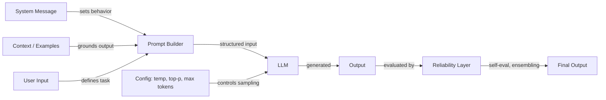

## Definition

Prompt engineering is the practice of crafting input text — instructions, examples, constraints, and context — to control the behavior of large language models without modifying their weights. It is the primary interface between human intent and model output, encompassing everything from simple instruction phrasing to sophisticated multi-step reasoning strategies.

The discipline spans three interconnected areas. **Configuration** covers the sampling parameters (temperature, Top-K, Top-P) and generation controls (max tokens, stop sequences) that shape how the model produces tokens. **Techniques** include structured approaches like chain-of-thought, self-consistency, step-back prompting, and system/role prompting that guide the model's reasoning process. **Reliability** addresses methods for making outputs more trustworthy — debiasing, prompt ensembling, and self-evaluation.

As LLMs move into production systems, prompt engineering has evolved from ad-hoc experimentation into a systematic practice. Tools like [DSPy](https://dspy-docs.vercel.app/) and [Automatic Prompt Engineering](/docs/prompt-engineering/automatic-prompt-engineering) even automate parts of the process. Whether you are building a chatbot, a code assistant, or a data extraction pipeline, prompt engineering is the first and most accessible lever for improving output quality.

## How it works

### The prompt pipeline

Every interaction with an LLM begins with a prompt — a structured input that may include a system message, user instructions, examples, and retrieved context. The model processes this input and generates output token by token, shaped by both the prompt content and the sampling configuration.

### Configuration vs. technique

Configuration parameters (temperature, Top-K, Top-P, max tokens) operate at the token-sampling level — they affect *how* the model selects each token. Techniques (chain-of-thought, self-consistency, step-back) operate at the prompt-design level — they affect *what* the model reasons about. Both layers interact: self-consistency requires high temperature to generate diverse reasoning paths, while structured output extraction works best with low temperature for determinism.

### The reliability layer

Advanced prompt engineering adds a reliability layer on top of basic prompting. This includes running multiple prompts in parallel (ensembling), having the model critique its own output (self-evaluation), and applying debiasing strategies to reduce systematic errors. These methods trade compute cost for output quality and are especially important in high-stakes applications.

## When to use / When NOT to use

| Scenario | Apply prompt engineering | Skip / use alternatives |
|---|---|---|
| Improving output quality without retraining | Yes — prompt engineering is the fastest lever | No — if the problem is a capability gap the model cannot bridge at all |
| Steering model persona, tone, or format | Yes — system prompts and role instructions are highly effective | No — if downstream parsing requires strict schemas, use [structured outputs](/docs/prompt-engineering/structured-outputs) with JSON mode |
| Multi-step reasoning tasks (math, logic, code planning) | Yes — add chain-of-thought or step-back prompting | No — for simple single-step responses, adding reasoning steps increases cost without benefit |
| Reducing hallucinations on knowledge-heavy queries | Yes — combine with [RAG](/docs/rag) to ground responses in retrieved facts | No — prompt engineering alone cannot add new knowledge the model was not trained on |
| High-volume, latency-critical inference | Partial — keep prompts concise; avoid few-shot examples when zero-shot suffices | Yes — long prompts and multi-call techniques (self-consistency, ensembling) add cost and latency |
| Safety and compliance guardrails | Partial — system prompts can constrain behavior | No — for hard safety requirements, add programmatic guardrails; models can be jailbroken |
| Domain-specific accuracy at scale | Partial — few-shot prompting helps | Yes — consider [fine-tuning](/docs/llms/fine-tuning) when prompt engineering hits a quality ceiling |

## Practical resources

- [OpenAI — Prompt engineering guide](https://platform.openai.com/docs/guides/prompt-engineering) — Comprehensive guide covering best practices and strategies
- [Anthropic — Prompt design](https://docs.anthropic.com/en/docs/build-with-claude/prompt-engineering/overview) — Anthropic's official prompting documentation
- [Learn Prompting](https://learnprompting.org/) — Open-source course covering prompt engineering techniques
- [Prompt Engineering Guide (DAIR.AI)](https://www.promptingguide.ai/) — Community-maintained guide with papers and techniques
- [DSPy documentation](https://dspy-docs.vercel.app/) — Framework for programmatic prompt optimization

## See also

- [Temperature, Top-K, Top-P](/docs/prompt-engineering/temperature-top-k-top-p)
- [Max tokens and stop sequences](/docs/prompt-engineering/max-tokens-stop-sequences)
- [Structured outputs](/docs/prompt-engineering/structured-outputs)
- [System, role, and contextual prompting](/docs/prompt-engineering/system-role-contextual-prompting)
- [Self-consistency](/docs/prompt-engineering/self-consistency)
- [Step-back prompting](/docs/prompt-engineering/step-back-prompting)
- [Automatic Prompt Engineering (APE)](/docs/prompt-engineering/automatic-prompt-engineering)
- [Debiasing techniques](/docs/prompt-engineering/debiasing-techniques)
- [Prompt ensembling](/docs/prompt-engineering/prompt-ensembling)
- [Self-evaluation and calibration](/docs/prompt-engineering/self-evaluation-calibration)
- [LLMs](/docs/llms)
- [Chain-of-thought](/docs/reasoning-patterns/cot)
- [RAG](/docs/rag)
- [AI Agents](/docs/agents)
