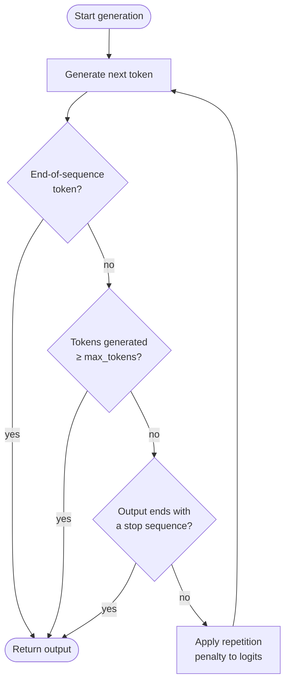

## Definition

Max tokens, stop sequences, and repetition penalties are generation-control parameters that determine when the model stops generating and how it handles repeated content. While sampling parameters like temperature shape *what* the model says, generation-control parameters shape *how much* it says, *where* it stops, and *how varied* it stays over the course of a long response. Every LLM API exposes some version of these controls, and understanding them is essential for building reliable, cost-efficient pipelines.

**Max tokens** sets a hard upper bound on the number of tokens the model can generate in a single response. It acts as a safety ceiling: the model stops the moment it would emit a token that exceeds this budget. It is not a target length — the model may stop earlier if it generates an end-of-sequence token naturally. Choosing an appropriate max tokens value matters both for cost (you are typically billed per output token) and for correctness (a truncated response can leave JSON objects open, cut off a reasoning chain mid-thought, or deliver partial results to downstream systems).

**Stop sequences** provide semantic stopping conditions: one or more strings that, when generated, cause the model to halt immediately (the stop string itself is excluded from the output). They are indispensable for structured generation — wrapping LLM output in a known delimiter and using the closing delimiter as a stop sequence makes extraction trivial and robust. **Repetition penalties** (frequency penalty and presence penalty in OpenAI; not natively exposed in Anthropic's messages API) reduce the probability of re-generating tokens that have already appeared, discouraging the looping and filler text that can emerge in long generations.

## How it works



Each generated token passes through three checkpoints in sequence: end-of-sequence detection, max-token budget enforcement, and stop-sequence matching. If none of the stopping conditions trigger, the repetition penalty is applied to the logits for the next token before sampling resumes.

### Max tokens

The `max_tokens` parameter (called `max_tokens_to_sample` in older Anthropic SDKs, now `max_tokens`) is a required or strongly recommended field in most LLM APIs. Setting it too low risks truncated output; setting it unnecessarily high wastes compute and increases latency on streaming endpoints. A practical heuristic: estimate the expected output length, then set `max_tokens` to 1.5–2× that estimate as a safe ceiling. For structured outputs like JSON, profile the worst-case token count of your schema and add a 20% buffer.

### Stop sequences

Stop sequences are defined as a list of strings. The model scans its output after each token and halts as soon as the generated text ends with any entry in the list. Common patterns include `["###", "\n\n", "</answer>", "```"]` for structured prompt templates, `["\nHuman:", "\nUser:"]` for chat simulators that should not generate the next user turn, and closing delimiters like `["</json>"]` for tagged extraction. Stop sequences are matched against raw generated text, not tokenized boundaries, so multi-token strings work correctly. A key gotcha: the stop sequence is *not* included in the returned text, so your parsing logic must account for its absence.

### Repetition penalties

OpenAI's API exposes two distinct penalty parameters. **Frequency penalty** (`frequency_penalty`, range −2.0 to 2.0) reduces a token's logit in proportion to how many times it has already appeared in the generated text — discouraging repetition of frequently used words. **Presence penalty** (`presence_penalty`, range −2.0 to 2.0) applies a flat logit reduction to any token that has appeared at least once, regardless of frequency — discouraging the reuse of any already-seen token. Positive values reduce repetition; negative values encourage it. Values in the range 0.1–0.5 are typically sufficient to suppress looping without significantly degrading output quality. Values above 1.0 can cause the model to avoid useful connecting words and degrade coherence.

## When to use / When NOT to use

| Scenario | Recommended settings | Avoid |
|----------|----------------------|-------|
| Short factual answers or classifications | `max_tokens=50–150`; no stop sequences needed | Very high `max_tokens`; wastes budget and can invite padding |
| Structured JSON or tagged extraction | Stop on closing delimiter (e.g., `["</json>"]`); `max_tokens` sized to worst-case schema | Omitting stop sequences; model may append prose after the closing brace |
| Multi-turn chat simulation | Stop sequences `["\nHuman:", "\nUser:"]` to prevent the model generating the next user turn | No stop sequences; model will hallucinate the next conversation turn |
| Long-form generation (essays, reports) | High `max_tokens` (2048–4096+); mild `frequency_penalty=0.2` to prevent repetitive phrasing | `frequency_penalty > 1.0`; breaks stylistic coherence and avoids legitimate repeated terms |
| Code generation | Stop on language-appropriate delimiters (e.g., triple backtick); `max_tokens` sized to function length | `presence_penalty > 0.5`; variable names and keywords need to repeat — penalties hurt correctness |
| Cost-sensitive batch inference | Set `max_tokens` tightly to the 95th-percentile expected output length | Leaving `max_tokens` at API maximum (e.g., 4096) when typical output is 100 tokens |

## Code examples

### OpenAI — max_tokens, stop, and frequency_penalty

```python
# OpenAI SDK: max_tokens, stop sequences, and repetition penalties
# pip install openai

import os
from openai import OpenAI

client = OpenAI(api_key=os.environ["OPENAI_API_KEY"])


def extract_with_controls(
    text: str,
    max_tokens: int = 512,
    stop: list[str] | None = None,
    frequency_penalty: float = 0.0,
    presence_penalty: float = 0.0,
) -> str:
    """Call the chat API with full generation-control parameters."""
    response = client.chat.completions.create(
        model="gpt-4o",
        messages=[
            {
                "role": "system",
                "content": (
                    "You are a structured data extractor. "
                    "Output only valid JSON between <json> and </json> tags."
                ),
            },
            {"role": "user", "content": f"Extract key facts from:\n\n{text}"},
        ],
        max_tokens=max_tokens,
        stop=stop or ["</json>"],
        frequency_penalty=frequency_penalty,
        presence_penalty=presence_penalty,
        temperature=0,
    )
    raw = response.choices[0].message.content
    # Strip the opening tag; closing tag was consumed by stop sequence
    return raw.replace("<json>", "").strip()


if __name__ == "__main__":
    article = (
        "SpaceX launched its Starship rocket on March 14, 2024. "
        "The vehicle reached an altitude of 210 km before completing a controlled reentry. "
        "It was the third integrated flight test of the system."
    )

    # Tight budget extraction
    result = extract_with_controls(
        article,
        max_tokens=256,
        stop=["</json>"],
        frequency_penalty=0.1,
    )
    print(result)

    # Long-form summary with anti-repetition penalty
    summary_resp = client.chat.completions.create(
        model="gpt-4o",
        messages=[{"role": "user", "content": f"Write a 3-paragraph summary of: {article}"}],
        max_tokens=600,
        frequency_penalty=0.4,
        presence_penalty=0.1,
        temperature=0.6,
    )
    print(summary_resp.choices[0].message.content)
```

### Anthropic — max_tokens and stop_sequences

```python
# Anthropic SDK: max_tokens and stop_sequences
# pip install anthropic

import os
import anthropic

client = anthropic.Anthropic(api_key=os.environ["ANTHROPIC_API_KEY"])


def generate_with_controls(
    prompt: str,
    max_tokens: int = 512,
    stop_sequences: list[str] | None = None,
) -> tuple[str, str]:
    """
    Returns (text_content, stop_reason).
    stop_reason is 'end_turn', 'max_tokens', or 'stop_sequence'.
    """
    message = client.messages.create(
        model="claude-opus-4-5",
        max_tokens=max_tokens,
        stop_sequences=stop_sequences or [],
        messages=[{"role": "user", "content": prompt}],
        temperature=0,
    )
    text = "".join(block.text for block in message.content if hasattr(block, "text"))
    return text, message.stop_reason


if __name__ == "__main__":
    # JSON extraction with stop sequence on closing delimiter
    json_prompt = (
        "Extract the event name, date, and location from the following text as JSON "
        "between <json> and </json> tags:\n\n"
        "The annual PyCon US conference will be held in Pittsburgh, PA on May 14-22, 2025."
    )
    output, reason = generate_with_controls(
        json_prompt,
        max_tokens=256,
        stop_sequences=["</json>"],
    )
    print(f"Stop reason: {reason}")
    print(output)

    # Constrained generation — stop before model generates a second answer
    answer_prompt = "Answer in one sentence: What is gradient descent?"
    answer, reason = generate_with_controls(
        answer_prompt,
        max_tokens=100,
        stop_sequences=["\n\n"],
    )
    print(f"Stop reason: {reason}")
    print(answer)
```

## Practical resources

- [OpenAI — API reference: chat completions](https://platform.openai.com/docs/api-reference/chat/create) — Full parameter reference for `max_tokens`, `stop`, `frequency_penalty`, and `presence_penalty`
- [Anthropic — API reference: messages](https://docs.anthropic.com/en/api/messages) — Reference for `max_tokens` and `stop_sequences` in the Messages API
- [OpenAI — Managing tokens](https://platform.openai.com/docs/guides/text-generation/managing-tokens) — Guide to counting tokens, understanding context windows, and sizing `max_tokens` appropriately
- [Hugging Face — Controlling text generation](https://huggingface.co/docs/transformers/main_classes/text_generation) — Low-level documentation on `max_new_tokens`, `eos_token_id`, `repetition_penalty`, and related parameters in the Transformers library
- [tiktoken (OpenAI tokenizer)](https://github.com/openai/tiktoken) — Token counting library for estimating output token budgets before making API calls

## See also

- [Prompt engineering](/docs/prompt-engineering)
- [Temperature, Top-K, Top-P](/docs/prompt-engineering/temperature-top-k-top-p)
- [Structured outputs](/docs/prompt-engineering/structured-outputs)
- [Self-consistency](/docs/prompt-engineering/self-consistency)
- [LLMs](/docs/llms)
- [Chain-of-thought](/docs/reasoning-patterns/cot)
