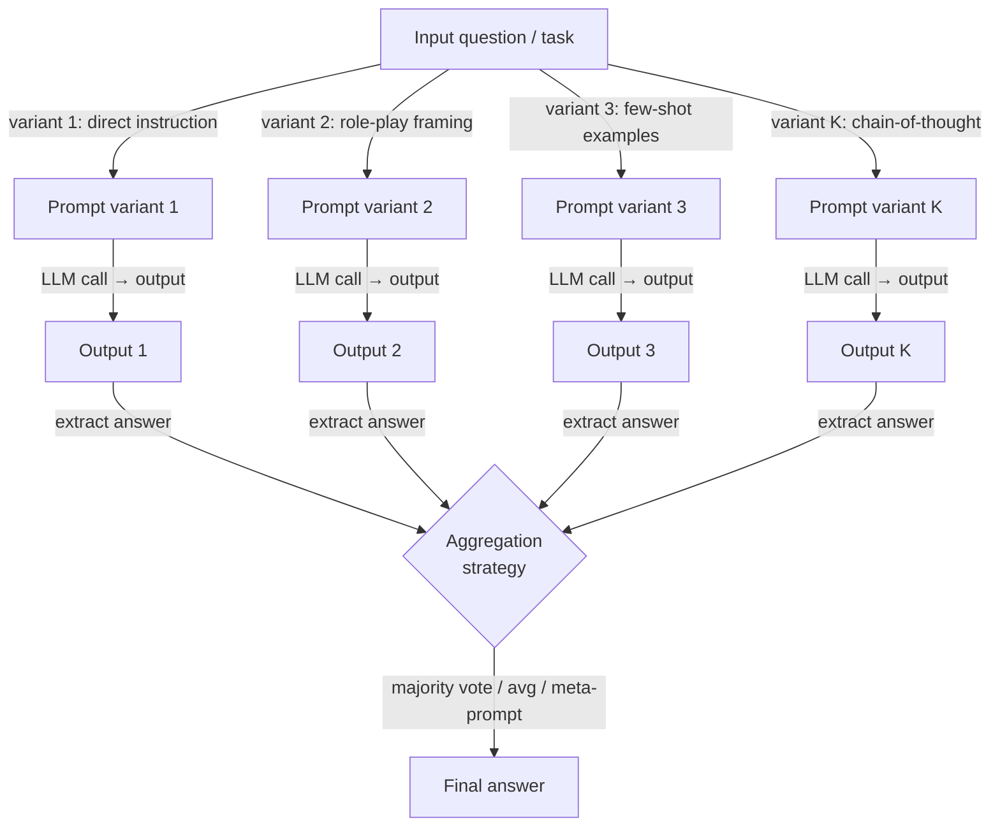

## Definition

Prompt ensembling is a prompting technique that generates multiple structurally different formulations of the same question or task, submits all of them to a language model, and then combines the resulting outputs into a single final answer. The core intuition is borrowed from classical machine learning ensembles (bagging, boosting, stacking): no single predictor is perfect, but a diverse committee of imperfect predictors tends to be more reliable than any individual member, because their errors are partially uncorrelated and therefore cancel out in aggregation.

The critical distinction between prompt ensembling and self-consistency is the source of diversity. In self-consistency, you run the *same* prompt N times at temperature > 0 and rely on stochastic sampling to produce diverse reasoning paths. In prompt ensembling, you deliberately craft *different* prompts — varying the framing, the role assignment, the instruction phrasing, the few-shot examples, or the output format — and run each one (typically at temperature 0 or low temperature) to produce diverse yet deterministic outputs. Self-consistency exploits variance introduced by sampling; prompt ensembling exploits variance introduced by prompt design. In practice, the two approaches are complementary and can be combined.

Prompt ensembling is especially valuable in two scenarios. First, when you are uncertain which prompt formulation is optimal for a task and cannot evaluate alternatives at scale — running multiple candidates and voting over their outputs gives you the benefit of the best prompt without having to identify it in advance. Second, when a task is high-stakes and a single prompt's failure mode is unacceptable — an ensemble provides a soft audit trail, because the spread of votes across different answers is a direct signal of the model's uncertainty. The main cost is latency and tokens: K prompt variants require K inference calls, which can be parallelized but not eliminated.

## How it works



### Prompt variation strategies

The quality of an ensemble depends heavily on the *diversity* of the prompt variants. If all variants are superficially different but structurally identical, the ensemble degenerates toward repeated sampling. Effective variation strategies include:

**Role and persona variation.** Assigning different expert personas (e.g., "You are a cautious medical doctor", "You are a data scientist", "You are a pragmatic engineer") shifts the model's prior over plausible answers and activates different knowledge registers. Role variation is especially effective for tasks with multiple valid framings.

**Instruction phrasing variation.** The same task can be phrased as a question ("What is the risk level of...?"), a command ("Assess the risk level of..."), or a completion ("The risk level of ... is"), and these surface differences measurably change the model's output distribution. Paraphrasing the core instruction is the lowest-effort form of variation.

**Few-shot example variation.** Using different sets of in-context examples changes which part of the model's knowledge the few-shot context activates. Rotating through example sets drawn from different sub-domains of the training distribution increases ensemble diversity substantially, especially for classification tasks.

**Chain-of-thought vs. direct answer variation.** Including one or more CoT variants alongside direct-answer variants combines the reasoning-quality benefits of CoT with the speed benefits of direct prompting. The CoT variants typically receive more weight in aggregation because they are more reliable, but direct variants can override in cases where CoT leads the model into over-thinking simple questions.

**Output format variation.** Asking for the answer as a JSON object, as a numbered list, or as a free-text sentence can elicit different levels of precision. Structured output variants are easier to parse and aggregate programmatically.

### Aggregation methods

Once you have K outputs, you need to reduce them to a single answer. The choice of aggregation method should match the output type:

**Majority vote** works best for discrete outputs (classification labels, short factual answers, multiple-choice selections). It is robust to adversarial or confused variants, requires no additional model calls, and directly mimics how self-consistency operates. Ties can be broken by log-probability or by deferring to a designated "trusted" variant.

**Score averaging** is appropriate when each variant returns a numeric score or probability rather than a label. Averaging is sensitive to outliers; median aggregation is more robust when individual variants can produce extreme values.

**Meta-prompt (LLM-as-judge) aggregation** sends all K outputs to a second LLM call that is instructed to synthesize or select the best answer. This is the most powerful but most expensive method, and it introduces a second point of LLM failure. It is most useful when the task requires open-ended generation (summaries, code, essays) where majority vote is not applicable.

**Weighted voting** assigns different weights to different variants based on their historical accuracy on a held-out validation set. If you have labeled data and can measure which variants perform best, weighting significantly outperforms uniform voting — but it requires calibration effort upfront.

## When to use / When NOT to use

| Use when | Avoid when |
|----------|------------|
| You are uncertain which prompt phrasing works best and cannot evaluate them individually at scale | Latency is a hard constraint — K parallel calls still have the latency of the slowest call |
| The task is high-stakes and a single prompt's failure mode is unacceptable | Token budget is severely limited and you cannot afford K completions |
| Outputs from different prompt framings provide complementary perspectives (e.g., medical diagnosis from multiple specialist angles) | The model already achieves ceiling accuracy with a single well-tuned prompt — diminishing returns |
| You want a built-in uncertainty signal (spread of votes = model disagreement) | The output space is continuous or open-ended in a way that makes voting or averaging meaningless |
| You are building a production pipeline where prompt sensitivity must be dampened | You lack the engineering infrastructure to run and aggregate parallel LLM calls |

## Comparisons

| Criterion | Prompt ensembling | Self-consistency | Single prompt |
|-----------|------------------|-----------------|---------------|
| Source of diversity | Different prompt designs | Stochastic sampling of one prompt | None |
| Number of LLM calls | K (number of variants, typically 3–10) | N (typically 10–40) | 1 |
| Temperature | Low (0–0.3) per variant | High (0.5–0.8) | Task-dependent |
| Accuracy improvement | High for tasks sensitive to prompt phrasing | High for multi-step reasoning | Baseline |
| Requires prompt engineering effort | Yes — designing diverse variants | No — only one prompt needed | Moderate |
| Handles open-ended output | Yes, via meta-prompt aggregation | No — majority vote requires discrete answers | Yes |
| Best use case | Tasks with prompt sensitivity or multiple valid framings | Math, symbolic reasoning, factual QA | Simple, well-defined tasks with a known good prompt |

## Code examples

### Prompt ensembling with multiple templates using OpenAI

```python
# Prompt ensembling: run K prompt variants and aggregate by majority vote
# pip install openai

import os
from collections import Counter
from openai import OpenAI

client = OpenAI(api_key=os.environ["OPENAI_API_KEY"])

# Five structurally different prompt variants for the same classification task
PROMPT_VARIANTS = [
    # 1. Direct instruction
    "Is the following customer review positive, negative, or neutral? "
    "Reply with exactly one word.\n\nReview: {review}",

    # 2. Role-play framing
    "You are a sentiment analysis expert. Classify the sentiment of the "
    "review below as positive, negative, or neutral. Output only the label.\n\nReview: {review}",

    # 3. Few-shot examples
    "Review: 'The product broke in two days.' → negative\n"
    "Review: 'Decent quality for the price.' → neutral\n"
    "Review: 'Absolutely love it, will buy again!' → positive\n"
    "Review: '{review}' →",

    # 4. Chain-of-thought variant
    "Analyze the sentiment of this review step by step, then state the "
    "final label (positive / negative / neutral) on the last line.\n\nReview: {review}",

    # 5. Completion framing
    "The overall sentiment expressed in the review '{review}' is",
]


def call_variant(prompt: str, model: str = "gpt-4o-mini") -> str:
    """Call the LLM with a single prompt variant and return the raw response."""
    resp = client.chat.completions.create(
        model=model,
        messages=[{"role": "user", "content": prompt}],
        temperature=0.0,
        max_tokens=80,
    )
    return resp.choices[0].message.content.strip()


def extract_label(text: str) -> str | None:
    """Extract a sentiment label from raw model output."""
    text_lower = text.lower()
    for label in ("positive", "negative", "neutral"):
        if label in text_lower:
            return label
    return None


def ensemble_sentiment(review: str) -> dict:
    """Run all prompt variants and aggregate by majority vote."""
    raw_outputs, labels = [], []

    for i, template in enumerate(PROMPT_VARIANTS):
        prompt = template.format(review=review)
        raw = call_variant(prompt)
        label = extract_label(raw)
        raw_outputs.append(raw)
        if label:
            labels.append(label)
        print(f"  Variant {i + 1}: {label!r}  (raw: {raw[:60]!r})")

    if not labels:
        return {"answer": None, "votes": {}}

    counts = Counter(labels)
    winner, top_votes = counts.most_common(1)[0]
    return {
        "answer": winner,
        "confidence": top_votes / len(labels),
        "votes": dict(counts),
        "raw_outputs": raw_outputs,
    }


if __name__ == "__main__":
    review = (
        "The delivery was fast but the item looks nothing like the photos. "
        "I'm disappointed and won't order again."
    )
    result = ensemble_sentiment(review)
    print(f"\nFinal answer : {result['answer']}")
    print(f"Confidence   : {result['confidence']:.0%}")
    print(f"Vote counts  : {result['votes']}")
```

### Weighted ensemble with a held-out validation set

```python
# Weighted prompt ensembling: calibrate variant weights from a validation set
# pip install openai scikit-learn

import os
from collections import defaultdict
from openai import OpenAI
from sklearn.metrics import accuracy_score

client = OpenAI(api_key=os.environ["OPENAI_API_KEY"])


def evaluate_variant(template: str, examples: list[dict]) -> float:
    """Return accuracy of a single prompt variant on a labeled dataset."""
    preds = []
    for ex in examples:
        prompt = template.format(review=ex["text"])
        raw = call_variant(prompt)   # reuse function from above
        preds.append(extract_label(raw) or "neutral")
    return accuracy_score([ex["label"] for ex in examples], preds)


def weighted_ensemble(review: str, templates: list[str], weights: list[float]) -> str:
    """Aggregate variant outputs with per-variant weights."""
    scores: dict[str, float] = defaultdict(float)
    for template, weight in zip(templates, weights):
        raw = call_variant(template.format(review=review))
        label = extract_label(raw)
        if label:
            scores[label] += weight
    return max(scores, key=scores.__getitem__) if scores else "neutral"


if __name__ == "__main__":
    # Dummy validation set — replace with real labeled examples
    val_set = [
        {"text": "Great product!", "label": "positive"},
        {"text": "Terrible quality.", "label": "negative"},
        {"text": "It's okay I guess.", "label": "neutral"},
    ]
    # Calibrate weights (accuracy on val set)
    weights = [evaluate_variant(t, val_set) for t in PROMPT_VARIANTS]
    print("Variant weights:", [f"{w:.2f}" for w in weights])

    review = "Arrived on time but packaging was damaged."
    answer = weighted_ensemble(review, PROMPT_VARIANTS, weights)
    print("Weighted ensemble answer:", answer)
```

## Practical resources

- [Diverse Demonstrations Improve In-context Compositional Generalization (Levy et al., 2022)](https://arxiv.org/abs/2212.06800) — Shows that diverse few-shot examples, the backbone of prompt variation, improve generalization significantly over randomly sampled demonstrations.
- [Self-Consistency Improves Chain of Thought Reasoning in Language Models (Wang et al., 2022)](https://arxiv.org/abs/2203.11171) — The closest relative of prompt ensembling; essential background for understanding aggregation over multiple LLM outputs.
- [Prompt Sensitivity and Prompt Ensembling for LLMs (Mizrahi et al., 2024)](https://arxiv.org/abs/2401.00595) — Directly studies how much LLM accuracy varies across paraphrased prompts and demonstrates that ensembling over paraphrases closes most of the gap.
- [Universal Self-Consistency for Large Language Model Generation (Chen et al., 2023)](https://arxiv.org/abs/2311.17311) — Extends self-consistency to open-ended generation via meta-prompt aggregation, bridging the gap between majority-vote ensembling and free-form outputs.

## See also

- [Prompt engineering](/docs/prompt-engineering)
- [Self-consistency](/docs/prompt-engineering/self-consistency)
- [Automatic prompt engineering](/docs/prompt-engineering/automatic-prompt-engineering)
