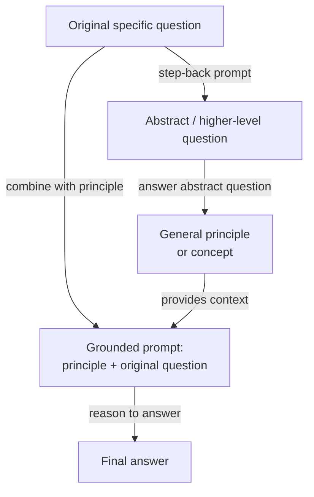

## Definition

Step-back prompting is a two-step prompting technique introduced by Zheng et al. (2023) at Google DeepMind. The core idea is deceptively simple: before asking the model to answer a specific, potentially difficult question, first ask it a more abstract, higher-level version of the same question — and then use the model's answer to that abstract question as context when answering the original. The technique is grounded in the observation that LLMs often fail on specific factual or reasoning questions not because they lack the relevant knowledge, but because the specificity of the question activates the wrong "retrieval context" in the model's internal representations. Stepping back to a higher level of abstraction activates broader, more reliable knowledge, which then grounds the final answer.

The insight behind step-back prompting draws from how experts approach hard problems. A physicist asked "What happens to the pressure in a gas if the temperature is increased at constant volume?" might first recall the ideal gas law (PV = nRT) as general background before applying it to the specific case — rather than jumping directly to an answer that risks mixing up variables. Step-back prompting instructs the model to do the same: generate a general principle or concept that underpins the specific question, then reason from that principle to the answer. This effectively adds a conceptual scaffolding step that reduces the chance of superficial pattern-matching leading to a wrong answer.

In the original paper, step-back prompting is demonstrated with few-shot examples that teach the model how to "step back" appropriately for a given domain. For physics questions, the abstract question typically asks for the relevant physical law or principle. For history questions, it asks for the broader historical context. For medical questions, it asks for the relevant physiology. The technique is model-agnostic and requires no fine-tuning — it is purely a prompt-level intervention. On the MMLU and TimeQA benchmarks, step-back prompting outperforms both standard chain-of-thought and retrieval-augmented baselines on difficult, knowledge-intensive questions.

## How it works



### Step 1 — Generating the abstract question

The first step is to prompt the model to identify a higher-level question that subsumes the original. This is typically done with a few-shot prompt containing domain-specific examples of (specific question, abstract question) pairs. For example, if the original question is "What is the melting point of gallium arsenide?", the abstract question might be "What are the thermodynamic and crystallographic properties of III-V semiconductors?" The abstract question should be general enough to activate broad relevant knowledge, but not so general as to be uninformative. Getting the right level of abstraction is the primary prompt engineering challenge, and few-shot examples are essential for steering the model to the appropriate abstraction level for a given domain.

### Step 2 — Answering the abstract question

With the abstract question generated, the model answers it. This answer typically takes the form of a general principle, a definition, a physical law, or a summary of relevant background context. The key property of this step is that the abstract question is usually easier for the model to answer reliably than the original specific question — it activates well-learned, factually grounded representations rather than edge cases or specific numeric facts that are more prone to hallucination. The answer to the abstract question becomes a context block that constrains and informs the final reasoning step.

### Step 3 — Answering the original question using the abstraction as context

The final step combines the abstract principle with the original specific question in a single prompt: "Given this background: [abstract answer], answer the specific question: [original question]." The model now reasons from a solid conceptual foundation rather than attempting direct retrieval of a specific fact. This reduces the risk of hallucination on fact-intensive questions and improves the logical consistency of multi-step reasoning. In the original paper, this final step also uses chain-of-thought, making step-back prompting composable with CoT: the abstraction step grounds the reasoning, and CoT makes it explicit.

## When to use / When NOT to use

| Use when | Avoid when |
|----------|------------|
| Question requires specific factual knowledge where the model is prone to hallucination | Simple questions where direct prompting already works reliably |
| Domain has a clear hierarchy from general principles to specific instances (physics, chemistry, history) | Abstract question is hard to define — tasks without a natural general/specific distinction |
| Model answers specific questions inconsistently but is reliable on general principles | Latency is critical — two LLM calls double response time |
| You want to reduce hallucination on knowledge-intensive benchmarks without RAG | The question is purely mathematical or symbolic — CoT alone is usually sufficient |
| Few-shot examples for the domain are available to teach the model how to step back | Token budget is tight — the abstract answer adds tokens to the final prompt |

## Comparisons

| Criterion | Step-back prompting | Chain-of-thought (CoT) | Self-consistency |
|-----------|--------------------|-----------------------|-----------------|
| Number of LLM calls | 2 (abstract + final) | 1 | N (typically 10–40) |
| Core mechanism | Abstraction to grounding to reasoning | Explicit step-by-step reasoning | Multiple independent paths + majority vote |
| Primary benefit | Reduces hallucination on knowledge-intensive questions | Improves multi-step logical reasoning | Reduces variance in reasoning outcomes |
| Cost | 2x baseline | 1x baseline | Nx baseline |
| Requires few-shot examples | Yes — to teach the step-back behavior | Yes — for best results | Yes — few-shot CoT as the base prompt |
| Best task type | Knowledge-intensive QA, science, history | Math, logic, code | Math, symbolic reasoning, factual QA |
| Composable with CoT | Yes — recommended to combine both | N/A | Yes — base prompt uses CoT |
| Note | Complementary to self-consistency; both can be stacked for further gains | Simpler baseline — try before step-back | More expensive; use when high accuracy justifies Nx cost |

## Code examples

### Step-back prompting with OpenAI — two-call implementation

```python
# Step-back prompting: abstraction-then-answer, two API calls
# pip install openai

import os
from openai import OpenAI

client = OpenAI(api_key=os.environ["OPENAI_API_KEY"])

STEP_BACK_FEW_SHOT = """Help identify a broader abstract question underpinning a specific one.

Original: At what temperature does gallium arsenide melt?
Step-back: What are the thermodynamic properties of III-V semiconductors?

Original: What was the immediate cause of the US entering World War I?
Step-back: What geopolitical tensions shaped US foreign policy before WWI?

Original: Patient has peripheral edema, elevated JVP, orthopnea. Diagnosis?
Step-back: What are the hallmark signs of right-sided and left-sided heart failure?

Original: {question}
Step-back:"""

GROUNDED = """Using the background context below, answer the specific question step by step.

Background (general principles):
{background}

Specific question:
{question}

Let's think step by step:"""


def generate_step_back(question: str) -> str:
    resp = client.chat.completions.create(
        model="gpt-4o",
        messages=[{"role": "user", "content": STEP_BACK_FEW_SHOT.format(question=question)}],
        temperature=0, max_tokens=150,
    )
    return resp.choices[0].message.content.strip()


def answer_abstract(abstract_q: str) -> str:
    resp = client.chat.completions.create(
        model="gpt-4o",
        messages=[
            {"role": "system", "content": "Answer with accurate background principles (3-5 sentences)."},
            {"role": "user", "content": abstract_q},
        ],
        temperature=0, max_tokens=300,
    )
    return resp.choices[0].message.content.strip()


def answer_with_step_back(question: str) -> str:
    abstract_q = generate_step_back(question)
    background  = answer_abstract(abstract_q)
    resp = client.chat.completions.create(
        model="gpt-4o",
        messages=[{"role": "user", "content": GROUNDED.format(
            background=background, question=question)}],
        temperature=0, max_tokens=500,
    )
    return resp.choices[0].message.content.strip()


if __name__ == "__main__":
    q = "Why did Soviet collectivization in the early 1930s lead to famine in Ukraine?"
    print(answer_with_step_back(q))
```

### Step-back prompting with Anthropic — single call with structured output

```python
# Step-back prompting in one Anthropic call: structured three-part format
# pip install anthropic

import os
import anthropic

client = anthropic.Anthropic(api_key=os.environ["ANTHROPIC_API_KEY"])

SYSTEM = """You are an expert reasoning assistant. For each question, respond in three parts:

## Abstract question:
A broader, general question capturing the underlying principle.

## Background context:
Answer the abstract question with relevant principles and definitions (3-5 sentences).

## Final answer:
Use the background to reason step-by-step to the specific answer."""

EXAMPLE = [
    {"role": "user", "content": "Ideal gas: 2 mol, 300 K, 0.05 m^3. What is the pressure?"},
    {"role": "assistant", "content": """## Abstract question:
What is the ideal gas law and how does it relate P, V, n, and T?

## Background context:
PV = nRT, where P is pressure (Pa), V is volume (m^3), n is moles, R = 8.314 J/mol/K, T is Kelvin. Rearranged: P = nRT / V.

## Final answer:
P = (2 x 8.314 x 300) / 0.05 = 99,768 Pa (about 0.985 atm)."""},
]


def step_back(question: str) -> str:
    response = client.messages.create(
        model="claude-opus-4-5",
        max_tokens=800,
        system=SYSTEM,
        messages=EXAMPLE + [{"role": "user", "content": question}],
    )
    return response.content[0].text


if __name__ == "__main__":
    q = "A patient is given furosemide. How does it cause hypokalemia?"
    print(step_back(q))
```

## Practical resources

- [Take a Step Back: Evoking Reasoning via Abstraction in Large Language Models (Zheng et al., 2023)](https://arxiv.org/abs/2310.06117) — Original Google DeepMind paper with benchmarks on MMLU, TimeQA, and MedQA.
- [Chain-of-Thought Prompting Elicits Reasoning in Large Language Models (Wei et al., 2022)](https://arxiv.org/abs/2201.11903) — The CoT paper that step-back prompting builds on and is evaluated against.
- [Anthropic — Prompt engineering overview](https://docs.anthropic.com/en/docs/build-with-claude/prompt-engineering/overview) — Covers system prompt structuring and few-shot example design.
- [OpenAI — Prompt engineering guide](https://platform.openai.com/docs/guides/prompt-engineering) — Practical guidance on few-shot prompting, reasoning strategies, and output structure.

## See also

- [Prompt engineering](/docs/prompt-engineering)
- [Chain-of-thought (CoT)](/docs/reasoning-patterns/cot)
- [Self-consistency](/docs/prompt-engineering/self-consistency)
