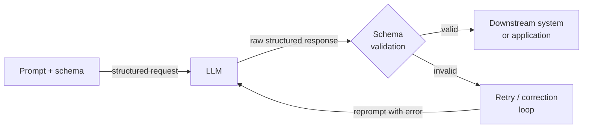

## Definition

Structured outputs refers to the practice of constraining or guiding an LLM to produce machine-readable data — most commonly JSON — rather than free-form prose. In a production pipeline, the gap between an LLM that returns a correct answer and one that returns a correct answer in a parsable format is the gap between a toy demo and a deployable system. A downstream service that needs to extract a product name, a sentiment label, or a list of action items cannot reliably operate on unstructured text; it needs a guaranteed shape it can deserialize, validate, and route.

The evolution of structured output techniques tracks the maturation of LLM APIs. Early systems relied on fragile prompt instructions ("respond only with valid JSON") combined with regex parsing and retry loops. This approach broke whenever the model added an explanatory preamble, wrapped the JSON in a markdown code block, or subtly violated the schema under edge cases. The next generation introduced function calling (OpenAI, mid-2023) and tool use (Anthropic), which move the schema definition out of the prompt and into a first-class API parameter, allowing the model to be explicitly trained and constrained on the output contract. Most recently, providers introduced strict grammar-constrained decoding that makes schema compliance a hard guarantee at the token level, not a soft prompt instruction.

Understanding which technique to apply — and why — matters for anyone building pipelines that depend on LLM output. JSON mode is the simplest entry point but provides no schema validation. Function calling / tool use provides a typed schema and structured parsing in the API response, but requires defining tool schemas upfront. Pydantic-based extraction libraries (Instructor, LangChain output parsers) sit above the API layer and add Python-level validation, automatic retry on schema violations, and ergonomic model definition. The right choice depends on the complexity of the target schema, the criticality of validation, and how much retry/correction logic you want the library to handle for you.

## How it works



### JSON mode

JSON mode is the most basic structured output mechanism. When enabled, the model is constrained to produce only valid JSON as its top-level output. In OpenAI's API this is activated by setting `response_format={"type": "json_object"}` on the request; in Anthropic's API a similar effect can be achieved by prefilling the assistant turn with `{`. JSON mode guarantees syntactic validity (the output can always be parsed by `json.loads`), but it does not validate against any schema — the model might return `{"result": "yes"}` when you expected `{"score": 0.87, "label": "positive", "confidence": 0.92}`. You must add schema validation (e.g. with Pydantic or `jsonschema`) as a separate step, and implement retry logic for schema mismatches. JSON mode is best suited for simple, flat structures where the risk of schema drift is low.

### Function calling and tool use

Function calling (OpenAI) and tool use (Anthropic) represent a qualitative step forward. Instead of embedding the output schema in the system prompt, you declare it as a tool or function definition with a JSON Schema object. The API returns the model's output as a structured `tool_use` block with a parsed `input` dict, separate from any text content. This decoupling is significant: the text and the structured data live in different parts of the response, and the API itself handles the JSON parsing. You get type annotations for every field, required vs. optional field semantics, enum constraints, and nested object support — all enforced by the schema at the API level. OpenAI's strict mode (2024) goes further by enabling constrained decoding, making schema adherence a hard guarantee. Tool use is the right choice for extracting structured data from documents, populating database records, or driving downstream API calls with typed arguments.

### Schema-based extraction with Pydantic

Libraries like [Instructor](https://github.com/jxnl/instructor) and LangChain's output parsers wrap the function calling / tool use API with a Pydantic-first interface. You define your output schema as a `pydantic.BaseModel` subclass and pass the model class to the library; it automatically generates the JSON Schema for the tool definition, calls the API, validates the response against your model, and retries with validation error feedback if the schema is violated. This approach is the most ergonomic for Python practitioners because the output is a fully typed Python object — not a raw dict — with field validation, default values, and nested model support. Automatic retry with error context dramatically reduces the rate of silent schema violations. The cost is an additional library dependency and slightly more token usage when validation errors trigger retry messages.

## When to use / When NOT to use

| Use when | Avoid when |
|----------|------------|
| The LLM output must be consumed programmatically (API response, DB insert, workflow trigger) | The output is read only by humans and no downstream parsing is needed |
| You need a typed, validated Python object rather than a raw string | The schema is so simple (single string or number) that plain text is easier to parse |
| Building pipelines where schema violations would cause silent data corruption | Latency is extremely tight and you cannot afford the overhead of retry loops |
| The extraction involves nested structures, arrays, or enum-constrained fields | You are in early prototyping and the output schema is not yet stable |
| You need reproducible, testable extraction behavior across model versions | The model you are using has poor support for tool use / function calling |

## Code examples

### OpenAI — JSON mode with Pydantic validation

```python
# Structured extraction with OpenAI JSON mode + Pydantic validation
# pip install openai pydantic

import json, os
from pydantic import BaseModel, ValidationError
from openai import OpenAI

client = OpenAI(api_key=os.environ["OPENAI_API_KEY"])


class SentimentResult(BaseModel):
    label: str       # "positive" | "negative" | "neutral"
    score: float     # 0.0 - 1.0
    key_phrases: list[str]


def extract_sentiment(text: str, max_retries: int = 3) -> SentimentResult:
    system = (
        "You are a sentiment analysis engine. Respond ONLY with valid JSON: "
        '{"label": "positive"|"negative"|"neutral", "score": <float>, "key_phrases": [...]}'
    )
    for attempt in range(max_retries):
        resp = client.chat.completions.create(
            model="gpt-4o-mini",
            response_format={"type": "json_object"},
            messages=[{"role": "system", "content": system},
                      {"role": "user", "content": f"Analyze: {text}"}],
            temperature=0,
        )
        try:
            return SentimentResult(**json.loads(resp.choices[0].message.content))
        except (json.JSONDecodeError, ValidationError) as e:
            if attempt == max_retries - 1:
                raise RuntimeError(f"Validation failed: {e}") from e
    raise RuntimeError("Unreachable")


if __name__ == "__main__":
    r = extract_sentiment("The model is fast, but docs leave much to be desired.")
    print(r.label, r.score, r.key_phrases)
```

### OpenAI — function calling with strict schema

```python
# Structured extraction with OpenAI function calling (strict mode)
# pip install openai

import os, json
from openai import OpenAI

client = OpenAI(api_key=os.environ["OPENAI_API_KEY"])

TOOL = {
    "type": "function",
    "function": {
        "name": "extract_product_info",
        "description": "Extract structured product info from a description.",
        "strict": True,
        "parameters": {
            "type": "object",
            "properties": {
                "product_name": {"type": "string"},
                "price_usd":    {"type": "number"},
                "features":     {"type": "array", "items": {"type": "string"}},
                "in_stock":     {"type": "boolean"},
            },
            "required": ["product_name", "price_usd", "features", "in_stock"],
            "additionalProperties": False,
        },
    },
}


def extract_product(description: str) -> dict:
    resp = client.chat.completions.create(
        model="gpt-4o",
        tools=[TOOL],
        tool_choice={"type": "function", "function": {"name": "extract_product_info"}},
        messages=[{"role": "system", "content": "Extract product information."},
                  {"role": "user", "content": description}],
        temperature=0,
    )
    return json.loads(resp.choices[0].message.tool_calls[0].function.arguments)


if __name__ == "__main__":
    desc = ("AcmePro X200 headphones — ships now at $149.99. "
            "Features: 40-hour battery, ANC, USB-C charging.")
    print(json.dumps(extract_product(desc), indent=2))
```

### Anthropic — tool use for structured extraction

```python
# Structured extraction with Anthropic tool use
# pip install anthropic pydantic

import os
from pydantic import BaseModel
import anthropic

client = anthropic.Anthropic(api_key=os.environ["ANTHROPIC_API_KEY"])

TOOL = {
    "name": "extract_meeting_notes",
    "description": "Extract structured meeting notes. Always call this tool.",
    "input_schema": {
        "type": "object",
        "properties": {
            "summary": {"type": "string"},
            "action_items": {
                "type": "array",
                "items": {
                    "type": "object",
                    "properties": {
                        "owner":    {"type": "string"},
                        "task":     {"type": "string"},
                        "due_date": {"type": "string"},
                    },
                    "required": ["owner", "task", "due_date"],
                },
            },
            "decisions": {"type": "array", "items": {"type": "string"}},
        },
        "required": ["summary", "action_items", "decisions"],
    },
}


class ActionItem(BaseModel):
    owner: str
    task: str
    due_date: str | None


class MeetingNotes(BaseModel):
    summary: str
    action_items: list[ActionItem]
    decisions: list[str]


def extract_meeting_notes(transcript: str) -> MeetingNotes:
    resp = client.messages.create(
        model="claude-opus-4-5",
        max_tokens=1024,
        tools=[TOOL],
        tool_choice={"type": "tool", "name": "extract_meeting_notes"},
        messages=[{"role": "user", "content": f"Extract notes:\n\n{transcript}"}],
    )
    for block in resp.content:
        if block.type == "tool_use":
            return MeetingNotes(**block.input)
    raise RuntimeError("No tool_use block")


if __name__ == "__main__":
    notes = extract_meeting_notes("""
        Alice: New pricing model starts Q3. Bob: I'll update the pricing page by June 15.
        Carol: I'll brief legal by end of week. Alice: We dropped the free tier.
    """)
    print("Summary:", notes.summary)
    print("Decisions:", notes.decisions)
    for item in notes.action_items:
        print(f"  [{item.owner}] {item.task} — due {item.due_date}")
```

## Comparisons

| Criterion | JSON mode | Function calling / Tool use | Pydantic-based (Instructor) |
|-----------|-----------|-----------------------------|-----------------------------|
| Schema enforcement | Syntactic only (valid JSON, no schema) | Structural (fields, types, required) | Structural + semantic (validators, field constraints) |
| API surface | `response_format` parameter | `tools` + `tool_choice` parameters | Library wrapper over tools |
| Output type | Raw string requiring `json.loads` | Parsed dict in tool call arguments | Typed Pydantic model instance |
| Retry on failure | Manual — must implement yourself | Manual | Automatic — library handles retry with error context |
| Nested schemas | Possible but error-prone | Well-supported via JSON Schema | First-class via nested BaseModel |
| Best for | Simple, flat structures; quick prototyping | Production extraction and typed API dispatch | Complex schemas with Python-level validation needs |

## Practical resources

- [OpenAI — Structured outputs guide](https://platform.openai.com/docs/guides/structured-outputs) — Official guide covering JSON mode, function calling, and strict mode with constrained decoding.
- [Anthropic — Tool use documentation](https://docs.anthropic.com/en/docs/build-with-claude/tool-use) — Complete reference for defining tool schemas and handling tool_use blocks in Claude responses.
- [Instructor library (jxnl/instructor)](https://github.com/jxnl/instructor) — The most widely used library for Pydantic-first structured extraction; supports OpenAI, Anthropic, and other backends.
- [Pydantic documentation](https://docs.pydantic.dev/) — Essential reference for defining schemas, validators, and nested models used in extraction pipelines.

## See also

- [Prompt engineering](/docs/prompt-engineering)
- [LLMs](/docs/llms)
- [Agents](/docs/agents)
