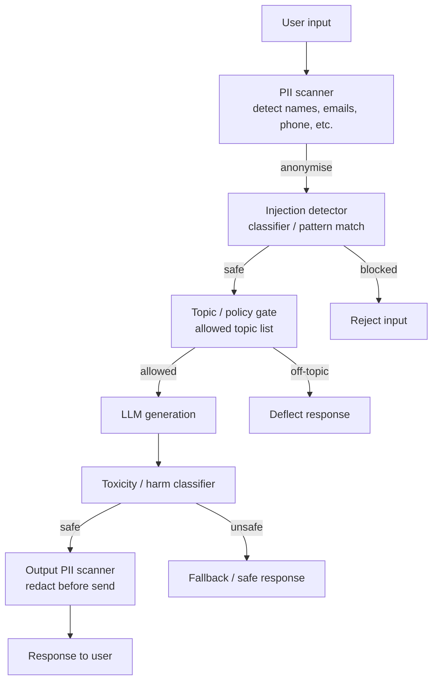

## Definition

**Guardrails** are programmable middleware components that intercept LLM inputs and outputs to enforce safety, compliance, and data protection policies. Unlike the model's built-in safety training (which is static and can be bypassed), guardrails are developer-controlled, configurable, and auditable. They sit outside the model and can be updated independently without retraining.

A complete guardrail architecture enforces four categories of control:
1. **Content safety** — detect and block harmful, toxic, or policy-violating inputs and outputs.
2. **Security** — detect prompt injection attempts and jailbreak patterns.
3. **Data protection** — identify and anonymise PII (Personally Identifiable Information) in inputs and outputs.
4. **Compliance** — enforce business rules, topic restrictions, jurisdiction-specific requirements, and EU AI Act obligations (effective August 2026 for high-risk AI).

## How it works



### NVIDIA NeMo Guardrails

NeMo Guardrails is an open-source Python toolkit that adds programmable safety rails to any LLM application. It uses **Colang**, a domain-specific language (DSL) for expressing guardrail policies as dialogue flows:

```text
define user ask harmful question
  "how to make a bomb"
  "explain how to hack"

define bot refuse harmful
  "I can't help with that."

define flow safety
  user ask harmful question
  bot refuse harmful
```

NeMo Guardrails intercepts the conversation at five pipeline stages: input rail, dialog management, output rail, and (for agents) execution rail and retrieval rail. GPU-accelerated inference achieves sub-100ms response times for the rail evaluation itself. Colang 2.0 (released 2024) added Python-native flows and improved support for agentic pipelines.

### Guardrails.ai

Guardrails.ai is a Python framework that wraps LLM calls with **Validators** — composable checks applied to the output. Validators can enforce:
- **Schema compliance** — output is valid JSON matching a Pydantic schema.
- **No PII** — output does not contain detected PII (integrated with Presidio).
- **No toxic language** — output passes a toxicity classifier.
- **Factual grounding** — output claims are present in the provided context (RAG grounding check).
- **Custom validators** — user-defined Python functions.

On validator failure, Guardrails.ai can either return an error, reask the LLM with the failure explanation, or return a partial result with the violating fields redacted.

### LlamaGuard

LlamaGuard (Meta, 2023–2025) is a fine-tuned Llama model purpose-built for input/output safety classification. It covers the MLCommons AI Safety taxonomy: violent crimes, hate speech, sexual content, self-harm, and privacy violations. LlamaGuard 3 (2024) supports multilingual classification and tool-call safety for agentic systems. It is open-weight and deployable on-premises for latency-sensitive applications.

### PII detection and anonymisation

PII guardrails identify sensitive entities (names, email addresses, phone numbers, SSN, credit card numbers, medical record IDs) in both inputs and outputs.

| Tool | Approach | Coverage | Notes |
|---|---|---|---|
| **Microsoft Presidio** | NER + regex + checksum | 50+ PII types, 15+ languages | Open source; integrates with Guardrails.ai |
| **Azure AI Content Safety PII** | Azure AI Language API | Fine-grained entity-level detection | Managed; strong recall (0.865) |
| **AWS Comprehend** | Managed NLP service | 15+ PII types | AWS-native; pay-per-API-call |
| **spaCy + custom rules** | NER pipeline | Domain-customisable | DIY; lower coverage out of the box |

Anonymisation strategies: **redaction** (replace with `[REDACTED]`), **pseudonymisation** (replace with a consistent fake value for re-identification mapping), or **tokenisation** (replace with an opaque token, reversible by an authorised service).

## When to use / When NOT to use

| Guardrail | Always apply | Relax |
|---|---|---|
| Toxicity / harm output classifier | Yes for any public-facing app | Internal dev tools with authenticated users may simplify |
| PII input scanner | Yes when users may share personal data | Pure code assistant with no personal data context |
| PII output scanner | Yes when LLM might echo user PII or hallucinate PII | Internal data never containing PII |
| Prompt injection detector | Yes for agents that process external content | Direct-user Q&A with no document retrieval |
| Schema / format validator (Guardrails.ai) | Yes for structured output tasks | Free-form text generation |
| NeMo Guardrails | For complex dialogue policy enforcement | Simple single-turn Q&A |

## Sources

- [NVIDIA NeMo Guardrails documentation](https://docs.nvidia.com/nemo/guardrails/)
- [NVIDIA NeMo Guardrails GitHub](https://github.com/NVIDIA/NeMo-Guardrails)
- [Guardrails.ai documentation](https://www.guardrailsai.com/docs)
- [Microsoft Presidio — open-source PII anonymisation](https://microsoft.github.io/presidio/)
- [The complete AI guardrails implementation guide for 2026 — Maxim](https://www.getmaxim.ai/articles/the-complete-ai-guardrails-implementation-guide-for-2026/)
- [Best AI guardrails platforms in 2026 — Galileo](https://galileo.ai/blog/best-ai-guardrails-platforms)
- [Benchmarking LLM guardrail providers — TrueFoundry](https://www.truefoundry.com/blog/benchmarking-llm-guardrail-providers)

## See also

- [Prompt security](/docs/prompt-security)
- [Prompt injection](/docs/prompt-security/prompt-injection)
- [Agents security](/docs/agents/security)
- [AI safety](/docs/ai-safety)
- [AI ethics](/docs/ai-ethics)
