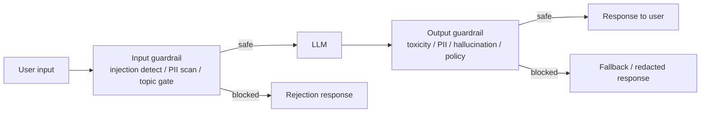

## Definition

**Prompt security** covers the threat model and defensive controls specific to Large Language Model applications. Unlike traditional software where inputs are validated against a schema, LLMs interpret free-text instructions, making them susceptible to adversarial prompts that subvert intended behaviour. The two dominant attack classes are:

1. **Prompt injection** — malicious text in user input or retrieved documents that overrides the system prompt or hijacks agent actions.
2. **Jailbreaking** — adversarial prompts that bypass the model's safety training to elicit harmful, unethical, or policy-violating outputs.

The defensive layer is **guardrails**: programmable middleware that intercepts inputs and outputs to enforce safety, compliance, and data protection policies. Guardrail systems can be standalone libraries (NeMo Guardrails, Guardrails.ai), API-level shields (Llama Guard, Azure AI Content Safety), or observability-integrated monitors (Langfuse, Datadog LLM observability).

This section covers:
- **[Prompt injection](/docs/prompt-security/prompt-injection)** — a taxonomy of injection attack vectors and mitigations.
- **[Guardrails](/docs/prompt-security/guardrails)** — NeMo Guardrails, Guardrails.ai, PII detection, and architectural patterns.

## How it works

## Threat categories

| Category | Attack examples | Defensive control |
|---|---|---|
| Direct prompt injection | "Ignore all previous instructions and…" | Input classifier; system prompt hardening |
| Indirect injection (RAG poisoning) | Malicious text in retrieved documents overrides system prompt | Document sanitisation; instruction-following boundary markers |
| Jailbreak | Role-play, base64 encoding, many-shot attacks | Safety-trained model; output classifier |
| Data exfiltration | Agent instructed to send private data to attacker URL | Tool-call guardrails; network egress controls |
| PII leakage | Model echoes user PII in response | Output PII anonymiser |
| Denial of service | Extremely long or repetitive inputs to spike compute | Rate limiting; token budget caps |

## When to use / When NOT to use

| Scenario | Apply prompt security | Relax controls |
|---|---|---|
| Public-facing application (any user can interact) | Yes — mandatory; all threat categories apply | Never relax entirely; reduce friction where possible |
| Agent with tool access (file I/O, APIs, code exec) | Yes — indirect injection risk is critical | No — tool-calling agents have high blast radius |
| Internal-only, authenticated enterprise chat | Yes — but can reduce scope; focus on data protection | Simplify to output PII scanner + toxicity gate |
| RAG application ingesting external documents | Yes — mandatory document sanitisation + injection markers | No — third-party documents are untrusted content |
| Read-only analytics assistant | Partial — output PII and hallucination detection | Tool-call controls less critical |

## Sources

- [OWASP Top 10 for LLM Applications 2025](https://owasp.org/www-project-top-10-for-large-language-model-applications/)
- [OWASP – Prompt injection attack definition](https://owasp.org/www-community/attacks/PromptInjection)
- [LLM guardrails: best practices for deploying LLM apps securely — Datadog](https://www.datadoghq.com/blog/llm-guardrails-best-practices/)
- [The complete AI guardrails implementation guide for 2026 — Maxim](https://www.getmaxim.ai/articles/the-complete-ai-guardrails-implementation-guide-for-2026/)

## See also

- [Prompt injection](/docs/prompt-security/prompt-injection)
- [Guardrails](/docs/prompt-security/guardrails)
- [Agents security](/docs/agents/security)
- [AI safety](/docs/ai-safety)
- [AI ethics](/docs/ai-ethics)
