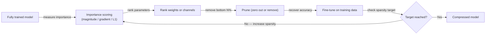
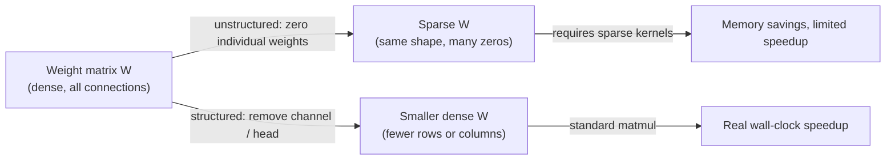

## Definition

Pruning is a [model compression](/docs/model-compression) technique that removes redundant or low-importance components from a trained neural network to reduce its size, memory footprint, and computational cost. The core insight is that most neural networks are over-parameterized: many weights contribute negligibly to the model's predictions and can be zeroed out or removed without substantially affecting accuracy. By identifying and eliminating these redundant parameters, pruning produces smaller, cheaper models suitable for edge or production deployment.

Two fundamentally different approaches exist. **Unstructured pruning** removes individual weight connections regardless of their position in the weight matrix, resulting in sparse tensors. While sparse weights reduce parameter count and storage, standard dense hardware (GPU matrix multiplication units) does not speed up automatically — sparse acceleration requires specialized sparse kernels or dedicated hardware. **Structured pruning**, by contrast, removes entire regular blocks: individual neurons, convolutional output channels, attention heads, or transformer layers. Because the resulting model has a smaller dense architecture, it achieves real wall-clock speedups on commodity hardware without any sparsity-aware runtime.

Pruning is most effective when combined with other [model compression](/docs/model-compression) techniques. A common pipeline is: train a full model → distill into a smaller student (see [knowledge distillation](/docs/knowledge-distillation)) → apply structured pruning → fine-tune → quantize. The multi-step approach exploits the complementary strengths of each technique and produces models that are significantly smaller and faster than any single method achieves.

## How it works

### Iterative pruning pipeline



### Unstructured vs structured



### Importance scoring methods

| Method | Score definition | Pros | Cons |
|--------|-----------------|------|------|
| Magnitude | Absolute weight value | Fast, no data needed | May remove important small weights |
| Gradient-based | Weight × gradient | Data-driven, more accurate | Requires a backward pass |
| Taylor expansion | First-order loss sensitivity | Good accuracy-sparsity trade-off | Computationally heavier |
| Learned mask | Binary mask trained with L0/L1 | Model-adaptive | Requires training-time regularization |

## When to use / When NOT to use

| Scenario | Use pruning | Do NOT use pruning |
|----------|------------|-------------------|
| Need real wall-clock speedup on commodity hardware | Yes — structured pruning achieves this | |
| Large transformer with many redundant attention heads | Yes — head pruning with minimal accuracy cost | |
| Combining with quantization for maximum compression | Yes — prune first, then quantize | |
| Storage reduction without requiring hardware speedup | Yes — unstructured pruning reduces model file size | |
| Very small models where any parameter matters | | Compression budget may not justify the effort |
| Models without access to training data for fine-tuning | | One-shot pruning without fine-tuning degrades accuracy significantly |

## Pros and cons

| Pros | Cons |
|------|------|
| Structured pruning achieves real hardware speedups | Unstructured pruning provides limited speedup without sparse hardware |
| Can target specific bottlenecks (heads, channels, layers) | Fine-tuning after pruning requires training data and compute |
| Reduces model file size for storage and transfer | Iterative pruning + fine-tune cycles are time-consuming |
| Complementary to quantization and distillation | Removing too many parameters can cause unrecoverable accuracy loss |

## Code examples

```python
# Structured channel pruning with PyTorch
import torch
import torch.nn.utils.prune as prune

model = MyCNNModel()
model.load_state_dict(torch.load("model.pt"))

# Unstructured L1 pruning: remove 30% of weights in a Conv2d layer by magnitude
prune.l1_unstructured(model.conv1, name="weight", amount=0.3)

# Check sparsity
sparsity = float(torch.sum(model.conv1.weight == 0)) / model.conv1.weight.numel()
print(f"Sparsity in conv1: {sparsity:.1%}")

# Make pruning permanent (remove the mask, keep zeroed weights)
prune.remove(model.conv1, "weight")

# Global unstructured pruning across all Conv2d layers
parameters_to_prune = [
    (module, "weight")
    for module in model.modules()
    if isinstance(module, torch.nn.Conv2d)
]
prune.global_unstructured(
    parameters_to_prune,
    pruning_method=prune.L1Unstructured,
    amount=0.4,  # remove 40% of weights globally
)

# After pruning: fine-tune for 1–3 epochs to recover accuracy
optimizer = torch.optim.Adam(model.parameters(), lr=1e-4)
# ... standard training loop
```

## Practical resources

- [TensorFlow — Pruning guide](https://www.tensorflow.org/model_optimization/guide/pruning) — Keras-based magnitude pruning with fine-tuning
- [PyTorch — Pruning tutorial](https://pytorch.org/tutorials/intermediate/pruning_tutorial.html) — Unstructured and structured pruning with `torch.nn.utils.prune`
- [SparseGPT paper](https://arxiv.org/abs/2301.00774) — One-shot pruning for large language models without retraining
- [Wanda paper](https://arxiv.org/abs/2306.11695) — Simple, calibration-free LLM pruning using weight and activation magnitudes

## See also

- [Model compression](/docs/model-compression)
- [Knowledge distillation](/docs/knowledge-distillation)
