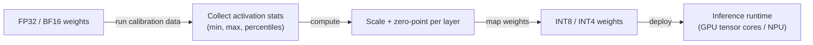
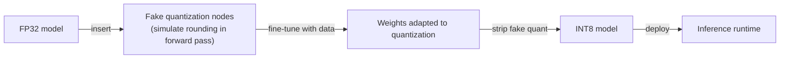

## Definition

Quantization is the process of representing neural network weights — and optionally activations — in lower numerical precision than the original training format (typically FP32 or BF16). By mapping floating-point values to a discrete integer range (INT8, INT4, INT2), quantization reduces model memory by 2–8x and enables faster inference on hardware with integer compute units such as GPU tensor cores, NPUs, and dedicated inference accelerators.

In practice, quantization is the most commonly applied [model compression](/docs/model-compression) technique for [LLMs](/docs/llms) because it requires no architecture changes, works post-training, and delivers memory reductions large enough to shift a model from server-grade hardware to consumer hardware. A 70B parameter model in FP16 requires approximately 140 GB of VRAM; the same model quantized to INT4 fits in around 35 GB, making it runnable on a dual-GPU workstation. The accuracy cost is typically small (1–3% on downstream benchmarks) for INT8, and manageable for INT4 with calibration-aware methods.

Quantization exists on a spectrum of approaches: **post-training quantization (PTQ)** applies the conversion after training using a small calibration dataset, while **quantization-aware training (QAT)** fine-tunes the model with simulated quantization so weights learn to be robust to the precision reduction. Modern LLM quantization schemes like GPTQ, AWQ, and GGUF integrate calibration and packing strategies that go beyond naive weight rounding, preserving accuracy even at INT4 precision.

## How it works

### Post-training quantization (PTQ)



### Quantization-aware training (QAT)



### Common quantization schemes

| Scheme | Precision | Method | Best for |
|--------|-----------|--------|---------|
| Dynamic INT8 | INT8 | Quantize activations at runtime | CPU inference, NLP |
| Static INT8 | INT8 | Calibrate activations offline | Low-latency GPU serving |
| GPTQ | INT4 | Second-order weight quantization | LLM serving on consumer GPUs |
| AWQ | INT4 | Activation-aware weight quantization | LLM serving, low accuracy loss |
| GGUF (llama.cpp) | INT2–INT8 | Mixed-precision per tensor | Local inference on CPU / Apple Silicon |
| QAT | INT8 | Train with simulated quantization | Highest accuracy at INT8 |

## When to use / When NOT to use

| Scenario | Use quantization | Do NOT use quantization |
|----------|-----------------|------------------------|
| Running a large LLM on a consumer GPU | Yes — INT4 cuts memory 4–8x | |
| Reducing inference latency in production | Yes — INT8 accelerates throughput on modern hardware | |
| Deploying models on mobile or edge hardware | Yes — TFLite and ONNX support INT8 natively | |
| Maximum accuracy on a well-resourced server | | Serve FP16 or BF16 if memory and cost allow |
| Very small models where accuracy loss is significant | | Distillation or pruning may be more appropriate |
| Models with unusual activation distributions | | Standard PTQ may fail; QAT or activation-aware methods needed |

## Pros and cons

| Pros | Cons |
|------|------|
| Large memory reduction (2–8x) with minimal accuracy loss | Accuracy degradation increases at aggressive precision (INT2/INT3) |
| PTQ requires no retraining — fast to apply | Calibration quality affects accuracy; needs representative data |
| Widely supported by runtimes (TFLite, ONNX, vLLM) | Requires hardware support for integer ops to see speedups |
| Enables LLM deployment on consumer and edge hardware | Activation quantization harder than weight-only quantization |

## Code examples

```python
# Static INT8 post-training quantization with PyTorch
import torch
import torch.quantization

model = MyModel()
model.load_state_dict(torch.load("model.pt"))
model.eval()  # set to inference mode

# Fuse BatchNorm and Conv for quantization efficiency
model_fused = torch.quantization.fuse_modules(model, [["conv", "bn", "relu"]])

# Set quantization config (fbgemm for x86, qnnpack for ARM/mobile)
model_fused.qconfig = torch.quantization.get_default_qconfig("fbgemm")
torch.quantization.prepare(model_fused, inplace=True)

# Calibration pass — run representative data to collect activation statistics
with torch.no_grad():
    for x_batch, _ in calibration_loader:
        model_fused(x_batch)

# Convert weights and activations to INT8
quantized_model = torch.quantization.convert(model_fused, inplace=True)

# Verify size reduction
original_params = sum(p.numel() for p in model.parameters())
quantized_params = sum(p.numel() for p in quantized_model.parameters())
print(f"Parameter count: {original_params:,} (same; precision changed, not count)")
print("INT8 model ready — memory footprint reduced ~4x vs FP32")

# Save quantized model
torch.save(quantized_model.state_dict(), "model_int8.pt")
```

## Practical resources

- [PyTorch — Quantization](https://pytorch.org/docs/stable/quantization.html) — PTQ, QAT, and dynamic quantization API
- [TensorFlow Lite — Quantization guide](https://www.tensorflow.org/lite/performance/quantization) — Post-training and QAT for mobile
- [GPTQ paper](https://arxiv.org/abs/2210.17323) — Accurate post-training quantization for generative pre-trained transformers
- [AWQ paper](https://arxiv.org/abs/2306.00978) — Activation-aware weight quantization for on-device LLMs
- [llama.cpp GGUF format](https://github.com/ggerganov/llama.cpp) — Local inference with flexible per-tensor mixed precision

## See also

- [Model compression](/docs/model-compression)
- [Pruning](/docs/pruning)
- [Knowledge distillation](/docs/knowledge-distillation)
- [Local inference](/docs/local-inference)
- [Edge reasoning](/docs/edge-reasoning)
- [Infrastructure](/docs/infrastructure)
