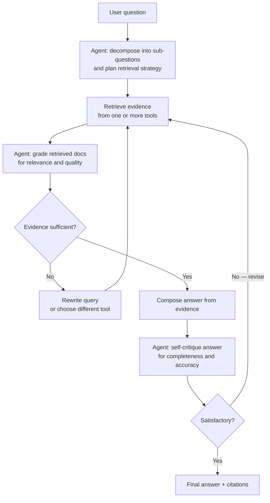

## Definition

**Agentic RAG** transforms retrieval from a fixed one-shot pipeline into a **dynamic control loop**. Instead of embedding a query, fetching the top-k chunks, and sending them to an LLM, an agentic RAG system uses an **agent** (an LLM with tool access) to orchestrate retrieval: planning what to search for, evaluating the quality of what it finds, deciding whether to re-query, and only composing an answer when evidence is sufficient.

The key shift: in naive RAG, retrieval is deterministic and happens once. In agentic RAG, retrieval is **iterative, adaptive, and self-correcting**. The agent can:

- Decompose a complex question into sub-questions and retrieve for each.
- Choose between multiple retrieval tools (vector search, keyword search, SQL, web).
- Grade retrieved documents for relevance and discard weak evidence.
- Rewrite the query and retry if initial results are poor.
- Detect contradictions in retrieved evidence and resolve them with further retrieval.

Research benchmarks consistently show that agentic RAG outperforms static pipelines on complex queries: one study found static RAG at 34% accuracy on multi-hop questions, agentic RAG at 78%.

## How it works

### Core loop



### Planning (query decomposition)

When a question is complex or multi-part, the agent decomposes it into a sequence of atomic sub-questions, each with a targeted retrieval plan. For example, "Compare the energy consumption of GPT-4 and Gemini Ultra" becomes two separate retrieval tasks. Planning can be explicit (the agent writes a retrieval plan before acting) or implicit (the agent interleaves thinking and retrieval steps via ReAct-style prompting).

### Retrieval tool use

The agent has access to one or more retrieval tools, selected per sub-question:

| Tool | Best for |
|---|---|
| **Vector search** | Semantic similarity, fuzzy matching |
| **Keyword / BM25 search** | Exact terms, proper nouns, code |
| **SQL / structured query** | Tabular data, filters, aggregations |
| **Web search** | Real-time or out-of-corpus information |
| **GraphRAG** | Entity relationships, thematic queries |

Routing between tools is a form of **context engineering**: the agent selects the retrieval method whose output type best fits the sub-question.

### Document grading and self-correction

After each retrieval, the agent grades the results for relevance. Irrelevant or low-quality documents are filtered before being added to context. If retrieval quality is poor, the agent rewrites the query — changing keywords, broadening the search scope, or switching tools — and retries. This self-correction loop is the mechanism that drives the accuracy improvement over static pipelines.

### Reflection

The **reflection** step prompts the agent to critique its own draft answer: Is it complete? Is it grounded in the retrieved evidence? Are there contradictions? Reflection is optional but adds robustness for high-stakes tasks (medical, legal, financial Q&A).

### Agentic RAG vs naive RAG

| Dimension | Naive vector RAG | Agentic RAG |
|---|---|---|
| **Retrieval strategy** | Fixed: embed → top-k fetch | Dynamic: plan → retrieve → grade → loop |
| **Query handling** | Single query, single retrieval | Multi-step decomposition |
| **Evidence quality** | All top-k chunks used as-is | Graded; weak evidence discarded |
| **Multi-hop questions** | Poor | Strong (iterative sub-question chaining) |
| **Latency** | Low (single pass) | Higher (multiple LLM + retrieval calls) |
| **Cost** | Low | Higher (multiple model calls per query) |
| **Hallucination risk** | Medium | Lower (self-correction reduces grounding errors) |
| **Implementation complexity** | Low | Higher (requires agent framework) |

## When to use / When NOT to use

| Use when | Avoid when |
|---|---|
| Questions require **multi-hop reasoning** across multiple documents | Questions are simple and factual — single-pass RAG is faster and cheaper |
| Evidence quality is **uncertain** and grading + re-querying is warranted | Latency is critical — the loop adds multiple round-trips |
| Multiple **retrieval tools** exist and the right one depends on the sub-question | Your retrieval corpus is small and well-curated — naive RAG will do |
| Answers must be **highly grounded** (medical, legal, compliance) and self-correction reduces hallucination risk | You have no agentic framework set up — naive RAG is simpler to implement |
| The corpus is **heterogeneous** (structured + unstructured data) and tool routing is needed | Costs are tightly constrained — each loop iteration multiplies LLM calls |

## Context engineering note

Agentic RAG exposes retrieval as a **context engineering problem**: the agent's job is to fill the LLM's context window with the *right* evidence at the *right* time. This means:

- Retrieval is no longer a single transformation — it is a series of context construction decisions.
- The agent must balance context richness (more evidence = more accurate) against context length (more tokens = more cost and potential distraction).
- Grounding quality scales with the agent's ability to select, filter, and organize retrieved evidence — not just with retrieval recall.

This framing connects agentic RAG to the broader discipline of context engineering: designing the full pipeline that governs what information flows into an LLM context window.

## Practical guidance

### LangGraph agentic RAG pattern

```python
from langgraph.graph import StateGraph, END
from langchain_core.messages import HumanMessage
from typing import TypedDict, List

class RAGState(TypedDict):
    question: str
    sub_questions: List[str]
    retrieved_docs: List[str]
    answer: str
    iterations: int

def plan_node(state: RAGState) -> RAGState:
    """Decompose the question into sub-questions."""
    # LLM call: decompose state["question"]
    ...

def retrieve_node(state: RAGState) -> RAGState:
    """Retrieve evidence for each sub-question."""
    # Vector search + grading for each sub-question
    ...

def compose_node(state: RAGState) -> RAGState:
    """Compose a grounded answer from retrieved evidence."""
    ...

def should_retry(state: RAGState) -> str:
    """Decide whether to retry retrieval or return the answer."""
    if state["iterations"] >= 3:
        return "compose"
    if evidence_quality_ok(state["retrieved_docs"]):
        return "compose"
    return "retrieve"

graph = StateGraph(RAGState)
graph.add_node("plan", plan_node)
graph.add_node("retrieve", retrieve_node)
graph.add_node("compose", compose_node)

graph.set_entry_point("plan")
graph.add_edge("plan", "retrieve")
graph.add_conditional_edges("retrieve", should_retry, {"retrieve": "retrieve", "compose": "compose"})
graph.add_edge("compose", END)

app = graph.compile()
result = app.invoke({"question": "How does GraphRAG differ from naive RAG?", "iterations": 0})
```

## Sources

- [Agentic RAG vs Classic RAG — Towards Data Science](https://towardsdatascience.com/agentic-rag-vs-classic-rag-from-a-pipeline-to-a-control-loop/)
- [Agentic Retrieval-Augmented Generation: A Survey — arXiv 2501.09136](https://arxiv.org/html/2501.09136v4)
- [Agentic RAG explained — MachineLearningMastery](https://machinelearningmastery.com/agentic-rag-explained-in-3-levels-of-difficulty/)
- [From RAG to Context — 2025 year-end review (RAGFlow)](https://ragflow.io/blog/rag-review-2025-from-rag-to-context)
- [Next-Generation Agentic RAG with LangGraph 2026 — Medium](https://medium.com/@vinodkrane/next-generation-agentic-rag-with-langgraph-2026-edition-d1c4c068d2b8)

## See also

- [RAG architecture](/docs/rag/architecture)
- [GraphRAG](/docs/rag/graphrag)
- [AI agents](/docs/agents)
- [RAG overview](/docs/rag)
- [Vector databases](/docs/rag/vector-databases)
