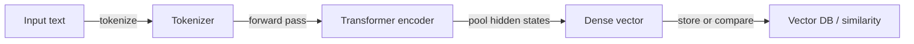
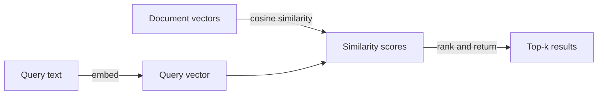

## Definition

Embeddings are dense, fixed-size numerical vectors that encode the semantic meaning of text (or other data modalities such as images and audio). When text is passed through an encoder model, semantically similar content produces vectors that are geometrically close in the high-dimensional space — so phrases like "customer support" and "help desk" will have nearby vectors if trained on similar data.

They are the bridge between raw text and [vector databases](/docs/rag/vector-databases). Both documents and queries must be embedded using the **same encoder** so that their vectors live in the same space and meaningful similarity comparisons can be made. The most common similarity metric is **cosine similarity**, though dot product and Euclidean distance are also used depending on the index configuration.

The choice of embedding model is one of the highest-impact decisions in a [RAG](/docs/rag) system. Factors include vector dimensionality (higher = more expressive but more storage), context window (how much text the encoder processes at once), domain specificity (a legal or biomedical model may outperform a general-purpose one), multilingual support, and cost (API vs. self-hosted). Popular options include OpenAI `text-embedding-3-large`, Cohere Embed, and open-source `sentence-transformers`. See [RAG architecture](/docs/rag/architecture) for how embeddings fit into the full pipeline.

## How it works

### Encoding pipeline



### Similarity search



**Text** (a sentence, paragraph, or chunk) is fed into an **encoder** (e.g. OpenAI embeddings, Cohere, or open-source sentence-transformers). The encoder outputs a fixed-size **vector** (e.g. 768 or 1536 dimensions). Training uses contrastive or similar objectives so that semantically related texts get nearby vectors. At query time, similarity is computed as cosine or dot product between the query vector and stored document vectors. Models can be multilingual or domain-specific. For [RAG](/docs/rag), always use the same encoder for documents and queries so distances are meaningful.

## When to use / When NOT to use

| Scenario | Use embeddings | Don't use embeddings |
|---|---|---|
| Semantic search ("find similar meaning") | Yes — embeddings capture semantic intent | No — keyword search if exact string match is needed |
| Multilingual retrieval | Yes — multilingual encoders map languages to same space | No — language-specific BM25 if you only have one language |
| Short queries against long documents | Yes — embed query and chunked docs | No — embedding entire long documents without chunking loses precision |
| Exact lookup by ID or structured field | No — use a relational DB or metadata filter | Yes — embeddings not needed for exact match |
| Low latency, limited compute | Consider smaller models (e.g. MiniLM) | Avoid large API-based models for every request |

## Comparisons

| Model | Dimensions | Context | Multilingual | Cost | Best for |
|---|---|---|---|---|---|
| OpenAI `text-embedding-3-large` | 3072 | 8191 tokens | Yes | API (paid) | High-accuracy production RAG |
| OpenAI `text-embedding-3-small` | 1536 | 8191 tokens | Yes | API (low cost) | Cost-sensitive apps |
| Cohere Embed v3 | 1024 | 512 tokens | Yes | API (paid) | Reranking + retrieval |
| `sentence-transformers/all-MiniLM-L6-v2` | 384 | 256 tokens | No | Self-hosted (free) | Low-latency or offline |
| `BAAI/bge-large-en-v1.5` | 1024 | 512 tokens | No | Self-hosted (free) | High-quality open-source |

## Pros and cons

| Pros | Cons |
|---|---|
| Captures semantic meaning, not just keywords | Vector space varies by model; can't mix encoders |
| Enables cross-lingual retrieval with multilingual models | Dimensionality increases storage and compute cost |
| Reusable: same vectors serve search, clustering, dedup | Quality depends heavily on model choice and domain fit |
| Fast at query time with ANN indexes | No interpretability — hard to debug why a chunk was returned |

## Code examples

```python
from openai import OpenAI

client = OpenAI()

def embed(text: str) -> list[float]:
    response = client.embeddings.create(
        model="text-embedding-3-small",
        input=text,
    )
    return response.data[0].embedding

# Embed a document chunk and a query
doc_vec = embed("The refund policy allows returns within 30 days.")
query_vec = embed("How long do I have to return a product?")

# Cosine similarity (manual)
import numpy as np
def cosine_sim(a, b):
    a, b = np.array(a), np.array(b)
    return float(np.dot(a, b) / (np.linalg.norm(a) * np.linalg.norm(b)))

print(f"Similarity: {cosine_sim(doc_vec, query_vec):.4f}")
```

## Practical resources

- [OpenAI – Embeddings guide](https://platform.openai.com/docs/guides/embeddings) — API usage, model comparison, and best practices
- [Hugging Face – Sentence Transformers](https://www.sbert.net/) — Open-source embedding models and evaluation benchmarks
- [MTEB leaderboard](https://huggingface.co/spaces/mteb/leaderboard) — Massive Text Embedding Benchmark for comparing models across tasks
- [Cohere – Embed API](https://docs.cohere.com/docs/embeddings) — Cohere embedding models with retrieval-optimized variants

## See also

- [RAG](/docs/rag)
- [Vector databases](/docs/rag/vector-databases)
- [RAG architecture](/docs/rag/architecture)
- [Semantic search](/docs/semantic-search)
