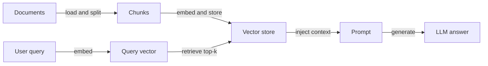
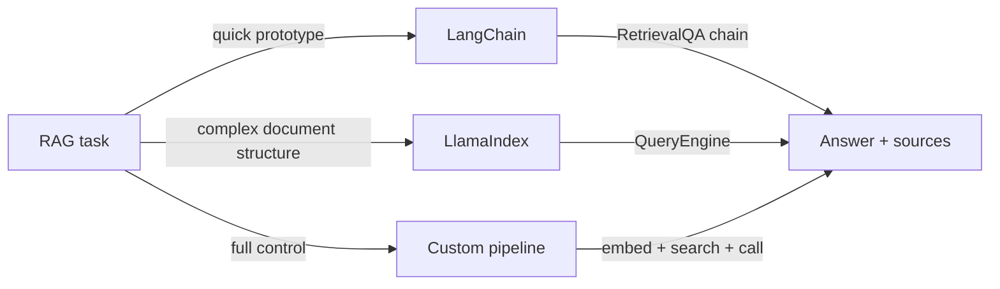

## Definition

This page collects concrete RAG examples: simple Q&A, document QA, and hybrid search with code you can adapt. Each example demonstrates a complete, runnable flow from document ingestion to answer generation.

Each example follows the same [RAG](/docs/rag) flow — index documents, embed query, retrieve, generate — but with different frameworks or options. The goal is to provide starting points you can drop into your own project and extend. Adjust [chunking](/docs/rag/architecture), [embeddings](/docs/rag/embeddings), and the [vector store](/docs/rag/vector-databases) to match your data volume, domain, and latency requirements.

Choosing the right example depends on your stack: LangChain is well-suited for quick prototypes with many built-in integrations; LlamaIndex excels at structured document ingestion and multi-index queries; a custom pipeline gives maximum control at the cost of more boilerplate. All three approaches produce the same conceptual output — retrieved context fed into an LLM call.

## How it works

### Pipeline overview



### Framework selection



## When to use / When NOT to use

| Scenario | Use these examples | Don't use |
|---|---|---|
| Prototyping a Q&A bot quickly | Yes — LangChain example is minimal | No — building a custom pipeline from scratch adds unnecessary time |
| Production app with custom chunking | Yes — custom pipeline example | No — framework defaults may not match your chunking strategy |
| Multi-document research over structured data | Yes — LlamaIndex example | No — LangChain generic chain may miss document structure |
| Single document that fits in context window | No — just pass the document directly | Yes — retrieval pipeline is unnecessary overhead |
| Hybrid search (semantic + keyword) | Yes — use Chroma or Weaviate with BM25 | No — single-vector search may miss keyword-critical queries |

## Code examples

### Example 1: minimal RAG with LangChain

```python
from langchain_openai import OpenAIEmbeddings, ChatOpenAI
from langchain_community.vectorstores import Chroma
from langchain.text_splitter import RecursiveCharacterTextSplitter
from langchain.chains import RetrievalQA
from langchain_community.document_loaders import TextLoader

# Load and chunk
loader = TextLoader("my_document.txt")
docs = loader.load()
splitter = RecursiveCharacterTextSplitter(chunk_size=500, chunk_overlap=50)
chunks = splitter.split_documents(docs)

# Index
vectorstore = Chroma.from_documents(chunks, OpenAIEmbeddings())

# Retrieve and generate
qa = RetrievalQA.from_chain_type(
    llm=ChatOpenAI(model="gpt-4o-mini"),
    retriever=vectorstore.as_retriever(search_kwargs={"k": 4}),
    return_source_documents=True,
)

result = qa.invoke({"query": "Summarize the main points."})
print(result["result"])
for doc in result["source_documents"]:
    print("Source:", doc.metadata)
```

### Example 2: document QA with LlamaIndex

```python
from llama_index.core import VectorStoreIndex, SimpleDirectoryReader

# Load all documents from a folder
documents = SimpleDirectoryReader("./docs_folder").load_data()

# Build index (embeds and stores automatically)
index = VectorStoreIndex.from_documents(documents)

# Query
query_engine = index.as_query_engine()
response = query_engine.query("What is the refund policy?")
print(response)
```

### Example 3: hybrid search (dense + keyword)

```python
from langchain_community.retrievers import BM25Retriever
from langchain.retrievers import EnsembleRetriever
from langchain_community.vectorstores import Chroma
from langchain_openai import OpenAIEmbeddings

# Dense retriever
vectorstore = Chroma.from_documents(chunks, OpenAIEmbeddings())
dense_retriever = vectorstore.as_retriever(search_kwargs={"k": 4})

# Sparse (BM25) retriever
bm25_retriever = BM25Retriever.from_documents(chunks)
bm25_retriever.k = 4

# Hybrid: combine both with equal weight
hybrid_retriever = EnsembleRetriever(
    retrievers=[bm25_retriever, dense_retriever],
    weights=[0.5, 0.5],
)

results = hybrid_retriever.invoke("product return window")
for r in results:
    print(r.page_content[:200])
```

## Practical resources

- [LangChain – Question answering](https://python.langchain.com/docs/use_cases/question_answering/) — Full walkthrough of RAG with LangChain components
- [LlamaIndex – RAG tutorial](https://docs.llamaindex.ai/en/stable/getting_started/starter_example/) — Starter example for document indexing and querying
- [Chroma – Quickstart](https://docs.trychroma.com/getting-started) — Setting up a local vector store for development
- [OpenAI Cookbook – RAG](https://cookbook.openai.com/examples/question_answering_using_embeddings) — Step-by-step RAG example with OpenAI embeddings

## See also

- [RAG](/docs/rag)
- [RAG architecture](/docs/rag/architecture)
- [Tools: LangChain](/docs/tools/langchain)
- [Tools: LlamaIndex](/docs/tools/llamaindex)
