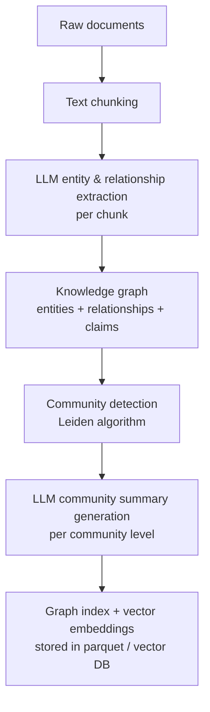
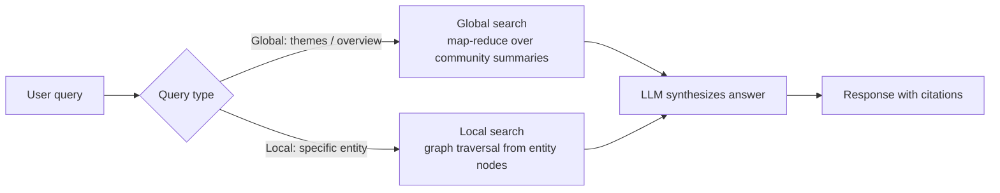

## Definition

**GraphRAG** (Graph Retrieval-Augmented Generation) is an open-source framework developed by **Microsoft Research** that augments standard RAG with a knowledge graph built from the source corpus. Instead of retrieving raw text chunks by vector similarity, GraphRAG first extracts **entities** (people, places, concepts, events) and their **relationships** from the documents, organizes them into a hierarchical graph, and then generates **community summaries** — concise natural-language descriptions of clusters of related entities.

At query time, two retrieval strategies are available:

- **Global search** — answers "whole-corpus" questions (e.g., "What are the main themes in this dataset?") by aggregating community summaries that span the entire graph.
- **Local search** — answers entity-specific questions by traversing the graph from relevant entities outward through their relationships and associated text chunks.

This dual-mode retrieval addresses the core limitation of naive vector RAG: vector similarity retrieves documents that are *locally* similar to the query but cannot reason about *global* patterns across an entire corpus.

GraphRAG was open-sourced on GitHub in mid-2024 and has been significantly extended through 2025, including **LazyGraphRAG** — a variant that skips the expensive up-front summarization step.

## How it works

### Indexing pipeline

The offline indexing phase is GraphRAG's most distinctive step and its primary cost center.

1. **Chunking** — Documents are split into text units (default ~300 tokens with overlap).
2. **Entity and relationship extraction** — An LLM reads each chunk and extracts structured triples: `(entity_name, entity_type, description)` and `(source, target, relationship_description)`.
3. **Graph construction** — Extracted entities and relationships are merged into a global property graph; duplicate entities are resolved by name matching.
4. **Community detection** — The Leiden algorithm partitions the graph into hierarchically nested communities (levels 0–3+), where communities at higher levels represent broader thematic clusters.
5. **Community summarization** — An LLM generates a natural-language summary for each community that describes its entities, key relationships, and themes. These summaries become the index for global queries.
6. **Vector embedding** — Entity descriptions, relationship descriptions, and text chunks are also embedded for local search.

### Query pipeline

**Global search** uses a map-reduce strategy: the query is sent to each community summary (in parallel), each produces a partial answer, and a final reduce step synthesizes them into a coherent response. This is expensive (many LLM calls) but unique to GraphRAG — no other RAG variant can answer global questions reliably.

**Local search** combines vector similarity (to find the most relevant text chunks) with graph traversal (to include related entities and their community context), producing richer context than pure vector RAG.

## When to use / When NOT to use

| Scenario | Use GraphRAG | Use naive vector RAG |
|---|---|---|
| Questions about **global patterns, themes, or overviews** ("What are the main risks in this corpus?") | Yes — community summaries are purpose-built | No — vector similarity misses global structure |
| **Entity-centric** queries with complex relationship chains | Yes — graph traversal connects related entities | Partial — may miss multi-hop relationships |
| Corpus is **stable and batch-updated** (research papers, legal documents) | Yes — up-front indexing cost amortizes over many queries | Either works |
| Corpus is **frequently updated** in real time | No — full reindexing is required for graph consistency | Yes — vector indices update incrementally |
| **Budget is constrained** (indexing costs 10–100× more in LLM calls than vector RAG) | Only if global queries justify the cost | Yes — much cheaper to index |
| Domain requires **traceable entity provenance** | Yes — citations link back to source chunks via entities | Partial — chunk-level citations only |
| Simple factual Q&A over a small corpus | Overkill | Yes — adequate and far cheaper |

## GraphRAG vs naive RAG

| Dimension | Naive vector RAG | GraphRAG (local) | GraphRAG (global) |
|---|---|---|---|
| **Retrieval unit** | Text chunks | Text chunks + entity graph nodes | Community summaries |
| **Query type strength** | Specific factual | Entity-specific with context | Thematic / whole-corpus |
| **Index cost** | Low (embed chunks) | High (LLM extraction + embedding) | High + summarization |
| **Update cost** | Low (incremental) | High (re-extract affected entities) | High (re-summarize communities) |
| **Multi-hop reasoning** | Poor | Good (graph traversal) | Excellent (community spans many hops) |
| **Hallucination risk** | Medium | Lower (structured entity context) | Lower (pre-computed summaries) |
| **Latency** | Low | Medium | High (map-reduce) |

## LazyGraphRAG

**LazyGraphRAG** (Microsoft Research, late 2024) is a cost-optimized variant that skips pre-generating community summaries. Instead, it uses **NLP-extracted noun phrases** (rather than LLM-extracted entities) to build a lightweight graph, and generates summaries **on demand** at query time from the relevant subgraph. This reduces indexing token costs dramatically (often 99%+) while retaining much of the global query quality. It is appropriate when query volume is low or corpus changes frequently.

## Practical resources

- [GraphRAG official documentation — Microsoft](https://microsoft.github.io/graphrag/)
- [GraphRAG GitHub repository](https://github.com/microsoft/graphrag)
- [Microsoft Research: GraphRAG announcement](https://www.microsoft.com/en-us/research/blog/graphrag-new-tool-for-complex-data-discovery-now-on-github/)
- [LazyGraphRAG — Microsoft Research blog](https://www.microsoft.com/en-us/research/blog/lazygraphrag-setting-a-new-standard-for-quality-and-cost/)
- [RAG vs GraphRAG — Weaviate deep-dive](https://weaviate.io/blog/graph-rag)

## Sources

- [Microsoft GraphRAG documentation](https://microsoft.github.io/graphrag/)
- [Microsoft Research — GraphRAG blog post](https://www.microsoft.com/en-us/research/blog/graphrag-new-tool-for-complex-data-discovery-now-on-github/)
- [LazyGraphRAG — new standard for quality and cost](https://www.microsoft.com/en-us/research/blog/lazygraphrag-setting-a-new-standard-for-quality-and-cost/)
- [Exploring RAG and GraphRAG — Weaviate](https://weaviate.io/blog/graph-rag)
- [RAG vs GraphRAG: Systematic Evaluation — arXiv 2502.11371](https://arxiv.org/html/2502.11371v2)
- [GraphRAG complete guide 2025 — Meilisearch](https://www.meilisearch.com/blog/graph-rag)

## See also

- [RAG overview](/docs/rag)
- [RAG architecture](/docs/rag/architecture)
- [Agentic RAG](/docs/rag/agentic-rag)
- [Vector databases](/docs/rag/vector-databases)
- [Embeddings](/docs/rag/embeddings)
