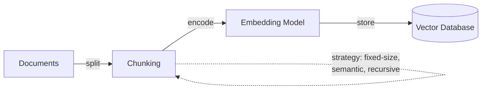
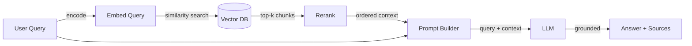

## Definition

**Retrieval-augmented generation (RAG)** is a technique that augments a large language model with an external retrieval step: given a user query, the system first retrieves relevant documents from a knowledge source (typically a vector store or search index), then passes those documents as context to the LLM to generate a grounded answer. This approach reduces hallucination by anchoring the model's output in real, verifiable data rather than relying solely on knowledge encoded during pre-training.

RAG emerged as a practical middle ground between two extremes — using a general-purpose LLM with no domain knowledge, and fine-tuning a model on domain-specific data. The original RAG architecture was proposed by [Lewis et al. (2020)](https://arxiv.org/abs/2005.11401) at Facebook AI, combining a retriever (based on Dense Passage Retrieval) with a sequence-to-sequence generator (BART). Since then, the pattern has evolved into a widely adopted architectural pattern with many variations across chunking strategies, retrieval methods, and generation techniques.

RAG is particularly important in enterprise and production settings because it allows organizations to leverage proprietary or frequently changing data without the cost and complexity of model fine-tuning. It also enables **source citation** — the system can point to the exact documents that informed its answer, which is critical for trust, compliance, and auditability in domains like legal, healthcare, and finance.

## How it works

### Indexing (offline)

Before RAG can answer queries, your knowledge base must be indexed. Documents are split into chunks (paragraphs, sections, or sliding windows), each chunk is converted into a dense vector using an [embedding model](/docs/rag/embeddings), and the resulting vectors are stored in a [vector database](/docs/rag/vector-databases). Chunking strategy significantly impacts retrieval quality — chunks too large dilute relevance, chunks too small lose context.



### Retrieval (query-time)

When a user sends a query, it is embedded using the same model, and the system performs a similarity search (cosine or dot product) against the vector database to retrieve the top-k most relevant chunks. Advanced RAG pipelines add a **reranking** step after initial retrieval to improve precision — a cross-encoder model scores each retrieved chunk against the query and reorders them.

### Generation (query-time)

The retrieved chunks are injected into the LLM prompt as context, alongside the original query. The LLM generates an answer grounded in this context. Prompt design matters here — instructions like "Answer using only the provided context" help reduce hallucination, while "If the context doesn't contain the answer, say so" prevents fabrication.



## When to use / When NOT to use

| Use when | Avoid when |
|----------|------------|
| Knowledge changes frequently (docs, FAQs, policies) and retraining is impractical | The knowledge is static and small enough to fit entirely in the prompt context window |
| You need answers grounded in private or domain-specific data | You need the model to learn a new behavior or style (fine-tuning is better) |
| Source citation and auditability are requirements | Latency is extremely critical and the retrieval step adds unacceptable delay |
| You want to keep costs low — no training compute needed | The domain requires reasoning across the entire corpus, not just retrieved chunks |
| Multiple data sources need to be queried (multi-index RAG) | Your data is mostly structured/tabular (SQL or structured queries may be more appropriate) |

## Comparisons

| Criteria | RAG | Fine-tuning |
|----------|-----|-------------|
| Knowledge update speed | Instant (update index) | Slow (retrain model) |
| Cost | Low (inference + embedding) | High (training compute + hosting) |
| Hallucination control | Strong (grounded in retrieved docs) | Moderate (depends on training data quality) |
| Source citation | Native (retrieved chunks are traceable) | Not supported |
| Custom behavior / style | Limited | Strong |
| Setup complexity | Moderate (chunking + vector DB + retrieval) | High (dataset curation + training pipeline) |

## Pros and cons

| Pros | Cons |
|------|------|
| Reduces hallucination by grounding in real data | Retrieval quality depends heavily on chunking and embedding choices |
| No need to retrain when knowledge changes | Adds latency from the retrieval step |
| Enables source citation for trust and compliance | Requires maintaining a vector database and indexing pipeline |
| Works with any LLM (API or self-hosted) | Context window limits how many chunks can be passed |
| Lower cost than fine-tuning for most use cases | "Garbage in, garbage out" — poor document quality propagates to answers |

## Benchmarks

- [RAGAS](https://docs.ragas.io/) — Framework for evaluating RAG pipelines (faithfulness, answer relevance, context precision/recall)
- [MTEB Leaderboard](https://huggingface.co/spaces/mteb/leaderboard) — Embedding model benchmarks relevant to RAG retrieval quality
- [RGB Benchmark](https://arxiv.org/abs/2309.01431) — Benchmarking retrieval-augmented generation across noise, rejection, integration, and counterfactual scenarios

## Code examples

### Basic RAG pipeline with LangChain (Python)

```python
from langchain_community.vectorstores import Chroma
from langchain_openai import OpenAIEmbeddings, ChatOpenAI
from langchain_core.prompts import ChatPromptTemplate

# 1. Index documents (one-time or incremental)
embeddings = OpenAIEmbeddings(model="text-embedding-3-small")
vectorstore = Chroma.from_documents(documents, embeddings)

# 2. Retrieve relevant chunks
query = "What is retrieval-augmented generation?"
docs = vectorstore.similarity_search(query, k=4)
context = "\n\n".join(d.page_content for d in docs)

# 3. Generate grounded answer
prompt = ChatPromptTemplate.from_messages([
    ("system", "Answer using only the context below. If the context "
               "doesn't contain the answer, say 'I don't know'.\n\n{context}"),
    ("human", "{question}"),
])

llm = ChatOpenAI(model="gpt-4o")
chain = prompt | llm
answer = chain.invoke({"context": context, "question": query})
print(answer.content)
```

### RAG with LlamaIndex (Python)

```python
from llama_index.core import VectorStoreIndex, SimpleDirectoryReader

# 1. Load and index documents
documents = SimpleDirectoryReader("./data").load_data()
index = VectorStoreIndex.from_documents(documents)

# 2. Query with built-in retrieval + generation
query_engine = index.as_query_engine(similarity_top_k=4)
response = query_engine.query("What is RAG?")
print(response)

# Access source nodes for citation
for node in response.source_nodes:
    print(f"Source: {node.metadata['file_name']} (score: {node.score:.3f})")
```

## Practical resources

- [RAG paper — Lewis et al. (2020)](https://arxiv.org/abs/2005.11401) — The original research paper introducing retrieval-augmented generation
- [LangChain RAG tutorial](https://python.langchain.com/docs/tutorials/rag/) — Step-by-step guide to building a RAG pipeline with LangChain
- [LlamaIndex RAG guide](https://docs.llamaindex.ai/en/stable/understanding/rag/) — Official LlamaIndex documentation on RAG concepts and implementation
- [Vertex AI RAG and grounding](https://cloud.google.com/vertex-ai/docs/generative-ai/grounding/overview) — RAG on Google Cloud with Vertex AI
- [Pinecone RAG guide](https://www.pinecone.io/learn/retrieval-augmented-generation/) — Practical guide covering chunking, embedding, and retrieval strategies

## See also

- [RAG architecture](/docs/rag/architecture)
- [Vector databases](/docs/rag/vector-databases)
- [Embeddings](/docs/rag/embeddings)
- [RAG examples](/docs/rag/examples)
- [LLMs](/docs/llms)
- [LangChain](/docs/tools/langchain)
- [LlamaIndex](/docs/tools/llamaindex)
