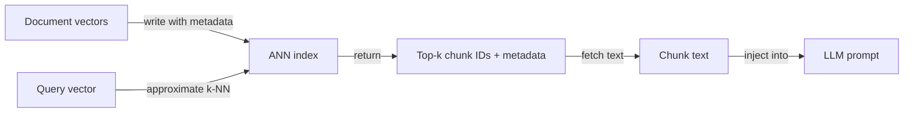
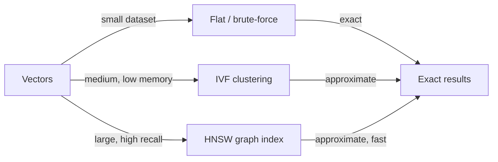

## Definition

Vector databases store high-dimensional vectors ([embeddings](/docs/rag/embeddings)) and support fast similarity search using algorithms such as k-nearest-neighbor (k-NN) and approximate nearest neighbor (ANN). They are the backbone of the retrieval layer in [RAG](/docs/rag) systems, enabling semantic search at scale over millions of document chunks.

They sit between [embeddings](/docs/rag/embeddings) (which produce the vectors) and the [RAG](/docs/rag) retriever (which needs the top-k chunks for a given query). Unlike traditional keyword-based databases, vector databases measure **semantic distance**: "customer support" can match "help desk" if the embedding model places them close together. Most vector databases also support metadata filtering — you can restrict retrieval to documents from a certain date, category, or source.

Choosing the right vector database depends on your requirements: managed vs. self-hosted, scale (thousands vs. hundreds of millions of vectors), metadata filtering capabilities, hybrid search support (dense + sparse), and whether you need multi-tenancy or access control. See [RAG architecture](/docs/rag/architecture) for how the index fits into the full pipeline.

## How it works

### Indexing and querying



### Index types



Documents are [embedded](/docs/rag/embeddings) and their vectors are written to an **index** (e.g. HNSW, IVF, or flat for small datasets). At query time, the **query vector** is compared against the index via **k-NN** (or approximate k-NN for scale); the index returns **top-k ids** and optionally stored metadata. You then fetch the corresponding chunks and pass them to the LLM. HNSW (Hierarchical Navigable Small World) is the most popular ANN algorithm — it offers sub-linear query time with high recall. Flat indexes are exact but O(n) and only suitable for small datasets.

## When to use / When NOT to use

| Scenario | Use vector DB | Don't use vector DB |
|---|---|---|
| Semantic search over large document corpora | Yes — ANN indexes handle scale | No — keyword search if you only need exact phrase matching |
| RAG with millions of chunks | Yes — purpose-built for vector scale | No — relational DBs with pgvector may suffice below ~1M vectors |
| Hybrid search (semantic + BM25) | Yes — Weaviate, Qdrant support hybrid natively | No — pure dense if your queries are always semantic |
| Multi-tenant SaaS with isolated namespaces | Yes — Pinecone and Weaviate support namespacing | No — self-hosted FAISS has no multi-tenancy |
| Offline, local development | Yes — Chroma or FAISS with zero infra | No — managed cloud DBs add cost and network latency for dev |

## Comparisons

| Database | Hosting | Scale | Hybrid search | Metadata filters | Best for |
|---|---|---|---|---|---|
| **Pinecone** | Managed cloud | Very large (billions) | Yes (sparse + dense) | Yes | Production at scale, no infra management |
| **Chroma** | Self-hosted / embedded | Small–medium | No (dense only) | Yes | Local dev, prototyping, Python-native |
| **Weaviate** | Self-hosted or cloud | Large | Yes (BM25 + dense) | Yes | Production with hybrid search |
| **FAISS** | Self-hosted (library) | Large | No | No | Research, offline batch search |
| **pgvector** | PostgreSQL extension | Medium | Partial (with FTS) | Yes (SQL) | Teams already on Postgres |
| **Qdrant** | Self-hosted or cloud | Large | Yes | Yes | Low-latency, Rust-based, open-source |

## Pros and cons

| Pros | Cons |
|---|---|
| Sub-linear query time with ANN indexes | ANN introduces recall tradeoff vs. exact search |
| Supports semantic similarity out of the box | Vector storage is expensive at very high dimensions |
| Metadata filters let you combine semantic + structured queries | Managed services add ongoing cloud cost |
| Scales horizontally for large corpora | No native understanding of text — depends on embedding quality |

## Code examples

```python
import chromadb
from openai import OpenAI

openai_client = OpenAI()
chroma_client = chromadb.Client()
collection = chroma_client.create_collection("my_docs")

# Helper: embed text
def embed(text: str) -> list[float]:
    return openai_client.embeddings.create(
        model="text-embedding-3-small",
        input=text,
    ).data[0].embedding

# Index documents
documents = [
    "Returns are accepted within 30 days of purchase.",
    "Shipping takes 3–5 business days.",
    "Contact support at support@example.com.",
]
collection.add(
    documents=documents,
    embeddings=[embed(d) for d in documents],
    ids=[f"doc_{i}" for i in range(len(documents))],
)

# Query
query = "What is the return window?"
results = collection.query(
    query_embeddings=[embed(query)],
    n_results=2,
)
for doc in results["documents"][0]:
    print(doc)
```

## Practical resources

- [Chroma – Get started](https://docs.trychroma.com/getting-started) — Embedded vector store for Python, ideal for local development
- [Pinecone – Vector database docs](https://docs.pinecone.io/) — Managed cloud vector DB with serverless and pod-based options
- [Weaviate – Documentation](https://weaviate.io/developers/weaviate) — Open-source vector DB with native hybrid search
- [FAISS – GitHub](https://github.com/facebookresearch/faiss) — Facebook AI Similarity Search library for local, high-performance indexing
- [pgvector – GitHub](https://github.com/pgvector/pgvector) — Vector similarity search extension for PostgreSQL

## See also

- [RAG](/docs/rag)
- [Embeddings](/docs/rag/embeddings)
- [RAG architecture](/docs/rag/architecture)
- [Semantic search](/docs/semantic-search)
