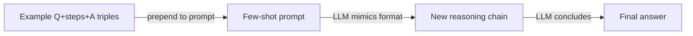

## Definition

Chain-of-thought (CoT) prompting asks the model to output intermediate reasoning steps before the final answer. This often improves accuracy on math, logic, and multi-step tasks by forcing the model to make its reasoning explicit rather than leaping directly to a conclusion.

CoT works because language models are autoregressive: each generated token attends to prior tokens. By generating a chain of reasoning steps first, the model essentially conditions its final answer on a more structured and elaborated context — reducing errors caused by skipping steps or making implicit assumptions.

It is one of the simplest [reasoning patterns](/docs/reasoning-patterns): no tools or search, just prompting. Use it when the task benefits from explicit steps (e.g. arithmetic, deduction) and you want to avoid [fine-tuning](/docs/llms/fine-tuning). For exploring multiple solution paths, see [tree of thoughts](/docs/reasoning-patterns/tot); for tool-using agents, see [ReAct](/docs/reasoning-patterns/react).

## How it works

### Zero-shot CoT


### Few-shot CoT



You give the model a **question** (or task) and ask it to reason step by step. The model produces **Step 1**, **Step 2**, … (intermediate reasoning) and then the **answer**. **Zero-shot CoT**: add "Let's think step by step" (or similar) to the prompt — no examples needed. **Few-shot CoT**: include example (question, steps, answer) triples so the model mimics the format. The model generates the full sequence in one pass; you can optionally parse the steps and verify or score them. Quality depends on [prompt engineering](/docs/prompt-engineering) and model capability.

## When to use / When NOT to use

| Scenario | Use CoT | Don't use CoT |
|---|---|---|
| Multi-step arithmetic or algebra | Yes — intermediate steps prevent calculation errors | No — simple single-step math doesn't need it |
| Logical deduction or inference | Yes — explicit steps make reasoning auditable | No — factual recall tasks don't benefit |
| Code planning or design decisions | Yes — writing out steps before code reduces bugs | No — generating boilerplate from a template |
| High-volume, low-latency inference | No — extra tokens increase cost and latency | Yes — avoid for simple classification or extraction |
| Model with strong built-in reasoning | Maybe — newer models reason internally (o1, o3) | Yes — forcing explicit CoT on thinking models adds redundancy |

## Comparisons

| Criteria | CoT | Self-consistency | Step-back prompting |
|---|---|---|---|
| Core idea | Single reasoning chain | Multiple CoT paths + majority vote | Abstract question first, then answer |
| Reliability | Moderate — one path may err | High — voting filters errors | High — abstraction reduces confusion |
| Cost (API calls) | 1 call | N calls (typically 5–20) | 2 calls |
| Best for | Math, logic, multi-step tasks | Tasks with verifiable answers | Knowledge-heavy, complex questions |
| Composability | Standalone or as building block | Builds on CoT | Builds on CoT |

## Pros and cons

| Pros | Cons |
|---|---|
| Simple to implement — just prompt engineering | Increases output length and token cost |
| No fine-tuning or special training needed | Model may generate plausible but incorrect steps |
| Makes reasoning inspectable and debuggable | Does not help with tasks that need external information |
| Works across many domains (math, logic, code) | Weaker benefit on small models vs. large ones |

## Code examples

```python
from openai import OpenAI

client = OpenAI()

SYSTEM_PROMPT = (
    "You are a careful reasoning assistant. "
    "When solving problems, always show your reasoning step by step "
    "before giving the final answer."
)

def cot_query(question: str) -> str:
    response = client.chat.completions.create(
        model="gpt-4o-mini",
        messages=[
            {"role": "system", "content": SYSTEM_PROMPT},
            {"role": "user", "content": question},
        ],
    )
    return response.choices[0].message.content

# Few-shot example
FEW_SHOT = """
Q: Roger has 5 tennis balls. He buys 2 more cans of tennis balls. Each can has 3 balls. How many does he have?
A: Roger starts with 5 balls. He buys 2 cans × 3 balls = 6 balls. Total: 5 + 6 = 11 balls.

Q: {question}
A:"""

def few_shot_cot(question: str) -> str:
    response = client.chat.completions.create(
        model="gpt-4o-mini",
        messages=[{"role": "user", "content": FEW_SHOT.format(question=question)}],
    )
    return response.choices[0].message.content

print(cot_query("A store has 40 apples. They sell 15 and receive 3 new shipments of 10. How many are left?"))
```

## Practical resources

- [Chain-of-Thought Prompting (Wei et al.)](https://arxiv.org/abs/2201.11903) — Original paper introducing CoT prompting
- [OpenAI – Prompt engineering](https://platform.openai.com/docs/guides/prompt-engineering) — Includes reasoning and step-by-step guidance
- [Self-consistency improves CoT (Wang et al.)](https://arxiv.org/abs/2203.11171) — Majority-voting over multiple CoT paths for higher reliability

## See also

- [Reasoning patterns](/docs/reasoning-patterns)
- [Tree of thoughts](/docs/reasoning-patterns/tot)
- [Prompt engineering](/docs/prompt-engineering)
- [Self-consistency](/docs/prompt-engineering/self-consistency)
- [Step-back prompting](/docs/prompt-engineering/step-back-prompting)
