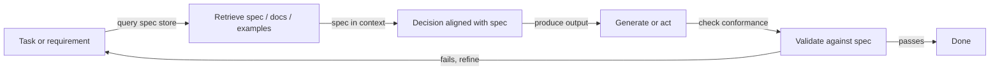
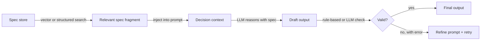

## Definition

**RDD (retrieval-decision-design)** is a reasoning pattern that ties together **retrieval** (fetching relevant specs, docs, or examples), **decision** (making choices aligned with specs or policies), and **design** (producing outputs that satisfy requirements). It is often used in spec-driven development: behavior is guided by explicit specifications that are retrieved and enforced during generation.

Unlike [CoT](/docs/reasoning-patterns/cot), which generates reasoning from the model's internal knowledge, or [ReAct](/docs/reasoning-patterns/react), which interleaves reasoning with arbitrary tool calls, RDD constrains every decision against a retrieved source of truth. This makes it particularly well-suited for regulated domains (legal, compliance, safety) or engineering workflows where code or configurations must conform to documented specifications.

RDD can be implemented as a single-pass pipeline (retrieve → decide → generate → validate) or as a loop inside an [agent](/docs/agents), where failed validation triggers re-retrieval and refinement. The pattern is composable: RDD's retrieval step can be powered by a [RAG](/docs/rag) pipeline, and its agent loop can use [ReAct](/docs/reasoning-patterns/react) for step-level reasoning.

## How it works

### RDD cycle



### Steps in detail



1. **Retrieval:** Given the current task, retrieve relevant specification fragments, examples, or constraints (e.g. from a vector store or structured specs).
2. **Decision:** Use the retrieved context to decide next steps, allowed actions, or output format — the spec is always in context during reasoning.
3. **Design:** Generate or execute in line with the spec; optionally validate outputs against the spec before returning.

This can be implemented in an [agent](/docs/agents) loop: retrieve spec → reason with spec in context → act or generate → validate → repeat. Failed validation triggers re-retrieval (possibly with a different query) or prompt refinement.

## When to use / When NOT to use

| Scenario | Use RDD | Don't use RDD |
|---|---|---|
| Generating code that must conform to an API spec | Yes — retrieve the spec, generate, validate | No — freeform coding without formal constraints |
| Compliance-driven document generation | Yes — retrieve policy, generate aligned output | No — creative writing with no hard rules |
| Agents operating in regulated domains (legal, safety) | Yes — each decision is grounded in retrieved policy | No — casual Q&A with no compliance requirements |
| Engineering with versioned design documents | Yes — specs change; RDD always retrieves the latest | No — simple CRUD with no formal spec |
| Real-time inference with tight latency budgets | No — retrieval + validation adds latency | Yes — direct generation is faster for unconstrained tasks |

## Comparisons

| Pattern | Uses retrieved knowledge | Validates output | Spec-grounded | Best for |
|---|---|---|---|---|
| CoT | No (model's internal knowledge) | No | No | Math, logic |
| ReAct | Via tool calls | No | No | General tool-using agents |
| RAG | Yes (documents) | No | No | Knowledge Q&A |
| RDD | Yes (specs and docs) | Yes | Yes | Compliance, spec-driven generation |

## Pros and cons

| Pros | Cons |
|---|---|
| Outputs align with explicitly retrieved specs | Requires well-maintained, queryable spec store |
| Reduces drift and ad-hoc behavior | Extra retrieval and validation adds cost and latency |
| Audit trail: spec fragments are traceable in output | Spec coverage gaps lead to under-constrained decisions |
| Composable with RAG and ReAct | Spec design and maintenance is its own ongoing workload |
| Fits regulated or safety-critical workflows | Validation logic must be kept in sync with spec updates |

## Code examples

```python
from openai import OpenAI
from langchain_community.vectorstores import Chroma
from langchain_openai import OpenAIEmbeddings

client = OpenAI()
# Assume a Chroma vector store pre-loaded with spec fragments
spec_store = Chroma(
    collection_name="api_spec",
    embedding_function=OpenAIEmbeddings(),
)

def rdd_generate(task: str) -> str:
    # 1. Retrieve relevant spec fragments
    spec_docs = spec_store.similarity_search(task, k=3)
    spec_context = "\n\n".join(d.page_content for d in spec_docs)

    # 2. Decision + Design: generate with spec in context
    prompt = (
        f"You must follow the specifications below exactly.\n\n"
        f"SPECIFICATIONS:\n{spec_context}\n\n"
        f"TASK: {task}\n\n"
        f"Generate an output that strictly complies with the specifications."
    )
    response = client.chat.completions.create(
        model="gpt-4o-mini",
        messages=[{"role": "user", "content": prompt}],
    )
    draft = response.choices[0].message.content

    # 3. Validate (simple: ask model to check conformance)
    validation_prompt = (
        f"Check if the following output complies with the spec. "
        f"Reply with PASS or FAIL and a brief reason.\n\n"
        f"SPEC:\n{spec_context}\n\nOUTPUT:\n{draft}"
    )
    validation = client.chat.completions.create(
        model="gpt-4o-mini",
        messages=[{"role": "user", "content": validation_prompt}],
    ).choices[0].message.content

    if "FAIL" in validation.upper():
        return f"[Validation failed: {validation}]\nDraft:\n{draft}"
    return draft

result = rdd_generate("Generate a JSON API request to create a new user.")
print(result)
```

## Practical resources

- [RAG paper (Lewis et al.)](https://arxiv.org/abs/2005.11401) — Retrieval component used as the foundation for RDD's spec-fetching step
- [LangChain – Agents and tools](https://python.langchain.com/docs/concepts/agents/) — Orchestration patterns for building RDD-style loops
- [Constitutional AI (Anthropic)](https://arxiv.org/abs/2212.08073) — Related idea: using retrieved principles to guide and validate model outputs

## Sources

- [Retrieval-Augmented Generation for Knowledge-Intensive NLP Tasks (Lewis et al., 2020)](https://arxiv.org/abs/2005.11401) — Foundational RAG paper providing the retrieval basis for RDD's spec-fetching step.
- [Constitutional AI: Harmlessness from AI Feedback (Bai et al., 2022)](https://arxiv.org/abs/2212.08073) — Principle-based approach to guiding and validating model decisions against retrieved rules.
- [Self-RAG: Learning to Retrieve, Generate, and Critique through Self-Reflection (Asai et al., 2023)](https://arxiv.org/abs/2310.11511) — Extends retrieval-augmented generation with inline self-critique, complementary to RDD's validate step.
- [ReAct: Synergizing Reasoning and Acting in Language Models (Yao et al., 2022)](https://arxiv.org/abs/2210.03629) — Agent loop that RDD composes with for step-level reasoning within the retrieve–decide–design cycle.

## See also

- [Spec-driven development](/docs/spec-driven-development)
- [RAG](/docs/rag)
- [Agents](/docs/agents)
- [ReAct](/docs/reasoning-patterns/react)
