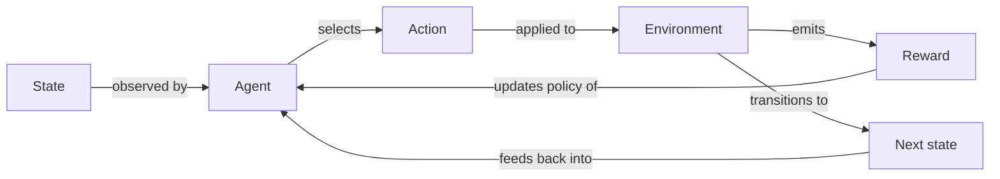

## Definition

Reinforcement learning (RL) is a machine learning paradigm where an agent learns to make decisions by interacting with an environment and receiving feedback in the form of rewards or penalties. Unlike supervised learning, there are no labeled input-output pairs; the agent must discover which actions yield the most cumulative reward through trial and error. The core objective is to find a **policy** — a mapping from states to actions — that maximizes long-term reward.

The mathematical framework underlying most RL problems is the **Markov Decision Process (MDP)**: a tuple of states, actions, transition probabilities, and rewards. At each time step, the agent observes the current state, selects an action, and transitions to a new state while receiving a reward signal. Because feedback is sparse and delayed (a reward may arrive long after the responsible action), the agent must reason about **credit assignment** across time.

RL differs fundamentally from [supervised](/docs/fundamentals/machine-learning) and [unsupervised](/docs/fundamentals/machine-learning) learning because the agent's actions influence future observations, requiring exploration strategies (e.g., epsilon-greedy, entropy bonuses) to discover better policies. It is applied across games, robotics, scheduling, and [LLM](/docs/llms) alignment via RLHF. When state or action spaces become high-dimensional, [deep RL](/docs/drl) uses neural networks for function approximation.

## How it works

### The MDP loop

At every step the **agent** observes a **state**, selects an **action**, and the **environment** returns a **reward** and the **next state**. This cycle repeats until termination or convergence.



### Value-based methods

Methods such as Q-learning and DQN learn a **value function** Q(s, a) — the expected cumulative reward from taking action *a* in state *s* — and derive the policy by acting greedily with respect to Q. The Bellman equation is used to iteratively update Q estimates using observed transitions.

### Policy gradient methods

Algorithms such as PPO and SAC directly parameterize and optimize the policy using gradient ascent on expected return. They handle continuous action spaces naturally and are preferred in robotics and LLM fine-tuning (RLHF). Actor-critic methods (e.g., A3C, SAC) combine a value function (critic) with a direct policy (actor) to reduce variance.

### Exploration

Because rewards are only observed for actions actually taken, the agent must **explore**: visit states it has not seen before to discover potentially better policies. Common strategies include epsilon-greedy (random action with probability ε), upper-confidence-bound (UCB), and entropy-based bonuses.

## When to use / When NOT to use

| Scenario | Use RL | Avoid RL |
|---|---|---|
| Sequential decisions with delayed feedback | Yes — RL is designed for this | No — prefer supervised if labels exist |
| Simulator or environment available for training | Yes — safe exploration in simulation | No — real-world-only with high failure cost |
| Reward signal can be defined clearly | Yes — well-specified reward guides learning | No — when reward is ambiguous or multi-objective without careful shaping |
| Large labeled dataset exists | No — supervised learning is simpler and faster | — |
| One-shot prediction (no time dimension) | No — regression or classification suffices | — |

## Comparisons

| Paradigm | Feedback type | Data source | Exploration needed |
|---|---|---|---|
| Supervised learning | Labeled pairs | Static dataset | No |
| Unsupervised learning | No labels | Static dataset | No |
| Reinforcement learning | Reward signal | Agent interactions | Yes |
| Imitation learning | Expert demonstrations | Human trajectories | Minimal |

## Pros and cons

| Pros | Cons |
|---|---|
| Learns from interaction without labeled data | Sample-inefficient — needs many environment steps |
| Can discover superhuman strategies (e.g., AlphaGo) | Reward shaping is non-trivial; misspecified reward leads to bad behavior |
| Applies to sequential, long-horizon problems | Training instability; hyperparameter sensitive |
| Enables continuous improvement from experience | Exploration in dangerous real-world settings is costly |

## Code examples

Basic Q-learning on a simple grid environment using Python:

```python
import numpy as np

# Environment: 5-state chain, action 0 = left, action 1 = right
n_states, n_actions = 5, 2
Q = np.zeros((n_states, n_actions))
alpha, gamma, epsilon = 0.1, 0.9, 0.1

def step(state, action):
    """Returns (next_state, reward)."""
    next_state = max(0, state - 1) if action == 0 else min(n_states - 1, state + 1)
    reward = 1.0 if next_state == n_states - 1 else 0.0
    return next_state, reward

for episode in range(500):
    state = 0
    for _ in range(20):
        # Epsilon-greedy action selection
        if np.random.rand() < epsilon:
            action = np.random.randint(n_actions)
        else:
            action = np.argmax(Q[state])

        next_state, reward = step(state, action)

        # Bellman update
        td_target = reward + gamma * np.max(Q[next_state])
        Q[state, action] += alpha * (td_target - Q[state, action])
        state = next_state

print("Learned Q-table:\n", Q)
```

## Practical resources

- [Reinforcement Learning: An Introduction (Sutton & Barto)](http://incompleteideas.net/book/the-book-2nd.html) — The canonical free textbook covering MDP theory, TD learning, and policy gradients
- [Spinning Up in Deep RL (OpenAI)](https://spinningup.openai.com/) — Practical guide with implementations of PPO, SAC, and DDPG
- [Gymnasium (formerly OpenAI Gym)](https://gymnasium.farama.org/) — Standard Python API for RL environments
- [Stable-Baselines3](https://stable-baselines3.readthedocs.io/) — Production-ready implementations of PPO, SAC, DQN, and more

## See also

- [Deep RL](/docs/drl)
- [Machine learning](/docs/fundamentals/machine-learning)
- [Agents](/docs/agents)
