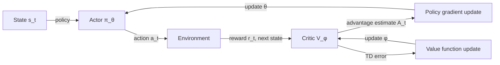

## Definition

Policy gradient methods are a family of reinforcement learning algorithms that directly parameterize and optimize the policy π_θ(a|s) — the probability distribution over actions given states — by computing gradients of expected return with respect to policy parameters θ. Unlike value-based methods (Q-learning, DQN) that learn a value function and derive the policy implicitly, policy gradient methods optimize the policy directly, making them naturally suited to continuous and high-dimensional action spaces.

The core insight is the **policy gradient theorem**: the gradient of expected return J(θ) with respect to policy parameters can be estimated from samples of environment interactions without knowing the transition model:

`∇_θ J(θ) = E[∇_θ log π_θ(a|s) · Q^π(s,a)]`

This expectation is estimated via Monte Carlo rollouts. A learned **baseline** (critic / value function) reduces variance. The actor-critic framework combines both: the **actor** is the policy, the **critic** is a learned value function that provides the baseline.

Key algorithms:

- **REINFORCE** — vanilla Monte Carlo policy gradient. Simple but high variance.
- **PPO (Proximal Policy Optimization)** — clips the policy update ratio to keep updates small, preventing catastrophic policy degradation. The most widely used deep RL algorithm for both robotics and RLHF.
- **SAC (Soft Actor-Critic)** — maximum entropy RL; adds an entropy bonus to encourage exploration. State-of-the-art for continuous control tasks and off-policy efficient.

## How it works

### Actor-critic loop

1. **Collect rollout** — run the current policy in the environment for T steps, recording (s, a, r, s') tuples.
2. **Estimate advantages** — compute advantage A_t = r_t + γV(s_\{t+1\}) - V(s_t) (TD advantage) or GAE (Generalized Advantage Estimation) for lower variance.
3. **Update actor** — maximize E[log π_θ(a|s) · A_t]; clip the update (PPO) or scale with entropy (SAC).
4. **Update critic** — minimize MSE between V_φ(s) and the computed returns.

### PPO clipping

PPO defines the probability ratio r_t(θ) = π_θ(a_t|s_t) / π_\{θ_old\}(a_t|s_t) and clips it to [1-ε, 1+ε] (typically ε=0.2). This prevents large policy updates that destabilize training while still allowing meaningful improvement.

### SAC entropy maximization

SAC augments the reward with an entropy term: r'(s, a) = r(s, a) + α H(π(·|s)). This encourages the policy to maintain diversity of actions (exploration) while maximizing task reward. SAC is off-policy — it uses a replay buffer — making it sample-efficient.

## When to use / When NOT to use

| Scenario | Use | Avoid |
|---|---|---|
| Continuous action spaces (robotics, control) | SAC or PPO — native support for continuous actions | DQN — discrete only without modification |
| LLM fine-tuning (RLHF) | PPO — widely adopted, stable | SAC — designed for continuous control |
| Sample efficiency is critical | SAC (off-policy replay buffer) | PPO (on-policy — requires fresh rollouts) |
| Stability and reproducibility | PPO — well-understood hyperparameters | REINFORCE — high variance |
| Multi-goal robotic manipulation | SAC + HER (Hindsight Experience Replay) | Value-based — poor at continuous control |

## Sources

- [Proximal Policy Optimization Algorithms — Schulman et al. (OpenAI, 2017)](https://arxiv.org/abs/1707.06347)
- [Soft Actor-Critic — Haarnoja et al. (UC Berkeley, 2018)](https://arxiv.org/abs/1801.01290)
- [High-Dimensional Continuous Control Using GAE — Schulman et al. (2015)](https://arxiv.org/abs/1506.02438)
- [Spinning Up in Deep RL (OpenAI)](https://spinningup.openai.com/en/latest/algorithms/ppo.html)
- [Stable-Baselines3 — PPO and SAC implementations](https://stable-baselines3.readthedocs.io/en/master/modules/ppo.html)

## See also

- [Reinforcement learning](/docs/rl)
- [Deep RL](/docs/drl)
- [RLHF](/docs/rl/rlhf)
- [Alignment methods](/docs/ai-safety/alignment-methods)
