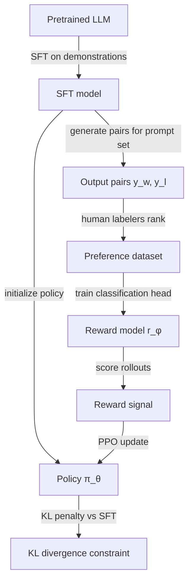

## Definition

Reinforcement Learning from Human Feedback (RLHF) is the dominant technique for aligning large language models to human values and preferences after supervised pretraining. It was first demonstrated at scale in InstructGPT (OpenAI, 2022) and has since been used to train GPT-4, Claude 1-3, Gemini, Llama 2-Chat, and nearly all publicly deployed chat models.

RLHF converts human preference signals — which output is better for a given prompt? — into a training signal that can fine-tune the language model using RL. The key insight is that human preferences are easier to collect than human demonstrations of ideal behavior, because judging quality is cognitively simpler than producing optimal output.

The standard pipeline has three stages:
1. **Supervised fine-tuning (SFT)** on a small set of high-quality demonstrations.
2. **Reward model (RM) training** on human preference comparisons.
3. **RL fine-tuning** (PPO) of the LLM to maximize the reward model's score while staying close to the SFT model.

## How it works

### Stage 1: Supervised fine-tuning

The base pretrained LLM is fine-tuned on human-written demonstrations for the target task (e.g., following instructions, answering questions helpfully). This produces an SFT model that can follow basic instructions but may still produce unsafe or unhelpful responses.

### Stage 2: Reward model training

Human labelers are shown pairs of model outputs for the same prompt and asked to pick which is better (or rate on a scale). A reward model — typically initialized from the SFT model with a scalar regression head — is trained to predict these preferences using pairwise ranking loss. The reward model maps (prompt, response) → scalar reward.

### Stage 3: PPO fine-tuning

The SFT model initializes the policy. PPO samples responses from the current policy, scores them with the frozen reward model, and updates the policy to maximize expected reward. A KL divergence penalty between the policy and the SFT reference prevents the policy from collapsing into reward-hacking behaviors far from the training distribution.

### Alternatives and extensions

| Method | Key difference | When to prefer |
|---|---|---|
| DPO | No RL, no reward model — direct preference classification | Simpler, cheaper, often same quality |
| RLAIF | AI model replaces human labelers | Scales to larger datasets at lower cost |
| Constitutional AI | Model critiques itself against principles → generates preference data | Reduces need for human harmlessness labels |
| GRPO | Group-relative policy optimization — used in DeepSeek-R1 | Reasoning-heavy tasks, math, code |

## When to use / When NOT to use

| Scenario | Use RLHF | Avoid |
|---|---|---|
| Aligning a chat LLM on helpfulness and safety | Yes — standard approach | DPO if RL infrastructure is unavailable |
| Domain-specific preference alignment (medical, legal) | RLHF or DPO on domain preference pairs | Generic human feedback — annotators lack domain expertise |
| Small team, limited compute | DPO — simpler, no RL loop | Full RLHF PPO — high engineering overhead |
| Research on reasoning or math | GRPO or process reward models | Outcome RLHF — insufficient signal for step-by-step reasoning |
| Reward hacking is a concern | Add KL penalty + adversarial reward probing | Unconstrained reward maximization |

## Sources

- [InstructGPT — Training language models to follow instructions with human feedback (OpenAI, 2022)](https://arxiv.org/abs/2203.02155)
- [Constitutional AI (Anthropic, 2022)](https://arxiv.org/abs/2212.08073)
- [Direct Preference Optimization (Rafailov et al., 2023)](https://arxiv.org/abs/2305.18290)
- [Llama 2 — Open Foundation and Fine-Tuned Chat Models (Meta, 2023)](https://arxiv.org/abs/2307.09288)
- [Scaling RLHF — Anthropic (2023)](https://arxiv.org/abs/2204.05862)

## See also

- [Reinforcement learning](/docs/rl)
- [Policy gradient methods](/docs/rl/policy-gradient-methods)
- [Alignment methods](/docs/ai-safety/alignment-methods)
- [LLMs](/docs/llms)
