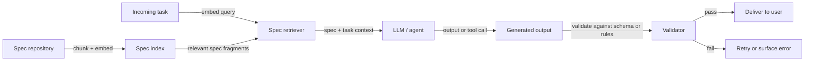

## Definition

Spec-driven development is an approach to building AI systems — agents, pipelines, tools, and workflows — where behavior is grounded in explicit, readable specifications rather than being encoded entirely in model weights or hand-crafted prompt strings. A specification defines what the system should do, what outputs are allowed, which actions are permitted, what constraints must hold, and what success looks like. These specs can take many forms: natural language documents, JSON schemas, OpenAPI definitions, formal rules, or structured requirement sets — and they are treated as first-class artifacts that are versioned, tested against, and retrieved at runtime.

The core idea is to separate the definition of behavior from its implementation. Instead of baking all rules into a monolithic system prompt or fine-tuned model, you maintain a live specification that can be updated, audited, and retrieved independently. In the [RDD (Retrieval-Driven Development)](/docs/reasoning-patterns/rdd) pattern, specs are indexed in a vector store or document repository; at runtime the agent retrieves the relevant spec fragments for the current task and grounds its decisions in them. This makes behavior auditable, correctable without retraining, and aligned with the specification that domain experts or compliance teams can read and approve.

Spec-driven development is especially valuable for [agents](/docs/agents) operating in regulated or safety-critical domains, where the cost of misaligned behavior is high and compliance teams need to verify what the system is allowed to do. It also complements [prompt engineering](/docs/prompt-engineering) — specs provide the stable semantic content; prompts orchestrate how the model reasons about and applies them. The approach contrasts with [vibe coding](/docs/vibe-coding), where behavior emerges iteratively from loose intent rather than from explicit requirements.

## How it works

### Spec authoring and indexing

Specifications are written in a structured but human-readable format. For an agent, a spec might define allowed tool calls, required output format, constraints on what information can be disclosed, and success criteria. These specs are chunked and indexed — in a vector store for semantic retrieval, or in a structured database for exact lookup — so that relevant fragments can be retrieved at inference time.

### Retrieval, generation, and validation



### Validation and correction

The validator checks that the generated output or action conforms to the spec: schema validation for structured outputs (JSON Schema, Pydantic), rules-based checks for constraints, or a secondary model call that verifies compliance. If validation fails, the system can retry with the violation description added to context, escalate to a human, or surface a structured error. This closed loop keeps behavior aligned with the spec even when the model would otherwise deviate.

## When to use / When NOT to use

| Use when | Avoid when |
|----------|------------|
| Agent behavior must be auditable and match documented requirements | Requirements are entirely unknown and need to be discovered iteratively |
| Compliance or safety teams need to approve and review system behavior | The task is exploratory prototyping where the spec would change every iteration |
| Behavior needs to be updated without retraining (by changing the spec) | The spec is too complex or ambiguous for a model to reliably apply at runtime |
| Output format and constraints must be enforced reliably | Latency from spec retrieval + validation is unacceptable for the use case |

## Comparisons

| Approach | Behavior defined by | Updatable without retraining | Auditable |
|----------|-------------------|------------------------------|-----------|
| Spec-driven (RDD) | Explicit specs retrieved at runtime | Yes | Yes |
| Prompt engineering | System prompt and examples | Partial (prompt changes) | Limited |
| Fine-tuning | Model weights | No | Hard |
| Vibe coding | Iterative user-model dialogue | N/A (exploratory) | No |

## Pros and cons

| Pros | Cons |
|------|------|
| Behavior is auditable and human-readable without inspecting weights | Spec retrieval and validation add latency and infrastructure complexity |
| Specs can be updated by domain experts without retraining | Model may misinterpret or incompletely apply retrieved spec fragments |
| Enables compliance review and signoff on system behavior | Requires discipline to maintain spec quality and coverage as requirements evolve |
| Validation catches spec violations before they reach users | Not suitable for tasks where requirements are inherently fuzzy or emergent |

## Code examples

### Structured output with spec validation using Pydantic and OpenAI (Python)

```python
from pydantic import BaseModel, field_validator
from openai import OpenAI
import json

client = OpenAI()

# Define the output spec as a Pydantic model
class SupportResponse(BaseModel):
    category: str  # "billing", "technical", "account", "other"
    priority: str  # "low", "medium", "high"
    summary: str
    suggested_action: str

    @field_validator("category")
    @classmethod
    def validate_category(cls, v: str) -> str:
        allowed = {"billing", "technical", "account", "other"}
        if v not in allowed:
            raise ValueError(f"category must be one of {allowed}")
        return v

    @field_validator("priority")
    @classmethod
    def validate_priority(cls, v: str) -> str:
        allowed = {"low", "medium", "high"}
        if v not in allowed:
            raise ValueError(f"priority must be one of {allowed}")
        return v

# System spec retrieved at runtime
spec = """
You are a support ticket classifier. Classify the ticket according to these rules:
- category: billing (payment issues), technical (bugs/errors), account (login/access), other
- priority: high (data loss, service outage), medium (degraded functionality), low (cosmetic/minor)
- summary: one sentence describing the issue
- suggested_action: one sentence recommending next steps
Output ONLY valid JSON matching the schema.
"""

ticket = "I can't log in to my account and my subscription payment failed this morning."

response = client.chat.completions.create(
    model="gpt-4o-mini",
    messages=[
        {"role": "system", "content": spec},
        {"role": "user", "content": ticket},
    ],
    response_format={"type": "json_object"},
)

raw = response.choices[0].message.content
parsed = SupportResponse(**json.loads(raw))
print(parsed.model_dump_json(indent=2))
```

## Practical resources

- [OpenAI – Structured outputs](https://platform.openai.com/docs/guides/structured-outputs) — Native JSON schema enforcement in the API
- [LangChain – Output parsers](https://python.langchain.com/docs/concepts/output_parsers/) — Parsing and validating LLM outputs against schemas
- [Pydantic documentation](https://docs.pydantic.dev/) — Data validation and schema definition in Python
- [Instructor library](https://python.useinstructor.com/) — Structured LLM outputs with Pydantic, retry logic, and validation
- [Guardrails AI](https://www.guardrailsai.com/) — Framework for spec-driven output validation and correction

## See also

- [RDD](/docs/reasoning-patterns/rdd)
- [Agents](/docs/agents)
- [Prompt engineering](/docs/prompt-engineering)
