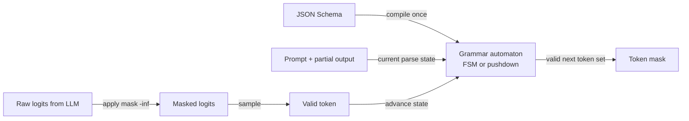

## Definition

**Constrained decoding** is the technique of modifying the logit distribution at each decode step so that the model can only emit tokens that keep the output within a valid parse state. Instead of sampling freely from the full vocabulary, the decoder consults a **grammar automaton** that masks out all tokens that would violate the target schema — JSON, SQL, regex, or any context-free grammar — before sampling.

The result is a hard guarantee: the model's output is always a syntactically valid instance of the specified schema. This is stronger than prompt-based approaches ("please output JSON") which are advisory and can be violated by the model.

Two classes of automata are used:
- **Finite-state machines (FSMs)**: Compiled from regular expressions or simple schemas. Each token advances the FSM state; invalid tokens are masked. Fast to compile and execute for simple schemas. Outlines pioneered this approach.
- **Context-free grammars (CFGs)**: Support arbitrary nesting (e.g., nested JSON objects). Require pushdown automata, which are more complex. XGrammar and llguidance implement CFG-based constrained decoding at near-FSM speed.

## How it works

### Compilation and execution cost

Schema compilation is a one-time cost: a given JSON Schema is compiled to an automaton once and cached. Per-token execution — checking which tokens are valid — is the critical path. Outlines achieves O(1) token lookup via a precomputed index. XGrammar achieves equivalent or better performance with full CFG expressiveness through context-independent persistent execution and adaptive token mask caching.

## Engine comparison

| Engine | Automaton type | Compilation speed | Token overhead | Notes |
|---|---|---|---|---|
| Outlines | FSM (index-based) | Slow for complex schemas (40s–10+ min) | O(1) per token | Pioneered the approach; struggling with complex schemas |
| XGrammar | CFG (pushdown + optimizations) | Fast | `&lt;40 µs per token` | Default backend for vLLM, SGLang, TensorRT-LLM (March 2026) |
| llguidance | CFG (Microsoft) | Fast | Low | Used in Guidance library |
| llama.cpp GBNF | BNF grammar | Moderate | Low | Built-in grammar support for llama.cpp |
| Provider JSON mode | Server-side (undisclosed) | N/A | Zero client-side | OpenAI, Anthropic, Google; no schema validation guarantee |

## When to use / When NOT to use

| Scenario | Use constrained decoding | Use alternatives |
|---|---|---|
| Deterministic schema compliance required | Yes — hard guarantee, not advisory | No — prompt-based JSON mode may fail unpredictably |
| Complex nested JSON with deeply recursive schema | Yes — XGrammar handles CFGs | No — Outlines may time out on compilation |
| Simple flat JSON or regex output | Yes — any engine; Outlines or XGrammar both work | Maybe — provider JSON mode is simpler and sufficient |
| Free-form creative generation | No — grammar constraints destroy naturalness | Yes — unconstrained sampling |
| Low-latency API (sub-100ms budget) | Yes — XGrammar adds &lt;50 µs per token | No — Outlines with complex schemas can blow latency budget at compile time |

## Sources

- [Outlines GitHub](https://github.com/dottxt-ai/outlines) — original FSM-based constrained decoding library
- [XGrammar paper](https://arxiv.org/abs/2411.15100) — CFG engine with near-zero per-token overhead; vLLM default
- [Willard & Louf 2023](https://arxiv.org/abs/2307.09702) — theoretical foundation for FSM-based efficient guided generation
- [vLLM structured decoding blog](https://blog.vllm.ai/2025/01/14/struct-decode-intro.html) — vLLM's structured generation backend evolution
- [JSONSchemaBench](https://github.com/guidance-ai/jsonschemabench) — benchmark comparing compliance rates across constrained decoding engines

## See also

- [Structured generation](/docs/structured-generation)
- [Instructor and JSON mode](/docs/structured-generation/instructor-and-json-mode)
- [Inference optimization](/docs/inference-optimization)
- [vLLM](/docs/inference-optimization/vllm)
- [Prompt engineering](/docs/prompt-engineering)
