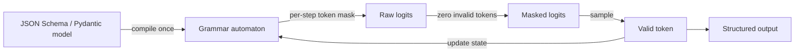

## Definition

**Structured generation** is the family of techniques that constrain a language model's output to conform to a predefined schema or grammar — producing valid JSON, XML, SQL, or any context-free grammar, rather than free-form text. This transforms LLMs from unpredictable text generators into reliable software components whose outputs can be parsed deterministically.

Without structured generation, extracting structured data from LLM output requires fragile regex parsing or retry loops. With it, the model is mathematically guaranteed to emit tokens that form valid structure — at the cost of some flexibility and, depending on the method, additional latency.

There are two main approaches:
- **Token masking (FSM-based)**: A finite-state machine (FSM) compiled from the schema masks the logits at each decode step, zeroing out tokens that would produce invalid output. Outlines pioneered this approach; XGrammar extends it with full context-free grammar support.
- **API-level JSON mode**: Providers (OpenAI, Anthropic, Google) enforce structured output server-side. The model is prompted or fine-tuned to prefer structured output and the server validates/retries internally.

As of 2025–2026, **XGrammar** is the default structured generation backend for vLLM, SGLang, and TensorRT-LLM, achieving under 40 microseconds per token overhead — effectively zero-cost structured generation at serving time.

## How it works

At each decode step the grammar automaton inspects the current parse state and computes the set of tokens that keep the output valid. Those tokens' logits are kept; all others are set to `-inf`. Sampling then draws only from valid continuations. Schema compilation is a one-time cost amortized across all requests that share the schema.

## When to use / When NOT to use

| Scenario | Use | Avoid |
|---|---|---|
| Extracting structured data for downstream code | Yes — eliminates parsing brittle text | No — adds complexity for one-off generation |
| Function/tool calling with typed parameters | Yes — pairs well with OpenAI/Anthropic tool use | No — if the provider already handles schema validation |
| Long free-form creative or conversational output | No — grammar constraints kill naturalness | Yes — unconstrained generation is the right tool |
| Multi-provider apps (need same schema everywhere) | Yes — Instructor abstracts provider differences | No — if you only target one provider's native JSON mode |
| Latency-sensitive production serving | Yes — XGrammar adds `&lt;50 µs per token` on vLLM | No — Outlines with complex schemas can compile for minutes |

## Key concepts

| Concept | Description |
|---|---|
| Token masking | Setting logits of invalid tokens to `-inf` at each decode step |
| FSM (finite-state machine) | Automaton compiled from a regex or simple schema |
| CFG (context-free grammar) | More expressive than FSM; supports nested structures like JSON |
| Outlines | Python library pioneering FSM-based constrained decoding |
| XGrammar | CFG engine achieving FSM-level speed; default backend for vLLM |
| Instructor | Python library wrapping any LLM with Pydantic-validated structured output and auto-retry |
| JSON mode | Provider-side enforcement that output is valid JSON (no schema validation) |

## Sources

- [Outlines — structured text generation](https://github.com/dottxt-ai/outlines) — original FSM-based constrained decoding library
- [XGrammar paper](https://arxiv.org/abs/2411.15100) — CFG-based engine with near-zero overhead; vLLM default since early 2025
- [Instructor documentation](https://python.useinstructor.com/) — Pydantic-based structured output with multi-provider support and retry logic
- [vLLM structured decoding blog](https://blog.vllm.ai/2025/01/14/struct-decode-intro.html) — vLLM's integration of grammar-constrained generation
- [Constrained decoding deep dive — Let's Data Science](https://letsdatascience.com/blog/structured-outputs-making-llms-return-reliable-json) — practical guide to how structured outputs work under the hood

## See also

- [Constrained decoding](/docs/structured-generation/constrained-decoding)
- [Instructor and JSON mode](/docs/structured-generation/instructor-and-json-mode)
- [Prompt engineering](/docs/prompt-engineering)
- [Inference optimization](/docs/inference-optimization)
- [RAG](/docs/rag)
