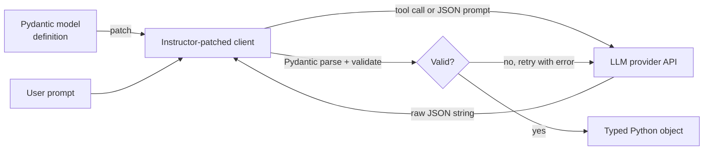

## Definition

**Instructor** is a Python library that wraps any LLM provider (OpenAI, Anthropic, Google, Cohere, and others) with structured output capabilities powered by Pydantic models. You define your desired output as a Pydantic class, pass it to Instructor, and receive a validated Python object — not a raw string. If the model produces output that fails Pydantic validation, Instructor automatically retries with the validation error as feedback.

**JSON mode** is a lighter-weight server-side feature offered by most major LLM providers (OpenAI `response_format: {"type": "json_object"}`, Anthropic tool use with JSON schema, Google `response_mime_type: "application/json"`). JSON mode guarantees that the output is valid JSON — but unlike schema-constrained decoding, it does not guarantee that the JSON conforms to a specific schema. It prevents parse errors but does not enforce field types or required keys.

The practical choice:
- Use **Instructor** when you need type-safe, schema-validated output with validation feedback loops and multi-provider portability.
- Use **provider JSON mode** when you want zero additional dependencies, simple flat JSON, and are willing to handle schema validation in your own code.
- Use **constrained decoding** (Outlines, XGrammar) when you are running your own inference server and need hard schema guarantees at the token level.

## How it works



Instructor patches the provider's client to inject the Pydantic schema as a tool definition (for providers supporting tool use) or as a JSON schema in the system prompt. When validation fails, the error message is appended to the conversation and the model is prompted to correct its output, up to a configurable `max_retries` limit.

## Instructor vs. JSON mode comparison

| Feature | Instructor | Provider JSON mode |
|---|---|---|
| Valid JSON guaranteed | Yes | Yes |
| Schema validation | Yes — Pydantic enforced | No — you validate manually |
| Auto-retry on invalid output | Yes — with validation feedback | No |
| Multi-provider support | Yes — same Pydantic model across providers | No — provider-specific format |
| Streaming support | Yes — partial object streaming | Provider-dependent |
| Dependency | `pip install instructor` | Zero (built-in API parameter) |
| Nested / complex schemas | Yes | Risky — model may violate structure |

## Code example

```python
import instructor
from anthropic import Anthropic
from pydantic import BaseModel

class Article(BaseModel):
    title: str
    summary: str
    tags: list[str]
    sentiment: str  # "positive" | "neutral" | "negative"

client = instructor.from_anthropic(Anthropic())

article = client.messages.create(
    model="claude-opus-4-5",
    max_tokens=512,
    messages=[{
        "role": "user",
        "content": "Extract structured info from this text: 'vLLM 0.6 ships XGrammar as default backend, improving structured output speed by 100x.'"
    }],
    response_model=Article,
)

print(article.title)   # validated str
print(article.tags)    # validated list[str]
```

## When to use / When NOT to use

| Scenario | Use Instructor | Use alternative |
|---|---|---|
| Multi-provider app (OpenAI + Anthropic + local) | Yes — one Pydantic model works everywhere | No — provider-specific JSON mode requires separate handling |
| Complex nested extraction (entities, relations) | Yes — Pydantic handles nested models and validators | No — JSON mode won't enforce nested schema |
| Quick one-off JSON extraction | Maybe — Instructor adds a dependency | Yes — simple JSON mode + manual parse is sufficient |
| Running your own inference server | No — use constrained decoding at the token level | Yes — XGrammar / Outlines give hard guarantees |
| Streaming structured output | Yes — Instructor supports partial streaming via `create_partial` | Provider-dependent |

## Sources

- [Instructor documentation](https://python.useinstructor.com/) — full API reference and multi-provider integration guides
- [Instructor GitHub](https://github.com/instructor-ai/instructor) — open-source library with examples
- [OpenAI structured outputs guide](https://platform.openai.com/docs/guides/structured-outputs) — OpenAI's JSON mode and schema-constrained response format
- [Anthropic tool use for structured output](https://docs.anthropic.com/en/docs/tool-use) — using tool definitions to extract structured data with Claude

## See also

- [Structured generation](/docs/structured-generation)
- [Constrained decoding](/docs/structured-generation/constrained-decoding)
- [Prompt engineering](/docs/prompt-engineering)
- [Anthropic tool use](/docs/agents/anthropic-tool-use)
