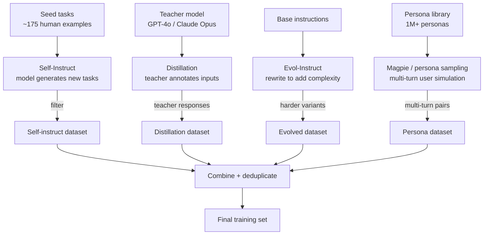

## Definition

Synthetic data generation methods define *how* a generator model is prompted to produce instruction-response pairs. The choice of method determines the diversity, difficulty distribution, and domain coverage of the resulting dataset. No single method dominates all settings; practitioners typically combine approaches.

The field can be organised into four families:
1. **Self-Instruct** — bootstrapping from a small seed set by prompting the model to generate new task instructions.
2. **Knowledge distillation** — a powerful teacher model generates responses that a smaller student model is trained to imitate.
3. **Evol-Instruct / evolution** — iteratively rewriting existing instructions to be harder, more complex, or more diverse.
4. **Persona / user-simulation** — generating data from simulated user personas to improve diversity and reduce homogeneity.

## How it works

### Self-Instruct

Proposed by Wang et al. (2023), Self-Instruct starts with ~175 manually written seed tasks and prompts the generator model to produce new task descriptions and corresponding input-output pairs. A heuristic filter removes low-quality and near-duplicate instructions (ROUGE-L similarity > 0.7 is a common deduplication threshold). The process iterates: newly generated tasks are added to the pool and used as seeds for the next round.

Self-Instruct is low-cost and requires minimal human effort but tends toward easier, common task types. **CoT-Self-Instruct** extends the method by instructing the model to reason via chain-of-thought before generating the task and answer, improving coverage of reasoning-heavy examples.

### Knowledge distillation via synthetic data

The teacher model (e.g. GPT-4o, Claude Opus) receives real input prompts and generates high-quality responses. The student model (e.g. Phi-4, Mistral 7B) is fine-tuned to imitate these responses via standard cross-entropy loss. This approach powers many open-weight models: Phi-4 (Microsoft) used 80% synthetic data from GPT-4, achieving near-GPT-4 performance at 14B parameters.

A variant — **simple self-distillation (SSD)** — samples solutions from the base model itself at elevated temperature, then fine-tunes on the unverified raw samples. SSD improves code generation without requiring an external teacher.

### Evol-Instruct

Evol-Instruct (WizardLM, 2023) takes existing instructions and rewrites them to be harder, longer, more constrained, or more abstract using a fixed set of evolution prompts:
- **In-breadth evolution:** generate a new, different task from the same domain.
- **In-depth evolution:** add constraints, edge cases, or reasoning steps.
- **Degeneration filter:** discard instructions the generator cannot answer.

WizardCoder and WizardMath applied Evol-Instruct to code and math datasets, producing training sets that outperformed raw human annotations on HumanEval and GSM8K.

### Magpie and persona-based generation

Magpie (2024) exploits the instruction-following alignment of chat models: by prompting the model with only the user-turn prefix and no system prompt, the model generates realistic user queries that reflect real use patterns without any seed task set. Combined with a persona library (1M+ demographically diverse personas), Magpie can generate highly diverse multi-turn conversations.

Persona-based generation is particularly effective for reducing the homogeneity bias of Self-Instruct, which tends to produce data from an implicit default-user perspective.

## When to use / When NOT to use

| Method | Use when | Avoid when |
|---|---|---|
| Self-Instruct | Low budget, no teacher model access, general tasks | Domain requires factual accuracy; self-hallucination propagates |
| Distillation | Access to a strong teacher; small student target | Teacher is expensive and dataset is large (cost-prohibitive) |
| Evol-Instruct | Need hard, diverse examples for a specific skill | Base instruction set is already high-quality and diverse |
| Magpie / persona | Need realistic user query distribution; reducing homogeneity | Domain requires expert knowledge beyond the model's priors |

## Sources

- [Self-Instruct: aligning language models with self-generated instructions — arXiv 2212.10560](https://arxiv.org/abs/2212.10560)
- [WizardLM: empowering large language models to follow complex instructions — arXiv 2304.12244](https://arxiv.org/abs/2304.12244)
- [Embarrassingly simple self-distillation improves code generation — arXiv 2604.01193](https://arxiv.org/html/2604.01193v1)
- [How to generate synthetic training data for LLM fine-tuning — PremAI](https://blog.premai.io/how-to-generate-synthetic-training-data-for-llm-fine-tuning-2026-guide/)
- [NVIDIA — synthetic data pipelines for AI model distillation](https://developer.nvidia.com/blog/how-to-build-license-compliant-synthetic-data-pipelines-for-ai-model-distillation/)

## See also

- [Synthetic data](/docs/synthetic-data)
- [Quality filtering](/docs/synthetic-data/quality-filtering)
- [LLMs fine-tuning](/docs/llms/fine-tuning)
- [Knowledge distillation](/docs/knowledge-distillation)
