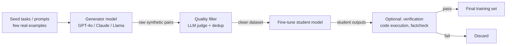

## Definition

**Synthetic data** is machine-generated training data produced without collecting real-world observations. In the context of large language models, synthetic data is typically generated by a teacher or oracle model — GPT-4, Claude, or a domain expert — and used to train a smaller or more specialised student model. The goal is to replace expensive human annotation, bypass data licensing constraints, and control the distribution of the training set.

Synthetic data has become a central technique in modern LLM development. Models like Phi-4 (Microsoft), Llama-3 (Meta), and Mistral rely heavily on synthetic instruction data. The synthetic data generation market is projected to reach $3.5 billion by 2026, driven by LLM advances and model distillation demand.

Three challenges define the field:
1. **Diversity** — synthetic generators tend to produce repetitive patterns; coverage of rare cases requires deliberate augmentation.
2. **Accuracy** — models hallucinate; generated data must be verified to avoid training on false facts.
3. **Model collapse** — iteratively training on model-generated data without real data injection causes quality degradation over successive generations.

This section covers:
- **[Generation methods](/docs/synthetic-data/generation-methods)** — Self-Instruct, Evol-Instruct, distillation, Magpie, and persona-based approaches.
- **[Quality filtering](/docs/synthetic-data/quality-filtering)** — LLM-as-a-judge, reward model scoring, deduplication, and safety checks.

## How it works

## When to use / When NOT to use

| Scenario | Use synthetic data | Avoid |
|---|---|---|
| Limited labelled data for a specialised domain | Yes — generate targeted examples with a teacher model | No — if ample high-quality real data exists |
| Data privacy constraints (healthcare, finance) | Yes — synthetic avoids PII exposure | No — verify synthetic data cannot be traced back to real records |
| Augmenting rare-class examples | Yes — controllable generation covers the tail | No — if base model lacks knowledge of the domain |
| Training a smaller distilled model | Yes — knowledge distillation via synthetic data is standard | No — for tasks requiring factual grounding (use real data) |
| Evaluating model capabilities | Yes — synthetic evals allow controlled difficulty | No — final human preference evals still need real annotators |

## Sources

- [How to generate synthetic training data for LLM fine-tuning — PremAI](https://blog.premai.io/how-to-generate-synthetic-training-data-for-llm-fine-tuning-2026-guide/)
- [Synthetic data: a secret ingredient for better language models — Red Hat](https://www.redhat.com/en/blog/synthetic-data-secret-ingredient-better-language-models)
- [The definitive guide to synthetic data generation using LLMs — Confident AI](https://www.confident-ai.com/blog/the-definitive-guide-to-synthetic-data-generation-using-llms)
- [NVIDIA — how to build license-compliant synthetic data pipelines](https://developer.nvidia.com/blog/how-to-build-license-compliant-synthetic-data-pipelines-for-ai-model-distillation/)

## See also

- [Generation methods](/docs/synthetic-data/generation-methods)
- [Quality filtering](/docs/synthetic-data/quality-filtering)
- [LLMs fine-tuning](/docs/llms/fine-tuning)
- [Knowledge distillation](/docs/knowledge-distillation)
- [Evaluation metrics](/docs/evaluation-metrics)
