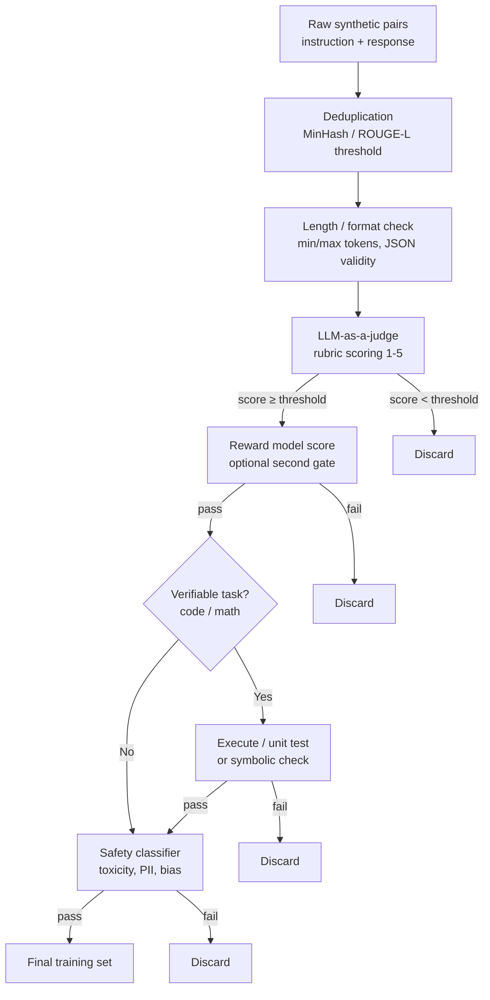

## Definition

**Quality filtering** is the set of post-generation steps applied to raw synthetic data to remove low-quality, duplicate, harmful, or factually incorrect examples before they enter the training set. Without filtering, models trained on synthetic data suffer from compounded noise: errors and hallucinations in the generator propagate to the student, and iterative self-training without filtering leads to **model collapse** — a degradation of quality across successive training generations.

Filtering operates at two stages: (1) immediately after context / instruction generation, to catch low-coherence or off-topic outputs, and (2) after response generation, to evaluate answer quality before including the pair in the final dataset.

## How it works

### Deduplication

Near-duplicate instructions produce redundant gradient updates and inflate apparent dataset diversity. MinHash LSH (Locality Sensitive Hashing) efficiently identifies near-duplicates across millions of examples. A ROUGE-L similarity threshold of 0.7 is a common deduplication cutoff for instruction text; stricter thresholds (0.5) are applied for response text in distillation datasets where repetition is especially harmful.

### LLM-as-a-judge

An LLM evaluator scores synthetic examples on a rubric — typically covering completeness, correctness, clarity, and instruction-following — on a 1–5 scale. Pairs scoring below a threshold (e.g. 3 out of 5) are discarded. The judge model should be equal to or stronger than the generator; using the same model as judge and generator introduces self-grading bias.

**Prometheus** and **GPT-4-as-judge** are popular open and closed judge models respectively. Research shows LLM judges achieve 80–90% agreement with human annotators on instruction-following quality, making them cost-effective at scale.

### Reward model scoring

A reward model (RM) trained on human preference data provides a quality signal that generalises beyond a rubric. RMs from RLHF pipelines (e.g. Llama Reward, OpenAssistant RM) score responses; examples with RM scores below the median of the dataset are filtered. RM filtering is particularly effective at catching verbose, sycophantic, or low-information responses that LLM judges sometimes miss.

### Verifiable task validation

For code and mathematics, correctness can be verified programmatically:
- **Code:** execute the generated code against unit tests; discard examples that fail.
- **Math:** apply a symbolic solver (SymPy) or formal verifier to check the answer; discard incorrect derivations.

Verifiable filtering is the strongest quality signal available — a failing unit test is an unambiguous quality marker. Models trained on only verifiably correct code examples (OSS-Instruct, Magicoder) consistently outperform those trained on unverified code.

### Safety filtering

A safety classifier checks for harmful content (toxicity, hate speech, self-harm), PII leakage (names, emails, phone numbers in examples derived from real data), and policy violations. Off-the-shelf classifiers (Perspective API, Azure Content Safety, Meta LlamaGuard) are typically used as a final gate before the dataset is committed.

## When to use / When NOT to use

| Filter | Always apply | Skip |
|---|---|---|
| Deduplication | Yes — always | Never — duplicates hurt generalisation |
| LLM-as-a-judge | Yes for instruction-following datasets | Optional for verifiable tasks (use execution instead) |
| Reward model | For RLHF / preference tuning datasets | Unnecessary for simple SFT if judge threshold is strict |
| Verifiable execution | Yes for code and math | N/A for open-ended tasks |
| Safety classifier | Yes for any public or user-facing deployment | Internal research datasets may relax this |

## Filtering intensity trade-offs

| Threshold | Retained data | Quality | Risk |
|---|---|---|---|
| Lenient (judge ≥ 2/5) | 90% | Noisy — includes mediocre examples | Higher model collapse risk |
| Moderate (judge ≥ 3/5) | 60–70% | Good balance | Standard practice |
| Strict (judge ≥ 4/5) | 20–40% | High quality | May under-represent difficult cases |

## Sources

- [The definitive guide to synthetic data generation using LLMs — Confident AI](https://www.confident-ai.com/blog/the-definitive-guide-to-synthetic-data-generation-using-llms)
- [CoT-Self-Instruct: building high-quality synthetic prompts — OpenReview](https://openreview.net/forum?id=nPEWyL8kxO)
- [Self-training AI: how synthetic data powers the next generation of LLMs — Contineo](https://contineo.world/self-training-ai-how-synthetic-data-is-powering-the-next-generation-of-llms/)
- [ACL 2025 tutorial on synthetic data](https://synth-data-acl.github.io/static/slides/slides.pdf)

## See also

- [Synthetic data](/docs/synthetic-data)
- [Generation methods](/docs/synthetic-data/generation-methods)
- [Evaluation metrics](/docs/evaluation-metrics)
- [LLMs post-training](/docs/llms/post-training)
- [Bias in AI](/docs/bias-in-ai)
