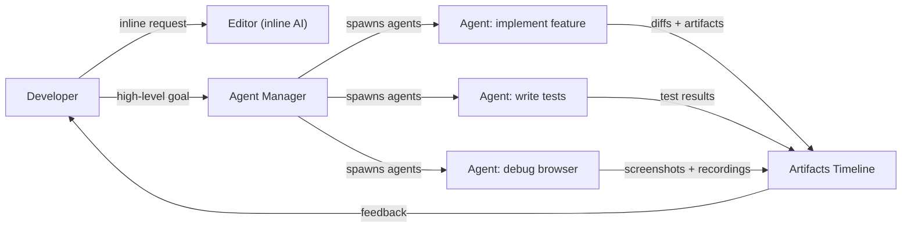
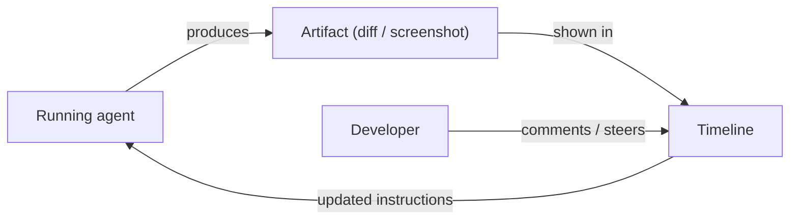

## Definition

Antigravity is an **agent-first IDE** built around the premise that autonomous [LLM](/docs/llms)-powered [agents](/docs/agents) should be first-class citizens of the development environment, not bolt-on features. Rather than showing completions as you type, Antigravity exposes an **Agent Manager** that spawns, coordinates, and monitors multiple agents running in parallel across editor, terminal, and browser panes. Each agent can implement a feature, run a test suite, debug a failure, or interact with a web interface while the developer observes and steers.

A distinguishing feature is the **Artifacts Timeline**: every significant agent action — plans, code diffs, screenshots, browser recordings, and test results — is captured and displayed in a chronological timeline. This audit trail makes autonomous execution verifiable: you can replay what happened, inspect intermediate states, and comment on specific artifacts to redirect the agent's next steps. This design makes Antigravity particularly suited to [spec-driven development](/docs/spec-driven-development) workflows where traceability and human-in-the-loop oversight matter.

The platform supports large context window models (Gemini and others), runs on Windows, macOS, and Linux, and provides both inline AI assistance (similar to Cursor's Cmd+K) and manager-driven autonomy in a single environment. The combination of granular artifact logging and parallel agent execution positions it as a "vibe coding" platform where developers specify intent at a high level and verify outcomes through the artifact record.

## How it works

### Dual-interface architecture



### Human-in-the-loop feedback loop



### Key features

**Agent Manager** — spawn and monitor multiple agents simultaneously. **Artifacts Timeline** — chronological log of plans, diffs, screenshots, and recordings. **Inline AI** — direct editor assistance for refactoring and generation. **Feedback loop** — comment on artifacts to steer agents in real time. **Multi-platform** — Windows, macOS, Linux. **Large context** — supports models with large context windows for repo-scale understanding.

## When to use / When NOT to use

| Scenario | Use Antigravity | Do NOT use Antigravity |
|----------|----------------|------------------------|
| Autonomous multi-agent implementation with oversight | Yes — Agent Manager + Artifacts Timeline | |
| Spec-driven workflows needing audit trails | Yes — every artifact is logged and inspectable | |
| Parallel workstreams (implement + test + debug simultaneously) | Yes — parallel agent spawning | |
| Lightweight inline completions with minimal setup | | [GitHub Copilot](/docs/tools/github-copilot) or [Cursor](/docs/tools/cursor) are lighter |
| Deep integration with GitHub issues and PRs | | [GitHub Copilot Workspace](/docs/tools/github-copilot) is better integrated |
| Terminal-first or CLI-based development | | [Claude Code](/docs/tools/claude-code) is purpose-built for this |

## Pros and cons

| Pros | Cons |
|------|------|
| Parallel agent execution across editor, terminal, and browser | Newer platform with a smaller community than VS Code tools |
| Artifacts Timeline provides verifiable, inspectable agent outputs | High autonomy increases risk of large unreviewed changes |
| Supports vibe coding at a higher level of abstraction | Requires familiarity with agent-first development patterns |
| Real-time steering via artifact comments | Platform maturity and stability still evolving |

## Code examples

```yaml
# Antigravity steering file — define agent behavior and project standards
project:
  name: my-web-app
  stack: [TypeScript, React, Node.js, PostgreSQL]

agents:
  default_model: gemini-2.0-flash
  context_window: large

standards:
  - "Follow existing file and folder structure conventions"
  - "Add tests for every new function using Vitest"
  - "Document all exported functions with JSDoc"
  - "Never modify database schema without a migration file"

artifacts:
  retain: 30d           # keep artifact timeline for 30 days
  require_approval:     # require human approval before applying
    - schema_changes
    - dependency_additions
```

## Tips for effective use

- Start with a clear goal statement for each agent — vague goals produce vague artifacts.
- Review the Artifacts Timeline after each agent run before accepting changes; use comments to steer the next iteration.
- Configure approval gates in the steering file for high-risk operations (schema changes, new dependencies).
- Run agents on isolated branches so the main branch remains stable during parallel agent work.
- Use the inline AI for small, precise edits and reserve the Agent Manager for larger, multi-step tasks.

## Practical resources

- [Antigravity — Agent-first IDE](https://www.antigravityai.io/) — Product overview, features, and download
- [Antigravity IDE](https://antigravityaiide.com/) — Platform capabilities and documentation

## See also

- [Agents](/docs/agents)
- [Spec-driven development](/docs/spec-driven-development)
- [Cursor](/docs/tools/cursor)
- [Kiro](/docs/tools/kiro)
- [Claude Code](/docs/tools/claude-code)
- [LLMs](/docs/llms)
