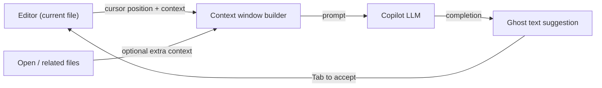

## Definition

GitHub Copilot is an AI-powered coding assistant developed by GitHub and Microsoft, powered by [large language models](/docs/llms) trained on vast amounts of public code. It integrates into existing editors as a lightweight extension and surfaces AI assistance primarily through **inline completions**: as a developer types, Copilot suggests the next line or block as ghost text that can be accepted with a single keystroke.

Beyond inline autocomplete, Copilot Chat adds a conversational interface within the IDE for asking questions, generating code from natural language, explaining unfamiliar code, and writing tests. Copilot Workspace (preview) extends this to issue-to-code workflows where Copilot proposes a plan and implementation for a GitHub issue. The tool is IDE-agnostic, with extensions for VS Code, JetBrains IDEs, Visual Studio, Neovim, and the GitHub web editor.

Compared to [Cursor](/docs/tools/cursor), Copilot is a lighter-weight extension that works inside your existing IDE rather than replacing it, and it focuses on file-level or selection-level context rather than full codebase indexing. Compared to [Claude Code](/docs/tools/claude-code), Copilot lacks a terminal-first workflow and deep multi-file agent editing. The right choice depends on whether you prefer staying in your current editor (Copilot), migrating to a deeply integrated AI editor (Cursor), or combining terminal and IDE work (Claude Code).

## How it works

### Inline completion



### Copilot Chat


### Key features

**Ghost text** — inline completions triggered by typing. **Copilot Chat** — conversational help with code explanations and test generation. **Copilot Edits** — apply multi-file changes from a chat instruction. **Copilot Workspace** — plan and implement from a GitHub issue. **IDE support** — VS Code, JetBrains, Visual Studio, Neovim.

## When to use / When NOT to use

| Scenario | Use GitHub Copilot | Do NOT use GitHub Copilot |
|----------|--------------------|--------------------------|
| Inline completion without switching editors | Yes — lightweight extension for any supported IDE | |
| Generating boilerplate and repetitive code | Yes — excels at pattern-based completions | |
| JetBrains, Neovim, or Visual Studio environments | Yes — broad IDE coverage | |
| Deep project-wide context and refactoring | | [Cursor](/docs/tools/cursor) or [Claude Code](/docs/tools/claude-code) handle this better |
| Terminal-first or CLI-based workflows | | [Claude Code](/docs/tools/claude-code) is purpose-built for this |
| Choosing the LLM backend (e.g. Claude models) | | [Cursor](/docs/tools/cursor) allows multi-model backend selection |

## Comparisons

| Feature | GitHub Copilot | Cursor | Claude Code |
|---------|---------------|--------|-------------|
| Base interface | IDE extension | VS Code fork | Terminal + IDE extension |
| IDE support | VS Code, JetBrains, Neovim, etc. | VS Code only | VS Code, JetBrains, terminal |
| Project-level context | Open files (limited) | Codebase index | Full repo via CLI |
| Multi-file edits | Copilot Edits (limited) | Composer | Yes |
| Model | OpenAI / GitHub | Multiple (Claude, GPT-4o) | Claude (Anthropic) |
| GitHub integration | Deep (issues, PRs) | Minimal | Via CLI git commands |
| Pricing | Subscription (free for students) | Subscription (hobby free) | Subscription (Pro+) |

## Pros and cons

| Pros | Cons |
|------|------|
| Works in existing editors without switching | Limited project-wide context vs Cursor |
| Broad language and framework coverage | No custom project rules or steering files |
| Deep GitHub integration (issues, PRs) | Less control over model selection |
| Low friction — ghost text completes as you type | Completion quality varies by language and task |

## Code examples

```python
# Copilot learns from context — write a docstring and let Copilot complete the function

def calculate_compound_interest(principal: float, rate: float, periods: int) -> float:
    """
    Calculate compound interest.

    Args:
        principal: Initial amount
        rate: Annual interest rate as a decimal (e.g., 0.05 for 5%)
        periods: Number of compounding periods

    Returns:
        Final amount after compound interest
    """
    # Copilot will suggest: return principal * (1 + rate) ** periods
    return principal * (1 + rate) ** periods
```

## Tips for effective use

- Write descriptive comments and docstrings before the function body — Copilot uses them as intent signals.
- Accept partial completions with `Ctrl+Right` (word by word) rather than accepting an entire multi-line suggestion blindly.
- Use Copilot Chat's `/explain` command on unfamiliar code before modifying it.
- Enable Copilot in `.github/copilot-instructions.md` (preview) to add lightweight project context.
- Review generated tests carefully — Copilot can produce syntactically valid but semantically incorrect tests.

## Practical resources

- [GitHub Copilot documentation](https://docs.github.com/en/copilot) — Setup, usage, and IDE-specific guides
- [GitHub Copilot — Getting started](https://docs.github.com/en/copilot/getting-started-with-github-copilot) — Installation and first steps
- [GitHub Copilot Chat](https://docs.github.com/en/copilot/github-copilot-chat) — Chat interface usage
- [GitHub Copilot Workspace](https://githubnext.com/projects/copilot-workspace) — Issue-to-code agent (preview)

## See also

- [Cursor](/docs/tools/cursor)
- [Claude Code](/docs/tools/claude-code)
- [Agents](/docs/agents)
- [LLMs](/docs/llms)
