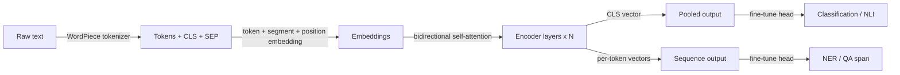

## Definition

BERT is a transformer **encoder** model pretrained with masked language modeling (MLM) and next-sentence prediction. It produces contextual embeddings that are fine-tuned for downstream NLP tasks.

Unlike [GPT](/docs/transformers/gpt)-style decoders, BERT uses **bidirectional** context (left and right of each token), which helps for understanding tasks (e.g. [NLP](/docs/nlp) classification, NER, QA) rather than open-ended generation. It is often used as a frozen or fine-tuned encoder in [RAG](/docs/rag) and search pipelines.

BERT's pretraining objective is elegantly simple: randomly mask 15% of tokens in an input and train the model to predict them using the full surrounding context. This forces the encoder to develop rich, context-dependent representations for every token rather than memorizing surface statistics. At fine-tuning time, a small task head (one or two linear layers) is added on top of the pretrained encoder and trained on labeled data — often yielding strong performance with only a few thousand examples. Variants like RoBERTa (improved training recipe), DistilBERT (distilled for speed), and DeBERTa (disentangled attention) have improved upon the original while preserving the encoder-only paradigm.

## How it works



### Tokenization and embedding

**Tokens** are produced by the WordPiece tokenizer, which appends a special [CLS] token at the start and [SEP] between/after segments. Each token's embedding is the sum of its token embedding, segment embedding, and positional embedding.

### Bidirectional encoder

The **encoder layers** apply bidirectional self-attention: unlike causal models, every token can attend to every other token in both directions. This produces representations that are deeply context-aware. Stacking 12 or 24 such layers (BERT-Base / BERT-Large) yields powerful universal representations.

### Output and fine-tuning

Output can be **pooled** (the [CLS] vector for sentence-level tasks) or the full **sequence** (one vector per token for NER, QA). **Fine-tuning** adds a task head (e.g. linear classifier) and updates the entire model or just the head on labeled data.

## When to use / When NOT to use

| Scenario | Use BERT? | Notes |
|---|---|---|
| Text classification (sentiment, intent) | Yes | [CLS] token + linear head is very effective |
| Named entity recognition (NER) | Yes | Per-token outputs suit span labeling |
| Semantic search / retrieval | Yes | Fine-tuned or bi-encoder variants (e.g. Sentence-BERT) |
| Open-ended text generation | No | Use GPT-style decoder instead |
| Very long documents (> 512 tokens) | With caution | Use Longformer or chunking strategies |
| Zero-shot generation tasks | No | BERT requires fine-tuning for generation |

## Comparisons

| Aspect | BERT (encoder-only) | GPT (decoder-only) |
|---|---|---|
| Context direction | Bidirectional | Unidirectional (causal) |
| Primary strength | Understanding / classification | Generation |
| Pretraining objective | Masked LM + NSP | Next-token prediction |
| Fine-tuning style | Add small task head | Prompting or supervised fine-tune |
| Generation capability | Poor (not designed for it) | Excellent |
| Embedding quality (retrieval) | Excellent (with bi-encoder) | Moderate without fine-tuning |

## Pros and cons

| Pros | Cons |
|---|---|
| Strong contextual representations | Cannot generate text autoregressively |
| Efficient fine-tuning on small datasets | Max 512 tokens (base architecture) |
| Widely available pretrained variants | Requires labeled data for most tasks |
| Interpretable attention patterns | Weaker than GPT-4-class models on complex reasoning |

## Code examples

```python
# Fine-tuning BERT for text classification with Hugging Face Transformers
from transformers import AutoTokenizer, AutoModelForSequenceClassification, Trainer, TrainingArguments
from datasets import Dataset
import torch

# Minimal synthetic dataset for demonstration
texts  = ["I love this product!", "Terrible experience.", "It was okay I guess.", "Absolutely fantastic!"]
labels = [1, 0, 0, 1]  # 1 = positive, 0 = negative

tokenizer = AutoTokenizer.from_pretrained("bert-base-uncased")

def tokenize(batch):
    return tokenizer(batch["text"], truncation=True, padding="max_length", max_length=64)

dataset = Dataset.from_dict({"text": texts, "label": labels})
dataset = dataset.map(tokenize, batched=True)
dataset.set_format("torch", columns=["input_ids", "attention_mask", "label"])

model = AutoModelForSequenceClassification.from_pretrained("bert-base-uncased", num_labels=2)

training_args = TrainingArguments(
    output_dir="./bert-sentiment",
    num_train_epochs=3,
    per_device_train_batch_size=2,
    logging_steps=5,
    save_strategy="no",
)

trainer = Trainer(model=model, args=training_args, train_dataset=dataset)
trainer.train()
print("Fine-tuning complete.")
```

## Practical resources

- [BERT: Pre-training of Deep Bidirectional Transformers (Devlin et al.)](https://arxiv.org/abs/1810.04805) — Original paper
- [Hugging Face – BERT](https://huggingface.co/docs/transformers/model_doc/bert) — API reference and model cards
- [Sentence-BERT](https://www.sbert.net/) — BERT variant optimized for semantic similarity and dense retrieval

## See also

- [Transformers](/docs/transformers)
- [GPT](/docs/transformers/gpt)
- [NLP](/docs/nlp)
