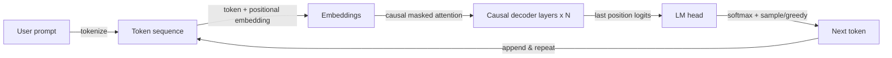

## Definition

GPT refers to decoder-only transformer models trained to predict the next token (autoregressive). Scaling these models has led to today's large language models (LLMs) capable of few-shot and zero-shot tasks.

Decoder-only design is well-suited for **generation**: at each step the model conditions on previous tokens and predicts the next. [LLMs](/docs/llms) built on this idea are then instruction-tuned and aligned (e.g. RLHF) for chat and tool use. For understanding-only tasks, [BERT](/docs/transformers/bert)-style encoders can be more parameter-efficient.

The GPT line of models (GPT-1, GPT-2, GPT-3, GPT-4) demonstrated that scaling a simple next-token prediction objective on ever-larger corpora produces models with emergent capabilities: reasoning, code generation, multi-step arithmetic, and few-shot task solving without any task-specific training. The instruction-tuning and RLHF stages that follow base pretraining transform a raw next-token predictor into an assistant that reliably follows natural language instructions, maintains conversation context, and refuses harmful requests. Modern GPT-family deployments are accessed through APIs and support features like function calling, vision inputs, and streaming.

## How it works



### Causal masking

**Tokens** are embedded and fed into **causal decoder layers**: each position can attend only to itself and previous positions (masked self-attention via an upper-triangular mask). This prevents the model from "seeing" the future during both training and inference.

### Language modeling head

The **next token** is predicted from the last position's representation via a linear layer over the vocabulary, followed by softmax. **Training** maximizes the log-likelihood of the next token given all preceding tokens (teacher forcing). The loss is averaged over all positions, so every token in the sequence contributes a gradient signal.

### Inference and sampling

**Inference** generates autoregressively: sample or greedily pick the next token, append it, and repeat until a stop condition (EOS token or max length). Sampling parameters (temperature, top-k, top-p) control diversity vs. determinism. [Prompt engineering](/docs/prompt-engineering) and [fine-tuning](/docs/llms/fine-tuning) shape task behavior on top of this mechanism.

## When to use / When NOT to use

| Scenario | Use GPT-style? | Notes |
|---|---|---|
| Text generation, summarization, dialogue | Yes | The natural fit for autoregressive generation |
| Few-shot classification via prompting | Yes | GPT handles this well with few examples |
| Semantic search / dense retrieval | With caution | Bi-encoders (BERT-style) are more efficient |
| NER or token-level classification | With caution | Encoder models are more parameter-efficient |
| Long-context reasoning (>8K tokens) | Yes | Modern GPT models support very long contexts |
| Strict budget / edge deployment | No | GPT models are large; use distilled alternatives |

## Comparisons

| Aspect | GPT (decoder-only) | BERT (encoder-only) |
|---|---|---|
| Context direction | Unidirectional (causal) | Bidirectional |
| Primary strength | Generation | Understanding / classification |
| Pretraining objective | Next-token prediction | Masked LM + NSP |
| Zero-shot capability | High | Low |
| Embedding quality (retrieval) | Moderate without fine-tuning | Excellent (bi-encoder) |
| API access | OpenAI, Anthropic, Mistral, etc. | HuggingFace hub |

## Pros and cons

| Pros | Cons |
|---|---|
| Strong zero-shot and few-shot generation | Expensive to run (large parameter count) |
| Unified model for diverse tasks | Prone to hallucination |
| Instruction-following via prompts | No explicit bidirectional context |
| Easily extended with tools and RAG | Output must be validated / grounded |

## Code examples

```python
# Chat completion with OpenAI API + streaming
from openai import OpenAI

client = OpenAI()  # reads OPENAI_API_KEY from environment

response = client.chat.completions.create(
    model="gpt-4o-mini",
    messages=[
        {"role": "system", "content": "You are a concise technical assistant."},
        {"role": "user",   "content": "Explain the difference between GPT and BERT in two sentences."},
    ],
    temperature=0.3,
    max_tokens=200,
    stream=True,
)

print("Response: ", end="", flush=True)
for chunk in response:
    delta = chunk.choices[0].delta
    if delta.content:
        print(delta.content, end="", flush=True)
print()  # newline at end
```

## Practical resources

- [Improving Language Understanding by Generative Pre-Training (OpenAI)](https://cdn.openai.com/research-covers/language-unsupervised/language_understanding_paper.pdf) — Original GPT-1 paper
- [Hugging Face – GPT-2](https://huggingface.co/docs/transformers/model_doc/gpt2) — Model docs and hosted weights
- [OpenAI API reference](https://platform.openai.com/docs/api-reference/chat) — Complete reference for chat completions endpoint

## See also

- [Transformers](/docs/transformers)
- [LLMs](/docs/llms)
- [Prompt engineering](/docs/prompt-engineering)
