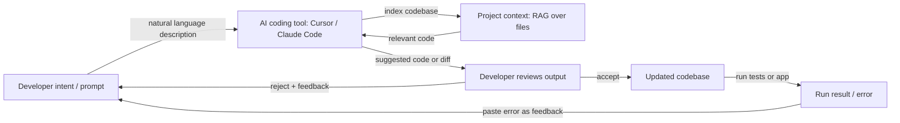

## Definition

Vibe coding is a style of software development where you work **iteratively with AI assistance**: you describe intent in natural language, get code or edits from an [LLM](/docs/llms) or coding tool, then refine by feedback and context rather than writing every line from scratch. The "vibe" is the loose, exploratory flow — you steer by intent and feel, and the model fills in implementation details. The focus is on reducing friction: ideas move from thought to working code in minutes rather than hours, with the developer acting as director and reviewer rather than typist.

Vibe coding contrasts with fully spec-first or plan-then-code approaches (e.g. [spec-driven development](/docs/spec-driven-development)): you often start with a rough idea and let [prompt engineering](/docs/prompt-engineering), [agents](/docs/agents), and tools (e.g. [Cursor](/docs/tools/cursor), [Claude Code](/docs/tools/claude-code)) suggest and edit code. The developer's role shifts from writing syntax to describing goals, evaluating outputs, and steering toward correctness. It is most productive when the developer retains enough understanding of the codebase to catch errors — vibe coding does not eliminate the need for engineering judgment, it changes where that judgment is applied.

The practice is enabled by a new generation of AI coding tools that provide project-level context: indexed codebases, multi-file edits, terminal access, and agentic loops that can write, run, and fix code autonomously. Tools like Cursor, Windsurf, and Claude Code go beyond autocomplete to act as collaborative agents that understand the full project. [RAG](/docs/rag)-style retrieval keeps suggestions grounded in your actual codebase rather than generic examples. The result is particularly useful for prototypes, scripts, boilerplate, tests, and refactors — tasks where the intent is easy to state but the implementation is tedious to write.

## How it works

### The intent-feedback loop

The core of vibe coding is a rapid loop: state an intent, review the output, provide feedback, repeat. Unlike waterfall-style development, there is no requirement to fully specify requirements before starting. You can explore by asking the model to "try a few approaches" and pick the one that feels right. The model's suggestions become scaffolding you refine rather than a completed artifact you accept wholesale.

### Context and tooling



### Agentic and autonomous modes

Modern tools support agentic vibe coding: the AI can run terminal commands, read error output, and self-correct over multiple iterations without developer intervention. This is useful for repetitive tasks (generating test suites, migrating APIs) but requires the developer to set clear boundaries and review the final diff — agentic loops can make cascading changes that are hard to untangle.

## When to use / When NOT to use

| Use when | Avoid when |
|----------|------------|
| Prototyping or scripting where speed matters more than architecture | Building safety-critical or highly regulated systems where unreviewed code is unacceptable |
| Generating boilerplate, tests, or migrations where intent is easy to state | The codebase is so complex that the model lacks sufficient context to avoid subtle bugs |
| Learning or exploring an unfamiliar codebase or library | You need to fully understand every line of code produced (e.g. for security review) |
| Iterating rapidly on UI or API design to validate ideas | Long-term maintainability requires consistent patterns and deliberate architecture decisions |

## Comparisons

| Approach | Starting point | Spec required | Best for |
|----------|---------------|--------------|---------|
| Vibe coding | Rough intent | No | Prototypes, scripts, exploration |
| Spec-driven development | Explicit spec | Yes | Regulated systems, agents, compliance |
| TDD (test-first) | Test cases | Partial | Production features with clear acceptance criteria |
| Pair programming (human + human) | Shared context | Varies | Complex problems requiring deep reasoning |

## Pros and cons

| Pros | Cons |
|------|------|
| Fast iteration and less typing | Can obscure understanding if you never read the code |
| Good for exploration and learning | May produce brittle or overfitted code without review |
| Low friction for small tasks and prototypes | Hard to scale to large, consistent systems without specs |
| Works well with [agents](/docs/agents) and IDE integrations | Depends heavily on model quality, context window, and tool integration |
| Reduces activation energy to start a new task | Agentic loops can make unwanted cascading changes |

## Code examples

### Example vibe coding session with Claude Code (shell)

```bash
# Start Claude Code in your project directory
claude

# Describe what you want — no need to specify exact implementation
> Add a rate limiting middleware to the Express app.
>  Use a sliding window of 100 requests per minute per IP.
>  Return 429 with a Retry-After header when the limit is exceeded.

# Claude Code will:
# 1. Read the existing Express setup
# 2. Install the appropriate library (e.g. express-rate-limit)
# 3. Write and insert the middleware
# 4. Update imports

# Review the diff, then iterate
> Actually use Redis for the rate limit store so it works across multiple instances.

# Accept the final diff and run tests
> Run the existing test suite and fix any failures.
```

## Practical resources

- [Claude Code documentation](https://docs.anthropic.com/en/docs/claude-code/overview) — Anthropic's terminal-based AI coding agent
- [Cursor documentation](https://docs.cursor.com/) — AI-first IDE with codebase-aware suggestions and agentic editing
- [Kiro – Spec-driven and Autopilot](https://kiro.dev/) — Tool that balances structured specs with AI-driven development flow
- [Andrej Karpathy – Vibe coding (Twitter/X)](https://x.com/karpathy/status/1886192184808149165) — Coinage and description of the term by its originator
- [Windsurf (Codeium)](https://codeium.com/windsurf) — Agentic IDE with Cascade, a multi-file agentic coding flow

## See also

- [Spec-driven development](/docs/spec-driven-development) — More structured, spec-first approach
- [Agents](/docs/agents) — AI that can write and edit code
- [Cursor](/docs/tools/cursor) — IDE built for AI-assisted coding
- [Prompt engineering](/docs/prompt-engineering)
