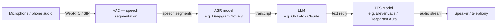

## Definition

A **voice agent** is an AI system that accepts spoken audio as input, reasons with a language model, and returns synthesised speech as output — all with latency low enough to sustain a natural conversation. Unlike text chatbots, voice agents must contend with acoustic noise, speaker interruptions, and a strict latency budget: research and industry data consistently show that round-trip latency above 600 ms feels sluggish, and above 1.5 s users abandon the interaction entirely.

The dominant production architecture in 2026 remains the **cascaded pipeline**: a dedicated Automatic Speech Recognition (ASR) model converts audio to text, an LLM reasons and generates a reply, and a Text-to-Speech (TTS) model synthesises the spoken response. This split is popular because each stage can be swapped or upgraded independently, and the intermediate text representation is easy to log and debug. An emerging alternative — **speech-to-speech models** (e.g. GPT-4o Audio, Gemini Live) — fuses all three stages into a single neural network, trading component transparency for lower latency on simple turns.

Key building blocks covered in this section:

- The cascaded **[STT → LLM → TTS pipeline](/docs/voice-agents/stt-llm-tts-pipeline)** — component selection, latency decomposition, and voice activity detection.
- **[Real-time audio](/docs/voice-agents/realtime-audio)** — WebRTC transport, barge-in / interruption handling, and managed platforms (LiveKit, Vapi, Deepgram).

## How it works

**VAD (Voice Activity Detection):** detects speech segments and triggers the STT stage; also detects barge-in (user speaking while the agent talks) to interrupt playback. **STT:** converts audio segments to text in real time; best-in-class models (Deepgram Nova-3, Whisper v3) achieve < 300 ms end-to-end latency. **LLM:** generates the response, optionally calling tools or querying RAG; streaming token output lets TTS start before the full reply is complete. **TTS:** converts text tokens to audio as they arrive, enabling speech playback to begin within ~75 ms of the first token.

## When to use / When NOT to use

| Scenario | Use voice agents | Avoid voice agents |
|---|---|---|
| Customer support / IVR replacement needing natural conversation | Yes — lower friction than DTMF menus | No — DTMF/text-only is fine for simple menu selection |
| Accessibility (visually impaired, hands-free scenarios) | Yes — voice is the primary modality | No — if a screen and keyboard are available and preferred |
| Complex multi-step reasoning with tool calls | Yes — with streaming TTS to hide LLM latency | No — if latency SLA < 300 ms; consider speech-to-speech |
| Noisy environments (factory floor, outdoors) | With noise-robust ASR (Deepgram, Whisper) | Avoid without acoustic preprocessing |
| High-volume telephony (call centres) | Yes — LiveKit/Vapi support SIP/PSTN natively | No — if per-minute cost is prohibitive at scale |
| Multilingual global deployment | Yes — Deepgram Nova-3 supports 36 languages | Verify TTS quality per language before launch |

## Key metrics

| Metric | Threshold | Notes |
|---|---|---|
| Total round-trip latency | < 600 ms ideal, < 300 ms excellent | STT + LLM first-token + TTS first-audio |
| Word Error Rate (WER) | < 10% | Deepgram Nova-3: 6.84% WER (2025) |
| Time-to-first-audio (TTFA) | < 200 ms | Streaming TTS critical for low TTFA |
| Barge-in detection rate | > 95% | Missed interruptions severely hurt UX |

## Sources

- [LiveKit – Voice agent architecture: STT, LLM, and TTS pipelines explained](https://livekit.com/blog/voice-agent-architecture-stt-llm-tts-pipelines-explained)
- [LiveKit Agents GitHub — open-source real-time agent framework](https://github.com/livekit/agents)
- [Deepgram – Nova-3 ASR model overview](https://deepgram.com/learn/nova-3-speech-to-text-model)
- [Voice AI pipeline: STT, LLM, TTS and the 300 ms budget — Chanl Blog](https://www.channel.tel/blog/voice-ai-pipeline-stt-tts-latency-budget)
- [Best voice agent stack: a complete selection framework — Hamming AI](https://hamming.ai/resources/best-voice-agent-stack)

## See also

- [STT-LLM-TTS pipeline](/docs/voice-agents/stt-llm-tts-pipeline)
- [Real-time audio](/docs/voice-agents/realtime-audio)
- [Speech recognition](/docs/speech-recognition)
- [AI agents](/docs/agents)
- [LLMs](/docs/llms)
