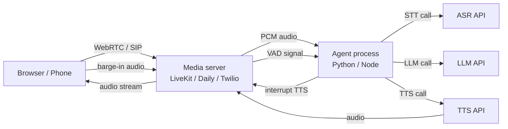

## Definition

**Real-time audio** in voice agents refers to the full-stack challenge of delivering sub-second interactive speech over a network: choosing the right transport protocol, handling user interruptions gracefully, and deciding between a self-hosted stack or a managed platform. While the [STT-LLM-TTS pipeline](/docs/voice-agents/stt-llm-tts-pipeline) defines what happens to audio, real-time audio infrastructure defines *how* audio travels between the user's device and the agent, and how the system reacts when the user speaks mid-reply.

## How it works

### WebRTC transport

WebRTC (Web Real-Time Communication) is the de-facto transport for browser-based voice agents. It provides encrypted peer-to-peer or server-relay UDP media with built-in jitter buffering, NACK retransmission, and adaptive bitrate. Opus codec (6–510 kbps) is universally supported and tuned for speech.

For telephony deployments (call centres, IVR), SIP/PSTN trunks are used instead; platforms like Vapi provide native SIP integration that abstracts protocol differences from the agent logic.

### Barge-in and interruption handling

Barge-in occurs when the user starts speaking while the agent's TTS audio is playing. Handling it correctly is critical to conversation naturalness:

1. **Detection** — VAD runs continuously on the user's audio channel even during TTS playback.
2. **Signal** — when VAD detects sustained speech (typically > 200 ms), it fires an interruption event.
3. **Cancel TTS** — the agent stops sending audio chunks and drains the playback buffer.
4. **Abort LLM** (optional) — if the LLM is still generating, the stream is cancelled to avoid wasted tokens.
5. **Resume pipeline** — the new user speech segment enters the STT stage normally.

LiveKit Agents 1.5 (April 2026) ships adaptive interruption handling that adjusts the voice-activity threshold based on background noise level, reducing false barge-ins in noisy environments.

### Managed platforms comparison

| Platform | Transport | Barge-in | SIP/PSTN | Open source | Pricing model |
|---|---|---|---|---|---|
| **LiveKit** | WebRTC-native | Adaptive (v1.5) | Via SIP trunk | Yes (Apache 2.0) | Free tier + $50/mo+ |
| **Vapi** | WebRTC + SIP | Built-in | Native | No | $0.05/min + components |
| **Deepgram** | WebSocket / API | Via Nova-3 streaming | No | No | Pay-per-minute |
| **Daily** | WebRTC | Via partner VAD | Via trunk | No | $0.004/min media |
| **Twilio Voice** | SIP/PSTN | Via `<Gather>` | Native | No | $0.013/min |

### LiveKit Agents (open source)

LiveKit is the dominant open-source choice for WebRTC-native voice agents. The Python SDK (v1.5, April 2026) exposes a pipeline API that wires VAD → STT → LLM → TTS with async streams. Features include native Model Context Protocol (MCP) tool support, room-level participant management, and multi-track audio mixing for conference scenarios.

### Vapi (managed)

Vapi is a fully managed platform with a REST/WebSocket API. Developers specify a model, voice, and system prompt; Vapi handles WebRTC session setup, STT, TTS, and barge-in. Its native SIP/PSTN integration makes it the lowest-friction path to phone-number-accessible voice agents. The modular component model allows mixing providers: e.g., Deepgram STT + GPT-4o + ElevenLabs TTS inside Vapi's orchestration.

## When to use / When NOT to use

| Scenario | Use | Avoid |
|---|---|---|
| Browser-based voice UX | WebRTC (LiveKit, Daily) | SIP — browser-native WebRTC is simpler |
| Telephony / IVR replacement | Vapi or Twilio SIP | WebRTC — phones use SIP/PSTN |
| Full infrastructure control, self-hosted | LiveKit open source | Managed platforms — they add vendor dependency |
| Fastest time-to-market | Vapi managed API | Self-hosting — ops overhead is significant |
| High-volume production (> 10 k min/month) | LiveKit self-host or LK Cloud | Vapi — per-minute pricing exceeds self-host cost |
| Noisy environments | Adaptive VAD (LiveKit 1.5+) | Fixed-threshold VAD causes frequent false barge-ins |

## Sources

- [LiveKit voice agents product page](https://livekit.com/voice-agents)
- [LiveKit Agents GitHub — open-source framework](https://github.com/livekit/agents)
- [Build and deploy LiveKit AI voice agents: the 2026 playbook — Forasoft](https://www.forasoft.com/blog/article/livekit-ai-agents-guide)
- [Voice AI chatbot platforms in 2026 — GetStream](https://getstream.io/blog/voice-chatbot-platforms/)
- [Best voice agent stack: a complete selection framework — Hamming AI](https://hamming.ai/resources/best-voice-agent-stack)

## See also

- [Voice agents](/docs/voice-agents)
- [STT-LLM-TTS pipeline](/docs/voice-agents/stt-llm-tts-pipeline)
- [Speech recognition](/docs/speech-recognition)
- [AI agents](/docs/agents)
