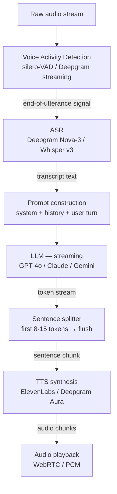

## Definition

The **STT → LLM → TTS cascaded pipeline** is the standard architecture for production voice agents. Each stage is a separate model or API: an Automatic Speech Recognition (ASR) system transcribes audio to text, a Large Language Model generates a textual reply, and a Text-to-Speech system renders speech. Cascading keeps each component swappable and independently observable, at the cost of additive inter-stage latency.

The central constraint is a **300 ms budget**: at or below 300 ms total round-trip latency the conversation feels human; 300–600 ms feels acceptable but slightly robotic; above 600 ms users adapt to a turn-taking mental model more like walkie-talkies; above 1.5 s call abandonment rises sharply. Streaming tokens from the LLM directly into the TTS system — so speech synthesis begins before the full reply is generated — is the single biggest lever for hitting this budget.

## How it works

### Stage 1 — Voice Activity Detection (VAD)

VAD detects speech segments and fires an end-of-utterance (EOU) event that triggers STT. Fast, accurate VAD (silero-VAD, WebRTC VAD) prevents false EOU on natural pauses, reducing truncated transcriptions. In real-time deployments, VAD also monitors the playback channel to detect barge-in (user speaking while TTS plays) and triggers interruption handling.

### Stage 2 — Speech-to-Text (ASR)

| Model | WER (en) | Latency | Languages | Notes |
|---|---|---|---|---|
| Deepgram Nova-3 | 6.84% | < 300 ms | 36 | Streaming, noise-robust, May 2025 |
| OpenAI Whisper v3 | ~8% | 300–800 ms | 99 | Batch-oriented; real-time via streaming endpoint |
| AssemblyAI Universal-2 | ~9% | < 400 ms | 99 | Strong on accented speech |
| Azure Cognitive Speech | ~9% | < 300 ms | 100+ | Enterprise SLA; custom vocabulary |

Streaming ASR (Deepgram, Azure) returns **partial transcripts** as the user speaks; the final transcript fires on EOU. Partial transcripts can be used to speculatively call the LLM earlier, shaving 150–300 ms from perceived latency.

### Stage 3 — LLM generation

The LLM receives the user transcript injected into the conversation prompt and streams tokens back. Key considerations:

- **Streaming is mandatory** — wait-for-full-reply before TTS adds 350 ms–1 s+ of silent dead time.
- **Tool calls block TTS** — if a tool call fires, play a filler phrase ("Let me check that…") while awaiting the tool result to avoid silence.
- **Context window management** — voice turns are short, but long conversations must prune history to stay within budget; sliding window or summarisation strategies apply.

### Stage 4 — Text-to-Speech (TTS)

TTS converts text tokens to audio. The pipeline sends sentence-level chunks (8–15 tokens) as soon as the LLM emits them, starting playback within ~75 ms of the first sentence completing.

| Provider | Latency (TTFA) | Voices | Streaming | Notes |
|---|---|---|---|---|
| ElevenLabs | ~100 ms | 1 000+ | Yes | Best expressiveness; higher cost |
| Deepgram Aura | ~75 ms | 10+ | Yes | Bundled with Nova-3; lowest latency |
| OpenAI TTS-1 | ~250 ms | 6 | Yes | Reliable; moderate expressiveness |
| Cartesia Sonic | ~90 ms | custom | Yes | Real-time-optimised; voice cloning |

## When to use / When NOT to use

| Scenario | Cascaded pipeline | Skip cascaded |
|---|---|---|
| Need to swap ASR or TTS independently | Yes — best flexibility | No — speech-to-speech fuses them |
| Full conversation logging required | Yes — text at each stage | No — speech-to-speech lacks intermediate text |
| Lowest possible latency on simple turns | Competitive with streaming | Speech-to-speech models (GPT-4o Audio) can be faster |
| Tool use, RAG, structured reasoning | Yes — LLM has full capabilities | Speech-to-speech models have limited tool-call support |
| Non-English languages | Yes — per-language model selection | Verify TTS quality — many speech-to-speech models are English-first |

## Practical latency decomposition

| Stage | Typical range | Optimised range |
|---|---|---|
| VAD end-of-utterance detection | 50–150 ms | 30–80 ms |
| ASR transcript (streaming) | 100–500 ms | 80–200 ms |
| LLM time-to-first-token | 200–800 ms | 150–350 ms |
| TTS time-to-first-audio | 75–250 ms | 60–100 ms |
| **Total (realistic)** | **425 ms–1.7 s** | **320–730 ms** |

## Sources

- [LiveKit – Sequential pipeline architecture for voice agents](https://livekit.com/blog/sequential-pipeline-architecture-voice-agents)
- [Voice AI pipeline: STT, LLM, TTS and the 300 ms budget — Chanl](https://www.channel.tel/blog/voice-ai-pipeline-stt-tts-latency-budget)
- [Deepgram Nova-3 model card](https://deepgram.com/learn/nova-3-speech-to-text-model)
- [Introl – Voice AI infrastructure: building real-time speech agents](https://introl.com/blog/voice-ai-infrastructure-real-time-speech-agents-asr-tts-guide-2025)

## See also

- [Voice agents](/docs/voice-agents)
- [Real-time audio](/docs/voice-agents/realtime-audio)
- [Speech recognition](/docs/speech-recognition)
- [LLMs streaming](/docs/llms/streaming)
