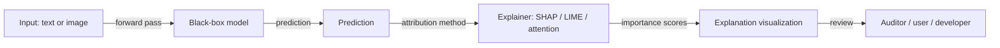

## Definition

Explainable AI (XAI) is the set of methods and practices that make machine learning model behavior understandable to humans — identifying which inputs or features drove a decision, surfacing the internal logic of a model, or producing natural language justifications that non-technical stakeholders can act on. The goal is not just to describe what a model did, but to provide explanations that are faithful to its actual reasoning and useful to the person receiving them: an auditor checking for bias, a doctor validating a diagnosis, or a user disputing a credit decision.

Explanations can be **global** (describing overall model behavior — which features are generally most important) or **local** (explaining a specific prediction — why was this particular loan denied?). They can be **post-hoc** (applied after training to an existing model, such as SHAP or LIME) or **intrinsic** (models that are interpretable by design, like linear models, decision trees, or rule-based systems). The post-hoc vs. intrinsic distinction matters: post-hoc explanations are flexible and can be applied to any model, but may not fully capture the model's true mechanism; intrinsic models are more faithful but often less expressive.

XAI is a critical enabler of [AI safety](/docs/ai-safety) auditing and [bias in AI](/docs/bias-in-ai) investigations. It is legally required or strongly recommended in regulated domains — under the EU AI Act and GDPR, individuals affected by automated decisions have the right to a meaningful explanation. As [LLMs](/docs/llms) and [agents](/docs/agents) become more capable, the challenge of explaining emergent behavior and multi-step reasoning is an active research frontier.

## How it works

### Feature attribution methods

Feature attribution methods assign importance scores to each input feature for a given prediction. SHAP (SHapley Additive exPlanations) uses cooperative game theory to fairly distribute the contribution of each feature, guaranteeing consistency and local accuracy. LIME (Local Interpretable Model-agnostic Explanations) fits a simple interpretable model around the neighborhood of a single prediction. Both work with any model type but may differ from each other and from the true model mechanism.

### Visual and attention-based explanations



For vision models, saliency maps and GradCAM highlight image regions that most influenced a prediction. For language models, attention weights show which tokens the model attended to; though attention is not always a reliable explanation of causal reasoning, it is widely used for debugging.

### Inherently interpretable models

Linear models, logistic regression, decision trees, and rule lists are inherently interpretable: their logic can be read directly from model parameters. When interpretability is paramount — for example, in clinical risk scoring or regulated credit models — these simpler models may be preferred even at the cost of some predictive accuracy.

## When to use / When NOT to use

| Use when | Avoid when |
|----------|------------|
| Regulated domain requires explanations for automated decisions (credit, hiring, healthcare) | The model is low-stakes with no individual impact and no regulatory requirement |
| Debugging model failures or unexpected behavior | Explanation overhead would introduce unacceptable production latency |
| Users need to understand or contest a model's decision | The model is an intrinsically interpretable baseline that needs no separate explanation |
| Auditing for bias or safety issues before or after deployment | The explanation method you have access to is known to be unreliable for your model type |

## Comparisons

| Method | Type | Model-agnostic | Scope | Fidelity |
|--------|------|---------------|-------|---------|
| SHAP | Post-hoc | Yes | Local + global | High (mathematically grounded) |
| LIME | Post-hoc | Yes | Local | Moderate (local approximation) |
| GradCAM | Post-hoc | No (gradient-based) | Local (vision) | Moderate |
| Attention | Post-hoc | No (transformer-specific) | Local | Variable |
| Decision tree | Intrinsic | N/A | Global | Perfect (model IS the explanation) |

## Pros and cons

| Pros | Cons |
|------|------|
| Supports compliance with GDPR and EU AI Act right-to-explanation | Post-hoc explanations may not reflect the true model mechanism |
| Enables bias detection by attributing decisions to protected proxies | Explanations can be manipulated to appear fair even when the model is not |
| Builds user trust and supports contestability | Inherently interpretable models often sacrifice predictive power |
| Facilitates model debugging and iterative improvement | Explaining emergent behavior in LLMs and deep nets remains an open problem |

## Code examples

### SHAP feature attribution for a tabular classifier (Python)

```python
import shap
import numpy as np
from sklearn.ensemble import GradientBoostingClassifier
from sklearn.datasets import make_classification

# Train a simple classifier
X, y = make_classification(n_samples=500, n_features=10, random_state=42)
feature_names = [f"feature_{i}" for i in range(X.shape[1])]

model = GradientBoostingClassifier(n_estimators=50, random_state=42)
model.fit(X, y)

# Compute SHAP values for the test set
explainer = shap.TreeExplainer(model)
shap_values = explainer.shap_values(X[:10])

# Show feature importances for the first prediction
print("SHAP values for prediction 0 (positive class):")
for name, value in sorted(
    zip(feature_names, shap_values[0]),
    key=lambda x: abs(x[1]),
    reverse=True,
):
    print(f"  {name}: {value:+.4f}")
```

## Practical resources

- [Interpretable Machine Learning (Molnar)](https://interpretable.ml/) — Comprehensive free online book covering all major XAI methods
- [SHAP documentation](https://shap.readthedocs.io/) — Official docs, tutorials, and visualization gallery
- [LIME GitHub](https://github.com/marcotcr/lime) — Original LIME implementation with examples
- [Google – What-If Tool](https://pair-code.github.io/what-if-tool/) — Interactive visual exploration of model fairness and explanations
- [Explainability for Large Language Models (survey)](https://arxiv.org/abs/2309.01029) — Recent survey on XAI methods for LLMs

## See also

- [AI safety](/docs/ai-safety)
- [Bias in AI](/docs/bias-in-ai)
