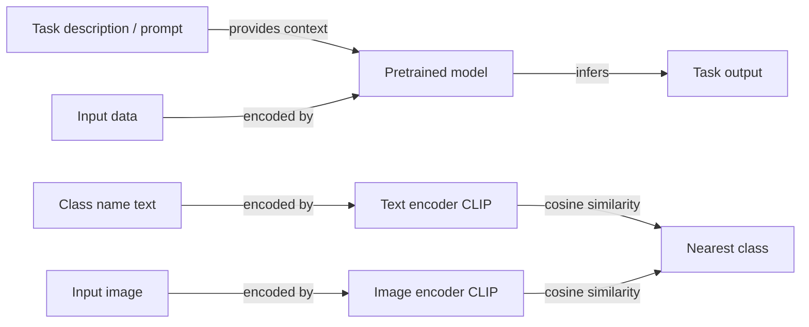

## Definition

Zero-shot learning (ZSL) is the ability of a model to perform a task for which it has received **no labeled training examples** at inference time. The model generalizes purely from knowledge acquired during pretraining, guided only by a task description — a natural language prompt, a set of class attribute vectors, or a shared embedding space between modalities. There are no gradient updates on the target task; the model must bridge the gap between what it learned during pretraining and the new task specification.

Two major paradigms exist. In the **attribute-based** approach — the original formulation from computer vision (Lampert et al., 2009) — unseen classes are described by semantic attributes (e.g., "has stripes", "lives in water"), and the model classifies inputs by matching predicted attributes to class descriptions. In the **large model** approach — now dominant — pretrained LLMs or vision-language models generalize via **prompting**. For text tasks, the model is given an instruction describing the task and format; for image tasks, CLIP embeds both images and class-name text in a shared space and classifies by cosine similarity.

The quality of zero-shot predictions depends entirely on how well pretraining covered the target task or semantically similar ones. LLMs excel at zero-shot for NLP tasks (classification, summarization, translation, question answering) because web-scale pretraining implicitly covers most text tasks. CLIP-style vision-language models generalize zero-shot to object recognition across hundreds of ImageNet classes. When zero-shot quality is insufficient, [few-shot learning](/docs/few-shot-learning) (adding examples to the prompt) or [fine-tuning](/docs/llms/fine-tuning) are natural next steps.

## How it works

### Prompt-based zero-shot (LLMs)

The task is fully specified in the prompt: no examples, only instructions and format. The LLM conditions on the prompt and generates or completes the answer. Instruction-tuned models (e.g., GPT-4, Claude, Llama-3-Instruct) are specifically trained to follow zero-shot instructions reliably.

### Vision-language zero-shot (CLIP)

CLIP trains an image encoder and a text encoder jointly so that matching image-text pairs have high cosine similarity in a shared embedding space. At inference, class names (e.g., "a photo of a cat") are embedded as text; an input image is embedded and classified by nearest-neighbor to class text embeddings — no labeled images required.



### Zero-shot chain-of-thought (CoT)

Adding "Let's think step by step" to a zero-shot prompt elicits multi-step reasoning from LLMs, substantially improving accuracy on arithmetic, logic, and commonsense tasks without providing any worked examples.

### Generalized zero-shot learning (GZSL)

In GZSL, the model must classify inputs from both **seen** (training) classes and **unseen** (zero-shot) classes simultaneously. This is harder than standard ZSL because the model tends to be biased toward seen classes. Calibration techniques and generative models (synthesizing features for unseen classes) help.

## When to use / When NOT to use

| Scenario | Use zero-shot | Avoid zero-shot |
|---|---|---|
| Task is well-described in natural language | Yes — instruction-tuned LLMs handle this reliably | No — if the task requires specialized domain knowledge not in pretraining |
| No labeled data available at all | Yes — zero-shot is the only option | No — collect even a few examples and use few-shot |
| Rapid prototyping across many tasks | Yes — no training overhead | No — production systems with quality requirements |
| New image classes described by text | Yes — CLIP-style models generalize from class names | No — if visual similarity to training classes is low |
| Arithmetic or reasoning tasks requiring high accuracy | Partial — use with chain-of-thought prompting | Prefer few-shot or fine-tuned models for critical applications |

## Comparisons

| Approach | Examples needed | Adaptation | Accuracy potential | Speed to deploy |
|---|---|---|---|---|
| Zero-shot | 0 | Prompt only | Moderate | Instant |
| Few-shot (in-context) | 1–10 | In-context examples | Higher | Very fast |
| Fine-tuning | 100–10K+ | Gradient updates | Highest | Slower |
| Zero-shot + CoT | 0 | Prompt with reasoning | Higher than zero-shot | Instant |

## Pros and cons

| Pros | Cons |
|---|---|
| No labeled data or training required | Quality depends heavily on pretraining coverage |
| Instant deployment — just write a prompt | Inconsistent for niche or highly specialized tasks |
| Flexible — one model handles many tasks | No guarantee of structured output format |
| CLIP extends zero-shot to vision without image labels | Generalized ZSL is biased toward seen classes |

## Code examples

Zero-shot text classification using Hugging Face's NLI-based pipeline:

```python
from transformers import pipeline

# Zero-shot classifier using NLI (no fine-tuning needed)
classifier = pipeline("zero-shot-classification", model="facebook/bart-large-mnli")

text = "The central bank raised interest rates by 50 basis points to combat inflation."
candidate_labels = ["finance", "sports", "technology", "politics", "science"]

result = classifier(text, candidate_labels=candidate_labels)
print("Top label:", result["labels"][0])      # finance
print("Confidence:", f"{result['scores'][0]:.2%}")
```

Zero-shot image classification with CLIP:

```python
import torch
from PIL import Image
from transformers import CLIPProcessor, CLIPModel

model = CLIPModel.from_pretrained("openai/clip-vit-base-patch32")
processor = CLIPProcessor.from_pretrained("openai/clip-vit-base-patch32")

# Class descriptions as text (no labeled images needed)
class_texts = [
    "a photo of a cat",
    "a photo of a dog",
    "a photo of a bird",
    "a photo of a car",
]

image = Image.open("test_image.jpg")  # Any image

inputs = processor(
    text=class_texts,
    images=image,
    return_tensors="pt",
    padding=True,
)

with torch.no_grad():
    outputs = model(**inputs)
    probs = outputs.logits_per_image.softmax(dim=1)

predicted_class = class_texts[probs.argmax().item()]
print(f"Predicted: {predicted_class} ({probs.max().item():.2%})")
```

## Practical resources

- [Learning Transferable Visual Models from Natural Language (CLIP, Radford et al., 2021)](https://arxiv.org/abs/2103.00020) — CLIP paper enabling zero-shot image classification from text descriptions
- [Language Models are Few-Shot Learners (GPT-3, Brown et al., 2020)](https://arxiv.org/abs/2005.14165) — GPT-3 paper demonstrating zero-shot and few-shot prompting at scale
- [Large Language Models are Zero-Shot Reasoners (Kojima et al., 2022)](https://arxiv.org/abs/2205.11916) — Chain-of-thought zero-shot prompting
- [Hugging Face – Zero-shot classification pipeline](https://huggingface.co/docs/transformers/tasks/zero_shot_classification) — Ready-to-use NLI-based zero-shot text classifier

## See also

- [Few-shot learning](/docs/few-shot-learning)
- [Prompt engineering](/docs/prompt-engineering)
- [LLMs](/docs/llms)
