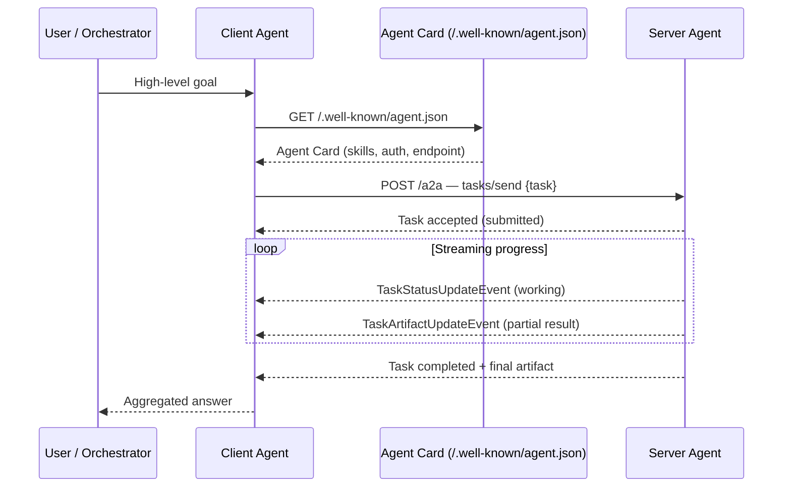

## Definição

O **protocolo Agent2Agent (A2A)** é um padrão aberto e neutro em relação ao fornecedor que permite que agentes de IA autônomos se comuniquem entre si, independentemente de qual framework, modelo ou nuvem eles executam. Introduzido pelo Google em abril de 2025 e contribuído à **Linux Foundation** em junho de 2025 (licença Apache 2.0), o A2A complementa o [Model Context Protocol (MCP)](/docs/mcp) em uma camada diferente: onde o MCP governa como um agente se conecta a **ferramentas e fontes de dados**, o A2A governa como um **agente fala com outro agente**.

Em início de 2026, mais de 150 organizações — incluindo Google, Microsoft, AWS, Salesforce, SAP e IBM — suportam ou implementam o A2A, tornando-o o padrão de facto para interoperabilidade de múltiplos agentes.

Os objetivos centrais de design são:

- **Descobribilidade** — qualquer cliente pode descobrir o que um agente faz antes de chamá-lo.
- **Interoperabilidade** — agentes construídos em LangGraph, CrewAI, ADK ou código personalizado podem colaborar sem adaptadores customizados.
- **Segurança** — a autenticação é declarada no Agent Card; as credenciais fluem por headers HTTP padrão.
- **Streaming** — tarefas de longa duração reportam progresso de forma incremental via Server-Sent Events.

## Como funciona

### Agent Cards

Todo agente compatível com A2A publica uma autodescricão na URL bem conhecida `/.well-known/agent.json` chamada de **Agent Card**. O card é um documento JSON com:

| Campo | Descrição |
|---|---|
| `name` / `description` | Identidade legível por humanos |
| `url` | O endpoint A2A do agente |
| `version` | Versão do protocolo e do agente |
| `skills` | Array de objetos de capacidade (id, nome, descrição, modos de entrada/saída) |
| `capabilities` | Flags: `streaming`, `pushNotifications`, `stateTransitionHistory` |
| `authentication` | Esquemas suportados (bearer, OAuth, API key) |
| `provider` | Organização que publica o agente |

Uma **Skill** é o equivalente A2A de uma assinatura de função: ela diz a um agente chamador exatamente o que o agente remoto pode fazer e qual formato de entrada ele espera. Agent Cards podem opcionalmente ser assinados com JSON Web Signatures (JWS) para garantir autenticidade.

### Ciclo de vida das tarefas

O A2A modela o trabalho como **tarefas** com uma máquina de estados definida:

```
submitted → working → (input-required) → completed | failed | canceled
```

O **agente cliente** (`A2AClient`) chama o endpoint do agente remoto com um objeto de tarefa contendo uma mensagem. O **agente servidor** (`A2AServer`) aceita a tarefa e responde de forma síncrona (para resultados rápidos) ou via streaming (para trabalho de longa duração). O streaming usa Server-Sent Events; o servidor emite mensagens `TaskStatusUpdateEvent` e `TaskArtifactUpdateEvent` conforme o trabalho progride. O estado `input-required` permite tarefas interativas de múltiplos turnos onde o servidor pausa e pede esclarecimento ao cliente.

### A2A vs MCP — protocolos complementares

| Dimensão | MCP | A2A |
|---|---|---|
| **Propósito** | Agente ↔ Ferramenta / fonte de dados | Agente ↔ Agente |
| **O que é conectado** | Host LLM + API externa, BD, sistema de arquivos | Agentes pares entre frameworks |
| **Descoberta** | Schemas de ferramentas via `tools/list` | Agent Cards em `/.well-known/agent.json` |
| **Transporte** | stdio ou Streamable HTTP | HTTPS (JSON-RPC over HTTP) |
| **Estado** | Sem estado por chamada (ferramentas) | Ciclo de vida de tarefa com estado |
| **Governança** | Anthropic / comunidade aberta | Linux Foundation |

Os protocolos são projetados para trabalhar juntos: um **agente cliente** pode usar o MCP para alcançar ferramentas enquanto simultaneamente atua como cliente A2A para delegar subtarefas a agentes especialistas.



### Autenticação e segurança

Os requisitos de autenticação são declarados no Agent Card. No momento da chamada, as credenciais (tokens Bearer OAuth, API keys) são passados em headers HTTP padrão — eles nunca são incorporados nas próprias mensagens do protocolo A2A. Agentes podem recusar ou escopo de tarefas com base na identidade do chamador, e os cards podem ser assinados (JWS) para que os clientes possam verificar que estão falando com o agente real.

## Quando usar / Quando NÃO usar

| Use quando | Evite quando |
|---|---|
| Você está construindo um **sistema multi-agente** onde agentes especialistas de diferentes fornecedores precisam colaborar | Todos os agentes vivem no mesmo processo — chamadas de função diretas são mais simples |
| Você precisa de **interoperabilidade entre frameworks** (agente LangGraph falando com um agente CrewAI) | Seus agentes são fortemente acoplados e co-implantados — o overhead do A2A adiciona latência |
| Agentes têm **execução longa** e precisam transmitir progresso de volta ao chamador | As tarefas são trivialmente rápidas — chamadas síncronas de ferramentas MCP são suficientes |
| Você quer **descoberta sem coordenação prévia** — o cliente encontra capacidades em tempo de execução pelo Agent Card | Você controla todos os agentes e prefere uma camada RPC proprietária mais simples |
| Você está construindo **marketplaces de agentes enterprise** onde agentes de diferentes organizações devem interoperar | Você tem apenas um único LLM invocando ferramentas locais — use o MCP em vez disso |

## Guia prático

### Início rápido em Python (SDK google-a2a)

```python
# Install: pip install a2a-sdk
from a2a.client import A2AClient
import asyncio

async def main():
    # The client fetches the Agent Card automatically from /.well-known/agent.json
    client = A2AClient(url="https://specialist-agent.example.com")
    await client.initialize()          # fetches Agent Card

    response = await client.send_task(
        skill_id="summarize_document",
        message={"role": "user", "content": "Summarize: https://example.com/report.pdf"},
    )

    # Stream progress events
    async for event in client.stream_task(response.task_id):
        print(event)

asyncio.run(main())
```

### Servidor A2A mínimo (Python)

```python
from a2a.server import A2AServer, AgentCard, Skill

card = AgentCard(
    name="Summarizer Agent",
    description="Summarizes documents from a URL",
    url="https://my-agent.example.com",
    version="1.0.0",
    skills=[
        Skill(
            id="summarize_document",
            name="Summarize Document",
            description="Fetches a URL and returns a concise summary",
            input_modes=["text"],
            output_modes=["text"],
        )
    ],
    capabilities={"streaming": True},
    authentication={"schemes": ["bearer"]},
)

server = A2AServer(card=card)

@server.skill("summarize_document")
async def summarize(task):
    url = task.message["content"].split()[-1]
    # ... fetch and summarize url ...
    return {"summary": "..."}

server.run(host="0.0.0.0", port=8080)
```

## Fontes

- [Especificação oficial do protocolo A2A](https://a2a-protocol.org/latest/specification/)
- [Repositório GitHub do protocolo A2A](https://github.com/a2aproject/A2A)
- [Conceito de Agent Card — documentação do protocolo A2A](https://agent2agent.info/docs/concepts/agentcard/)
- [Protocolo A2A explicado — blog HuggingFace](https://huggingface.co/blog/1bo/a2a-protocol-explained)
- [IBM — O que é o protocolo Agent2Agent](https://www.ibm.com/think/topics/agent2agent-protocol)
- [Stellagent — Protocolo A2A: 150+ organizações](https://stellagent.ai/insights/a2a-protocol-google-agent-to-agent)

## Veja também

- [Sistemas multi-agente](/docs/agents/multi-agent-systems)
- [Visão geral do Model Context Protocol](/docs/mcp)
- [Runtimes de agentes](/docs/agents/agent-runtimes)
- [Agentes de IA](/docs/agents)
