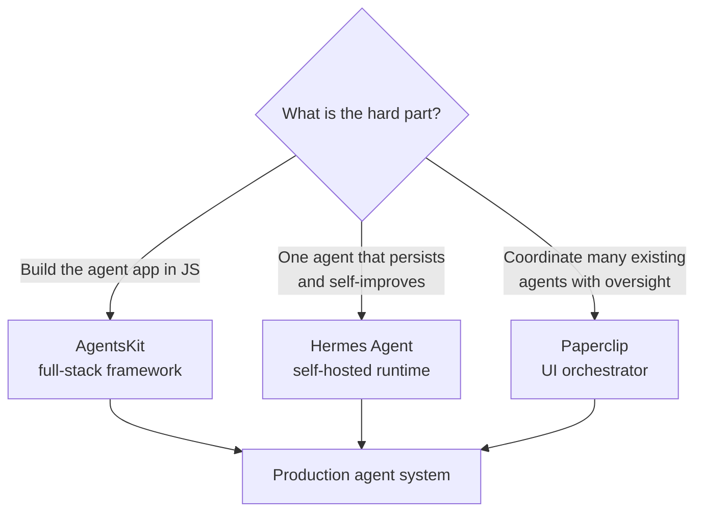

## Definição

Um **runtime / orquestrador de agentes** é a camada que fica *acima* de um framework de agentes. Um framework (LangGraph, CrewAI, as APIs nativas — veja a [visão geral dos frameworks](/docs/agents/frameworks-overview)) ajuda você a construir um loop de agente. Um runtime responde às questões operacionais: onde o agente roda, como ele persiste memória ao longo de dias, como muitos agentes heterogêneos se coordenam e quem supervisiona seus custos e saídas.

Ao longo de 2026, essa camada amadureceu em três projetos open-source notáveis com filosofias distintas: **AgentsKit** (um framework JavaScript com baterias incluídas), **Hermes Agent** (um agente único persistente e auto-hospedado que melhora com o tempo) e **Paperclip** (um orquestrador via UI que executa uma equipe de agentes existentes como uma empresa). Eles são complementares, não intercambiáveis.

## Como funciona

### AgentsKit — framework JavaScript full-stack para agentes

O [AgentsKit](https://www.agentskit.io/) é um framework TypeScript/JavaScript organizado em camadas: um core sem dependências (`@agentskit/core`), adaptadores e um runtime durável (roteamento de provedor, loops ReAct), bindings de UI unificados para React/Vue/Svelte/Angular/Solid/React Native e terminal (Ink), além de pacotes de capacidades para ferramentas, memória (chat / vetor / grafo / criptografada), RAG e skills/personas. Inclui uma bridge MCP, execução de código em sandbox, topologias multi-agente, observabilidade e integrações de avaliação (Langfuse, Braintrust). Sua [documentação for-agents](https://www.agentskit.io/docs/for-agents) é escrita deliberadamente como resumos de pacotes densos e interconectados, dimensionados para caber em uma única janela de contexto de LLM. O AgentsKit é a escolha quando você quer uma stack coerente e de ponta a ponta no ecossistema JS em vez de costurar bibliotecas avulsas.

### Hermes Agent — agente único persistente e auto-aprimorável

O Hermes Agent (Nous Research, lançado em fevereiro de 2026) é um agente autônomo auto-hospedado projetado para rodar 24/7 em seu próprio servidor e **melhorar com o uso**. Seus diferenciais são a memória persistente de longo prazo e um flywheel de dados integrado: possui 11 parsers de chamada de ferramentas, executa chamadas de ferramentas sequencialmente ou em paralelo (thread pool, até 8 workers), suporta servidores MCP e pode gerar milhares de trajetórias de chamada de ferramentas com checkpointing para experimentos de RL e exportação de fine-tuning. É um agente *único* de longa duração que acumula contexto e sinal de treinamento, não um coordenador multi-agente.

### Paperclip — orquestrador multi-agente via UI

O Paperclip (lançado em março de 2026) é um servidor Node.js + UI React que organiza agentes *existentes* — Claude Code, OpenClaw, Codex, scripts Python, webhooks HTTP — em uma "empresa" coordenada. Você não programa contra ele como uma biblioteca; você contrata agentes em um dashboard, atribui objetivos e ele cuida do roteamento de tarefas, comunicação entre agentes, organogramas, orçamentos, governança e rastreamento de custos. É auto-hospedado e não requer conta. O Paperclip é a escolha quando você já tem agentes funcionando e o problema difícil é a *coordenação e supervisão* de muitos deles.

## Quando usar / Quando NÃO usar

| Usar quando | Evitar quando |
| --- | --- |
| **AgentsKit:** você quer uma stack JS/TS integrada (UI + runtime + memória + RAG) | Você está em Python — use LangGraph / CrewAI |
| **Hermes Agent:** você precisa de um agente durável que acumule memória e dados de treinamento | Você precisa de muitos agentes especializados colaborando em paralelo |
| **Paperclip:** você já tem agentes e precisa de coordenação, orçamentos e governança | Você tem um único agente simples — a camada de orquestração é excessiva |
| Você está operando agentes a longo prazo e precisa de custo/observabilidade | Um script stateless pontual sem requisito de persistência |

## Comparação

| | AgentsKit | Hermes Agent | Paperclip |
| --- | --- | --- | --- |
| Camada | Framework | Runtime de agente único | Orquestrador multi-agente |
| Linguagem | TypeScript/JS | Python (auto-hospedado) | Node.js + React UI |
| Interação | Código (SDK) | Processo de servidor | Dashboard / UI |
| Ponto forte | Stack de ponta a ponta | Persistência + auto-aprimoramento | Coordenação + governança |
| Traz agentes? | Constrói-os | É o agente | Orquestra os existentes |

## Orientação prática

Essas camadas se compõem. Uma stack realista para 2026: construa agentes individuais com AgentsKit (ou as APIs nativas), execute um de longa duração como Hermes Agent para fluxos de trabalho com uso intenso de memória e coloque o Paperclip no topo quando precisar de uma equipe deles trabalhando em direção a objetivos de negócio com orçamentos e trilhas de auditoria. Escolha o runtime pelo seu gargalo *operacional* — construção, persistência ou coordenação — não pela popularidade. Veja também [sistemas multi-agente](/docs/agents/multi-agent-systems) e [avaliação de agentes](/docs/agents/evaluation).

## Fontes

- AgentsKit — [agentskit.io](https://www.agentskit.io/) e [docs for-agents](https://www.agentskit.io/docs/for-agents)
- Hermes Agent — [Nous Research](https://hermes-agent.nousresearch.com/) e [GitHub](https://github.com/nousresearch/hermes-agent)
- Paperclip — [paperclip.ing](https://paperclip.ing/) e [GitHub](https://github.com/paperclipai/paperclip)
