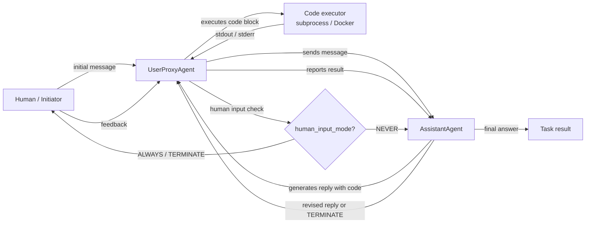

## Definição

AutoGen é um framework de código aberto desenvolvido pela Microsoft Research para construir **sistemas de IA conversacional multi-agente**. Sua ideia central é simples: os agentes se comunicam trocando mensagens em uma conversa estruturada, e o framework lida com a lógica de roteamento, revezamento e terminação. Ao contrário de frameworks baseados em papéis como CrewAI que definem agentes como personas com tarefas, os agentes AutoGen são definidos principalmente por seu **comportamento conversacional** — como respondem a mensagens, se podem executar código e quando passam o controle para outro agente ou humano.

O primitivo mais importante do framework é o `ConversableAgent` — uma classe base que pode desempenhar qualquer papel dependendo de sua configuração. Duas especializações cobrem os padrões mais comuns: `AssistantAgent` (suportado por um LLM, responde com planos e código) e `UserProxyAgent` (opcionalmente suportado por um humano ou executor de código, executa código localmente e alimenta os resultados de volta). Esse padrão de dois agentes é poderoso imediatamente: você obtém um loop de escrita de código onde o assistente propõe soluções e o proxy as executa e reporta resultados, sem andaime adicional.

AutoGen também suporta **chats em grupo**, onde três ou mais agentes se revezam contribuindo para uma conversa compartilhada gerenciada por um `GroupChatManager`. Human-in-the-loop é um recurso de primeira classe: o `UserProxyAgent` pode pausar e pedir entrada humana a qualquer momento, tornando-o bem adequado para fluxos de trabalho de pesquisa e experimentação.

## Como funciona

### ConversableAgent: o bloco de construção universal

`ConversableAgent` é a classe base para todos os agentes AutoGen. Ela mantém uma mensagem de sistema, uma configuração LLM opcional, uma lista de funções registradas (ferramentas) e um conjunto de regras para quando terminar uma conversa (`is_termination_msg`). Cada agente tem um método `generate_reply` que decide qual mensagem enviar em seguida dado o histórico da conversa. Agentes podem ser feitos como agentes proxy humanos (pausam e pedem entrada), agentes LLM (geram respostas com um LLM) ou agentes executores (executam código sem chamadas LLM). Essa flexibilidade significa que uma única classe base cobre todo o espectro de agentes totalmente automatizados a totalmente manuais.

### AssistantAgent e UserProxyAgent

`AssistantAgent` é um `ConversableAgent` pré-configurado como um assistente de IA útil: ele tem uma mensagem de sistema padrão que o encoraja a propor blocos de código Python para tarefas que requerem computação. `UserProxyAgent` é pré-configurado para executar blocos de código em um contêiner Docker local ou subprocesso, reportar resultados e opcionalmente pedir entrada humana quando não pode prosseguir automaticamente. Juntos formam o loop canônico de dois agentes AutoGen: o assistente sugere código, o proxy o executa, a saída retorna ao assistente, e o loop continua até que a tarefa esteja concluída ou uma condição de terminação seja acionada. Esse padrão é particularmente poderoso para análise de dados, scripts de automação e experimentação de ML.

### Chats em grupo e GroupChatManager

Para fluxos de trabalho com três ou mais agentes, AutoGen fornece `GroupChat` e `GroupChatManager`. `GroupChat` mantém a lista de agentes participantes e o histórico de mensagens compartilhado. `GroupChatManager` é ele mesmo um `ConversableAgent` que atua como moderador: após cada mensagem, seleciona o próximo orador (seja por uma regra de round-robin, uma função de seleção personalizada ou uma estratégia de seleção baseada em LLM). Chats em grupo permitem padrões de painel de especialistas onde um pesquisador, um programador e um revisor se revezam, ou pipelines de múltiplas etapas onde cada agente lida com uma fase.

### Execução de código e human-in-the-loop

A camada de execução de código do AutoGen é configurável: agentes podem executar código localmente (subprocesso), em um contêiner Docker (isolado) ou via executor personalizado. O `UserProxyAgent` detecta blocos de código nas mensagens do assistente e os executa automaticamente quando `human_input_mode="NEVER"`. Definir `human_input_mode="ALWAYS"` ou `"TERMINATE"` coloca a execução atrás da aprovação humana, permitindo padrões seguros de human-in-the-loop para fluxos de trabalho de produção ou sensíveis.



## Quando usar / Quando NÃO usar

| Usar quando | Evitar quando |
|---|---|
| Você precisa de agentes que escrevam e executem código como parte do fluxo de trabalho | A execução de código não é necessária e o overhead conversacional é indesejado |
| Você quer human-in-the-loop em checkpoints configuráveis | Pipelines totalmente automatizados onde a intervenção humana é indesejável |
| Seu fluxo de trabalho envolve pesquisa, experimentação ou refinamento iterativo | Você precisa de uma API declarativa e opinativa — AutoGen requer mais configuração manual |
| Você quer um painel de especialistas multi-agente ou padrão de debate (chat em grupo) | Você precisa de pipelines determinísticos e testáveis — fluxos conversacionais não determinísticos são mais difíceis de testar unitariamente |
| Você está prototipando assistentes de codificação agênticos ou automação de ciência de dados | A latência de produção é crítica — loops de conversa multi-turno adicionam overhead significativo |

## Comparações

| Critério | AutoGen | CrewAI | LangGraph |
|---|---|---|---|
| **Metáfora central** | Agentes como participantes conversacionais | Agentes como membros da tripulação com papéis | Comportamento do agente como grafo com estado |
| **Gerenciamento de estado** | Implícito: histórico de mensagens compartilhado no GroupChat | Implícito: contexto de tarefa e memória da tripulação | Explícito: estado TypedDict compartilhado entre todos os nós |
| **Execução de código** | Primeira classe: UserProxyAgent executa blocos de código automaticamente | Apenas via ferramentas externas | Via nós de ferramentas no grafo |
| **Human-in-the-loop** | Primeira classe: `human_input_mode` em cada agente | Limitado: apenas intervenção manual | Primeira classe: `interrupt_before` / `interrupt_after` em nós do grafo |
| **Curva de aprendizado** | Média: intuitivo para desenvolvedores Python, mas roteamento de chat em grupo pode ser complexo | Baixa: API declarativa é fácil de aprender | Alta: requer pensamento baseado em grafos |

## Exemplos de código

```python
import os
import autogen

# --- LLM configuration ---
# AutoGen uses a list of configs for load balancing / fallback.
# Set your OPENAI_API_KEY or use an Anthropic-compatible config.
llm_config = {
    "config_list": [
        {
            "model": "gpt-4o",
            "api_key": os.environ.get("OPENAI_API_KEY"),
        }
    ],
    "temperature": 0.1,
    "timeout": 120,
}

# --- Two-agent pattern: AssistantAgent + UserProxyAgent ---
# The assistant writes code; the proxy executes it and reports results.

assistant = autogen.AssistantAgent(
    name="data_analyst",
    system_message=(
        "You are a data analysis expert. When given a task, write Python code to solve it. "
        "Always verify your results by printing them. "
        "Reply TERMINATE when the task is fully complete."
    ),
    llm_config=llm_config,
)

user_proxy = autogen.UserProxyAgent(
    name="user_proxy",
    human_input_mode="NEVER",       # fully automated; change to "ALWAYS" for human review
    max_consecutive_auto_reply=10,  # safety limit on auto-replies
    is_termination_msg=lambda msg: "TERMINATE" in msg.get("content", ""),
    code_execution_config={
        "work_dir": "/tmp/autogen_workspace",
        "use_docker": False,         # set True to execute in an isolated Docker container
    },
)

# Kick off the two-agent conversation
user_proxy.initiate_chat(
    assistant,
    message=(
        "Analyze the following data and compute the mean, median, and standard deviation. "
        "Data: [12, 45, 23, 67, 34, 89, 11, 56, 78, 42]"
    ),
)


# --- Group chat pattern: researcher, coder, reviewer ---
# Three specialized agents collaborate on a more complex task.

researcher = autogen.AssistantAgent(
    name="researcher",
    system_message=(
        "You are a research specialist. Find information and summarize findings. "
        "Do not write code — delegate code tasks to the coder."
    ),
    llm_config=llm_config,
)

coder = autogen.AssistantAgent(
    name="coder",
    system_message=(
        "You are a Python expert. Write clean, well-commented code when asked. "
        "Always include error handling and print results clearly."
    ),
    llm_config=llm_config,
)

reviewer = autogen.AssistantAgent(
    name="reviewer",
    system_message=(
        "You are a critical reviewer. After the researcher and coder have finished, "
        "review the outputs for accuracy and completeness. "
        "Reply TERMINATE when you are satisfied with the result."
    ),
    llm_config=llm_config,
)

group_proxy = autogen.UserProxyAgent(
    name="group_proxy",
    human_input_mode="NEVER",
    max_consecutive_auto_reply=15,
    is_termination_msg=lambda msg: "TERMINATE" in msg.get("content", ""),
    code_execution_config={"work_dir": "/tmp/autogen_group", "use_docker": False},
)

# GroupChat manages turn order and shared message history
group_chat = autogen.GroupChat(
    agents=[group_proxy, researcher, coder, reviewer],
    messages=[],
    max_round=12,
    speaker_selection_method="auto",  # LLM-based speaker selection
)

manager = autogen.GroupChatManager(
    groupchat=group_chat,
    llm_config=llm_config,
)

group_proxy.initiate_chat(
    manager,
    message=(
        "Research the top 3 Python libraries for data visualization in 2025. "
        "Then write a code example using the most popular one to plot a bar chart."
    ),
)
```

## Recursos práticos

- [Documentação oficial do AutoGen](https://microsoft.github.io/autogen/) — Referência completa do framework cobrindo agentes, chat em grupo, execução de código e uso de ferramentas.
- [Repositório GitHub do AutoGen](https://github.com/microsoft/autogen) — Código-fonte, rastreador de problemas e um rico conjunto de notebooks de exemplo.
- [Paper AutoGen: "AutoGen: Enabling Next-Gen LLM Applications via Multi-Agent Conversation" (Wu et al., 2023)](https://arxiv.org/abs/2308.08155) — Paper de pesquisa original motivando o design multi-agente orientado à conversa.
- [AutoGen Studio](https://microsoft.github.io/autogen/docs/autogen-studio/getting-started) — Interface sem código para construir e testar fluxos de trabalho AutoGen, útil para prototipagem.

## Veja também

- [Visão geral dos frameworks de agentes](/docs/agents/frameworks-overview)
- [CrewAI](/docs/agents/crewai)
- [LangGraph](/docs/agents/langgraph)
- [Sistemas multi-agente](/docs/agents/multi-agent-systems)
- [Agentes de IA](/docs/agents)
