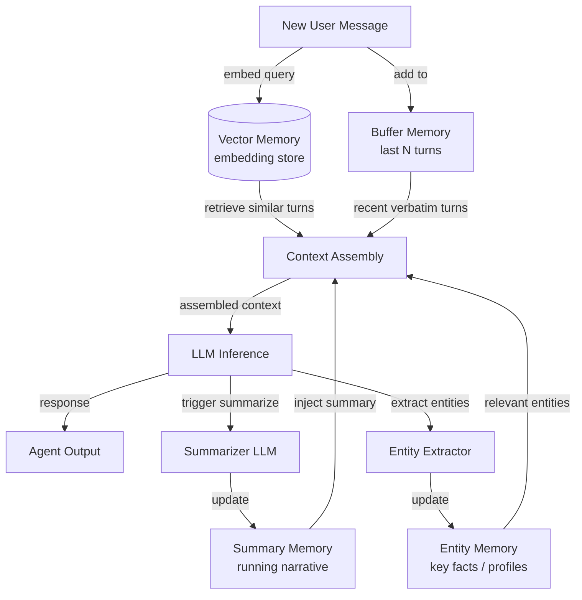

## Definição

A memória conversacional refere-se ao conjunto de técnicas que permitem a um agente de chat reter e utilizar informações de turnos anteriores em um diálogo. Ao contrário da geração aumentada por recuperação, que busca documentos externos, a memória conversacional está exclusivamente preocupada com o que já foi dito entre o usuário e o agente. Acertar nisso é o que separa um chatbot frustrante que pede que você repita tudo de um agente que parece genuinamente atento.

Existem várias estratégias distintas para gerenciar o histórico de conversa, cada uma com diferentes trade-offs entre custo, fidelidade e escalabilidade. A abordagem mais simples — manter cada mensagem literalmente — funciona bem para conversas curtas, mas rapidamente esgota a janela de contexto do modelo. Padrões mais sofisticados usam sumarização ou indexação semântica para comprimir ou recuperar seletivamente o histórico que mais importa para o turno atual.

Escolher o padrão de memória certo depende muito do comprimento esperado da conversa, da importância da formulação exata versus o significado semântico e das restrições de custo da implantação. Na prática, agentes de chat em produção frequentemente combinam dois ou mais padrões: um buffer literal de curto prazo para coerência imediata e uma camada de resumo ou vetor para recuperação de longo horizonte.

## Como funciona

### Memória de buffer

A memória de buffer é o padrão mais direto: o agente mantém uma lista ordenada dos últimos N pares de mensagens e os coloca no início de cada nova janela de contexto. Quando o buffer atinge a capacidade, o par mais antigo é descartado (FIFO). Isso garante que o agente sempre tenha acesso às trocas mais recentes sem qualquer transformação ou compressão com perda. A memória de buffer é ideal para conversas curtas a médias onde a recência é o sinal principal, e não incorre em chamadas extras ao LLM. Sua principal fraqueza é que o contexto mais antigo é silenciosamente perdido sem nenhum resumo.

### Memória de resumo

A memória de resumo aborda o problema do esquecimento usando um LLM para gerar periodicamente um resumo contínuo da conversa até o momento. Quando o buffer cresce muito, o agente condensa em uma narrativa compacta — capturando fatos principais, decisões e sentimento — depois descarta as mensagens brutas. O resumo ocupa muito menos tokens do que os turnos originais, tornando conversas longas viáveis. A contrapartida é uma chamada secundária ao LLM para cada etapa de sumarização, o que adiciona latência e custo, e alguma informação é inevitavelmente perdida na compressão.

### Memória vetorial

A memória vetorial incorpora cada turno de conversa e o armazena em um banco de dados vetorial. A cada novo turno, as trocas passadas semanticamente mais relevantes são recuperadas por busca de similaridade e injetadas na janela de contexto junto com mensagens de buffer recentes. Esse padrão se destaca quando as conversas são muito longas ou quando a pergunta atual se relaciona com algo dito muitos turnos atrás. A memória vetorial é a abordagem de maior fidelidade para recuperação de longo horizonte, mas requer infraestrutura de embedding e introduz latência de recuperação.

### Memória de entidades

A memória de entidades extrai entidades nomeadas — pessoas, lugares, produtos, preferências — da conversa e mantém um registro estruturado do que o agente sabe sobre cada entidade. Quando uma entidade é mencionada novamente, seu perfil armazenado é injetado no contexto. A memória de entidades é ideal para casos de uso de assistente pessoal onde lembrar que "Alice prefere reuniões matinais" ou "o prazo do projeto é 10 de junho" é mais valioso do que lembrar a formulação exata de mensagens passadas.



## Quando usar / Quando NÃO usar

| Use quando | Evite quando |
|---|---|
| As conversas se estendem por mais do que alguns turnos | A tarefa é de turno único sem necessidade de histórico |
| Os usuários esperam que o agente lembre o que disseram antes | Os dados de conversa não podem ser armazenados por razões de privacidade ou conformidade |
| Os custos de janela de contexto são significativos e o histórico é longo | A conversa é sempre curta o suficiente para caber completamente na janela de contexto |
| Os usuários discutem múltiplas entidades ou tópicos ao longo da sessão | A latência de sumarização é inaceitável para o caso de uso |
| Recuperação entre sessões é necessária (padrões vetor/entidade) | A complexidade de infraestrutura adicional supera o benefício de fidelidade |

## Comparações

| Critério | Memória de buffer | Memória de resumo | Memória vetorial |
|---|---|---|---|
| Custo por turno | Baixo (sem chamada extra ao LLM) | Médio (chamada ocasional ao sumarizador) | Médio (chamada de embedding + consulta ao BD) |
| Fidelidade de recuperação | Exata, mas limitada aos últimos N turnos | Compressão com perda de turnos mais antigos | Alta para conteúdo semanticamente relevante |
| Tratamento de comprimento de contexto | Ruim — turnos mais antigos são silenciosamente descartados | Bom — resumo comprime turnos antigos | Excelente — recupera apenas fragmentos relevantes |
| Latência | Mínima | Moderada (sumarização adiciona uma etapa) | Moderada (embedding + busca de vizinho mais próximo) |
| Recuperação entre sessões | Não (buffer em memória) | Possível se o resumo for persistido | Sim (armazenamento vetorial é persistente) |
| Complexidade de implementação | Muito baixa | Baixa-média | Média-alta |

## Exemplos de código

```python
"""
Conversational memory patterns using LangChain.

Demonstrates:
1. ConversationBufferMemory  — keep verbatim last N messages
2. ConversationSummaryMemory — compress history into a running summary
3. ConversationBufferWindowMemory — sliding window variant
"""
# pip install langchain langchain-openai openai
from langchain.memory import (
    ConversationBufferMemory,
    ConversationSummaryMemory,
    ConversationBufferWindowMemory,
)
from langchain.chains import ConversationChain
from langchain_openai import ChatOpenAI


# ---------------------------------------------------------------------------
# 1. Buffer memory — keeps ALL messages (use for short conversations)
# ---------------------------------------------------------------------------
def demo_buffer_memory():
    llm = ChatOpenAI(model="gpt-4o-mini", temperature=0)
    memory = ConversationBufferMemory(return_messages=True)
    chain = ConversationChain(llm=llm, memory=memory, verbose=False)

    reply1 = chain.predict(input="My name is Alice. I enjoy hiking.")
    reply2 = chain.predict(input="What outdoor activities would you recommend for me?")

    # The second call has access to the first turn verbatim
    print("Buffer memory — reply 2:", reply2)
    print("History length:", len(memory.chat_memory.messages), "messages\n")


# ---------------------------------------------------------------------------
# 2. Summary memory — LLM compresses history on each turn
# ---------------------------------------------------------------------------
def demo_summary_memory():
    llm = ChatOpenAI(model="gpt-4o-mini", temperature=0)
    # The same LLM is used to generate summaries; you can use a cheaper model here
    memory = ConversationSummaryMemory(llm=llm, return_messages=True)
    chain = ConversationChain(llm=llm, memory=memory, verbose=False)

    chain.predict(input="I'm planning a trip to Japan next spring.")
    chain.predict(input="I'm most interested in traditional temples and local food.")
    reply3 = chain.predict(input="Can you suggest a one-week itinerary?")

    print("Summary memory — reply 3:", reply3)
    # The buffer contains only the latest summary, not all past raw messages
    print("Summary:", memory.moving_summary_buffer[:200], "...\n")


# ---------------------------------------------------------------------------
# 3. Window memory — keeps only the last k turns (sliding window)
# ---------------------------------------------------------------------------
def demo_window_memory(k: int = 3):
    llm = ChatOpenAI(model="gpt-4o-mini", temperature=0)
    # k=3 means only the last 3 HumanMessage+AIMessage pairs are retained
    memory = ConversationBufferWindowMemory(k=k, return_messages=True)
    chain = ConversationChain(llm=llm, memory=memory, verbose=False)

    for i in range(6):
        reply = chain.predict(input=f"This is message number {i + 1}.")
        print(f"Turn {i + 1}: {reply[:80]}")

    print(
        f"\nWindow memory keeps {len(memory.chat_memory.messages)} messages "
        f"(max {k * 2} for k={k} turn pairs)\n"
    )


# ---------------------------------------------------------------------------
# Manual entity-style memory (illustrative, no extra dependency)
# ---------------------------------------------------------------------------
def demo_entity_memory_manual():
    """
    Minimal entity memory: parse key facts from each turn and inject them.
    In production, use LangChain's ConversationEntityMemory or a dedicated NER model.
    """
    entity_store: dict[str, str] = {}

    def extract_entities_mock(text: str) -> dict[str, str]:
        """Mock extraction — real impl would call an LLM or NER model."""
        entities = {}
        if "my name is" in text.lower():
            name = text.lower().split("my name is")[-1].strip().split()[0].rstrip(".,")
            entities["user_name"] = name.capitalize()
        if "deadline" in text.lower():
            entities["deadline"] = "mentioned but not parsed in this mock"
        return entities

    turns = [
        ("user", "My name is Bob and my project deadline is end of July."),
        ("user", "Can you help me prioritize my tasks?"),
    ]
    for role, msg in turns:
        entity_store.update(extract_entities_mock(msg))
        entity_context = "; ".join(f"{k}={v}" for k, v in entity_store.items())
        print(f"[{role}] {msg}")
        print(f"  Entity context injected: {entity_context}\n")


if __name__ == "__main__":
    import os

    if os.getenv("OPENAI_API_KEY"):
        demo_buffer_memory()
        demo_summary_memory()
        demo_window_memory()
    else:
        print("Set OPENAI_API_KEY to run LangChain demos.")
    demo_entity_memory_manual()
```

## Recursos práticos

- [Documentação de Memória LangChain](https://python.langchain.com/docs/concepts/memory/) — Referência completa para todas as classes de memória LangChain com exemplos de uso.
- [Rethinking Memory in Conversational AI (Lilian Weng)](https://lilianweng.github.io/posts/2023-06-23-agent/#memory) — Post de blog aprofundado cobrindo taxonomia de memória e trade-offs de design em sistemas de agentes.
- [MemoryOS: Memory-based Operating System for LLM Agents](https://arxiv.org/abs/2506.06326) — Pesquisa sobre gerenciamento hierárquico de memória inspirado no design de SO.
- [OpenAI Assistants Thread Management](https://platform.openai.com/docs/assistants/how-it-works/managing-threads) — Como a API gerenciada da OpenAI lida com threads de conversa persistentes.

## Fontes

- [MemGPT: Towards LLMs as Operating Systems (Packer et al., 2023)](https://arxiv.org/abs/2310.08560) — Introduz gerenciamento de contexto virtual para memória de agente de longo prazo ilimitada.
- [Cognitive Architectures for Language Agents (Sumers et al., 2023)](https://arxiv.org/abs/2309.02427) — Levantamento de arquiteturas de memória e ação para agentes baseados em LLM.
- [Generative Agents: Interactive Simulacra of Human Behavior (Park et al., 2023)](https://arxiv.org/abs/2304.03442) — Demonstra memória episódica de longo prazo e recuperação em agentes conversacionais.
- [LangChain Memory concepts](https://python.langchain.com/docs/concepts/memory/) — Documentação oficial para tipos de memória buffer, summary, entity e baseados em vetor.

## Veja também

- [Memória de agentes](/docs/agents/memory)
- [Agentes de IA](/docs/agents)
- [Embeddings RAG](/docs/rag/embeddings)
