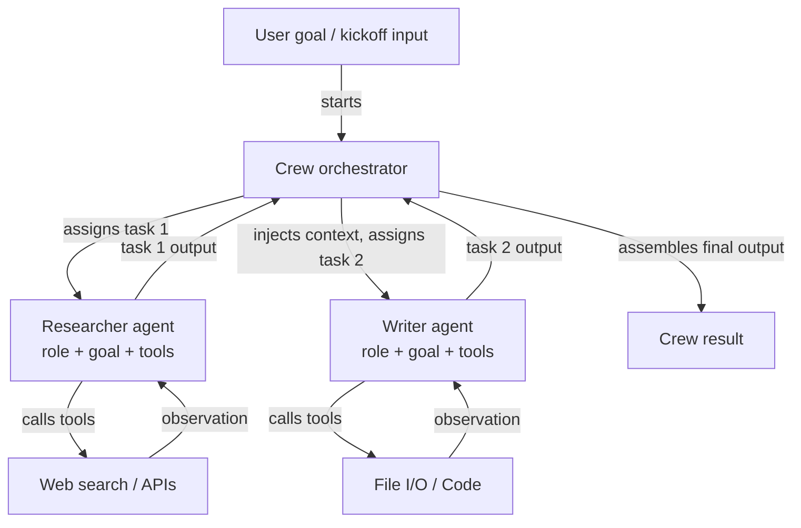

## Definição

CrewAI é um framework Python de código aberto para orquestrar **sistemas multi-agente baseados em papéis**. Cada agente em uma crew é definido por três coisas: um **papel** (o que o agente faz, por exemplo "Pesquisador Sênior"), um **objetivo** (o que o agente está tentando alcançar, por exemplo "Encontrar informações precisas e atualizadas") e uma **backstory** (uma descrição de persona que molda o comportamento e o tom do agente). Essa estrutura torna o comportamento do agente intuitivo de especificar e fácil de entender — reflete como você integraria um membro humano da equipe.

As tarefas no CrewAI são unidades discretas de trabalho atribuídas a agentes. Uma tarefa tem uma descrição, saída esperada e opcionalmente contexto de tarefas anteriores. As tarefas são agrupadas em uma **Crew**, que define o processo de execução: **sequencial** (as tarefas são executadas uma após a outra, com a saída de cada uma alimentando a próxima) ou **hierárquico** (um agente gerente delega e coordena tarefas entre os trabalhadores). Esse modelo declarativo abstrai o loop de passagem de mensagens, permitindo que os desenvolvedores se concentrem no *que* precisa ser feito em vez de *como* os agentes se comunicam.

O CrewAI tem integração de ferramentas embutida, suportando ferramentas LangChain, funções Python personalizadas decoradas com `@tool` e uma biblioteca crescente de ferramentas embutidas (pesquisa na web, E/S de arquivos, execução de código). Os agentes também podem receber memória (de curto prazo, longo prazo, memória de entidades) para manter contexto entre execuções de tarefas e execuções da crew.

## Como funciona

### Agentes: papéis, objetivos e backstories

Um agente é a unidade fundamental de trabalho no CrewAI. Você instancia um `Agent` com um papel, objetivo e backstory, além de ferramentas opcionais e uma substituição de LLM. A backstory prepara o prompt do sistema do agente, dando-lhe uma persona consistente em todas as interações de tarefas. Os agentes podem ser configurados com `verbose=True` para expor seus passos de raciocínio interno. Cada agente opera independentemente dentro da camada de orquestração da crew, recebendo tarefas do gerenciador de processo e retornando saídas estruturadas. A memória do agente (quando habilitada) persiste observações entre tarefas, o que é crítico para fluxos de trabalho longos de pesquisa ou análise.

### Tarefas: descrições, saídas esperadas e contexto

Um objeto `Task` descreve o que um agente deve fazer, como é uma boa saída e qual agente deve executá-la. As tarefas podem declarar dependências de `context` em outras tarefas, fazendo com que suas saídas sejam automaticamente injetadas como contexto. As descrições de saída esperada orientam o LLM a produzir resultados estruturados e utilizáveis. As tarefas suportam formatos de saída: texto simples, JSON via modelos Pydantic ou saídas de arquivo. Ao usar um processo hierárquico, o agente gerente usa as descrições de tarefas para decidir a atribuição e o sequenciamento dinamicamente, sem exigir que o desenvolvedor codifique dependências.

### Processos: sequencial e hierárquico

O objeto `Crew` une agentes e tarefas e especifica um `Process`. Em `Process.sequential`, as tarefas são executadas na ordem da lista, com a saída de cada tarefa passada para a próxima. Em `Process.hierarchical`, um LLM gerente é automaticamente instanciado para decompor objetivos, atribuir trabalho e revisar resultados — habilitando coordenação emergente sem fiação explícita. Sequencial é previsível e fácil de testar; hierárquico é mais flexível, mas menos determinístico. Escolher entre eles depende de se seu fluxo de trabalho tem um DAG fixo (sequencial) ou precisa de alocação dinâmica de tarefas (hierárquico).

### Integração de ferramentas embutida

O CrewAI vem com um decorador `@tool` compatível com ferramentas LangChain, facilitando equipar agentes com pesquisa na web (SerperDev, DuckDuckGo), execução de código, leitura/escrita de arquivos e chamadas de API personalizadas. As ferramentas são registradas por agente, então o agente pesquisador pode ter ferramentas de busca enquanto o agente escritor tem ferramentas de arquivo. As descrições das ferramentas são incluídas no prompt do agente, e o framework cuida do loop de chamada de ferramentas de forma transparente. Para uso em produção, o pacote `CrewAI Tools` fornece um conjunto curado de integrações pré-construídas.



## Quando usar / Quando NÃO usar

| Usar quando | Evitar quando |
|---|---|
| Seu problema se mapeia naturalmente para papéis humanos distintos (pesquisador, escritor, revisor) | Você precisa de um agente único com ferramentas — a sobrecarga do CrewAI é desnecessária |
| Você quer uma API declarativa e de alto nível que oculta a complexidade de passagem de mensagens | Você precisa de controle preciso sobre cada mensagem trocada entre agentes |
| Você está construindo pipelines de conteúdo, fluxos de trabalho de pesquisa ou sistemas de análise | Seu fluxo de trabalho requer ramificação condicional complexa ou ciclos não suportados por sequencial/hierárquico |
| Você quer memória embutida e integração de ferramentas com configuração mínima | A latência em tempo real é crítica — execuções sequenciais multi-agente adicionam sobrecarga |
| Sua equipe não é especialista em frameworks de agentes e precisa de uma API intuitiva | Você precisa de observabilidade detalhada de cada interação de agente no nível do grafo |

## Comparações

| Critério | CrewAI | AutoGen | LangGraph |
|---|---|---|---|
| **Nível de abstração** | Alto: papéis declarativos, objetivos, tarefas | Médio: agentes conversacionais com API baseada em mensagens | Baixo: nós e arestas explícitos do grafo |
| **Modelo multi-agente** | Crew baseada em papéis com processos sequenciais ou hierárquicos | Pares de agentes orientados a conversas ou group chats | Subgrafos; grafo único com estado e múltiplos nós por agente |
| **Gerenciamento de estado** | Implícito: passado via contexto de tarefa e memória da crew | Implícito: histórico de mensagens | Explícito: estado TypedDict compartilhado entre todos os nós |
| **Facilidade de configuração** | Muito fácil: 10-20 linhas para uma crew multi-agente funcionando | Moderada: requer compreensão dos tipos de agentes e padrões de iniciação | Mais difícil: requer modelo mental de construção de grafos |
| **Fluxos condicionais/cíclicos** | Limitado: sequencial é linear, hierárquico é opaco | Limitado: depende das respostas dos agentes | Primeira classe: arestas condicionais e ciclos são a funcionalidade central |

## Exemplos de código

```python
import os
from crewai import Agent, Task, Crew, Process
from crewai_tools import SerperDevTool

# --- Tool setup ---
# Requires SERPER_API_KEY environment variable for web search
search_tool = SerperDevTool()

# --- Agent definitions ---
# Each agent has a role, a goal that guides its behavior, and a backstory
# that sets its persona. Tools are assigned per-agent.

researcher = Agent(
    role="Senior AI Research Analyst",
    goal="Uncover the latest developments and practical applications of AI agent frameworks",
    backstory=(
        "You are an expert AI researcher with 10 years of experience evaluating "
        "LLM frameworks. You excel at finding accurate, up-to-date information "
        "and synthesizing it into clear technical summaries."
    ),
    tools=[search_tool],
    verbose=True,  # shows reasoning steps
    allow_delegation=False,
)

writer = Agent(
    role="Technical Content Writer",
    goal="Transform technical research into clear, engaging documentation",
    backstory=(
        "You are a seasoned technical writer who specializes in AI and machine learning. "
        "You turn dense research into accessible content without losing precision."
    ),
    tools=[],  # writer does not need search tools
    verbose=True,
)

reviewer = Agent(
    role="Editorial Reviewer",
    goal="Ensure accuracy, clarity, and completeness of technical content",
    backstory=(
        "You are a detail-oriented editor with a background in computer science. "
        "You catch technical inaccuracies, improve clarity, and verify all claims."
    ),
    verbose=True,
)

# --- Task definitions ---
# Tasks describe what to do, what output to expect, and which agent executes them.
# Context dependencies are declared explicitly.

research_task = Task(
    description=(
        "Research the current state of AI agent frameworks in 2024-2025. "
        "Focus on CrewAI, AutoGen, LangGraph, and Anthropic Tool Use. "
        "Cover: architecture, use cases, community size, and key differentiators."
    ),
    expected_output=(
        "A structured research report with sections for each framework, "
        "covering architecture, strengths, weaknesses, and best use cases. "
        "Include specific version numbers and recent updates where available."
    ),
    agent=researcher,
)

writing_task = Task(
    description=(
        "Using the research report, write a 500-word technical blog post comparing "
        "the four agent frameworks. Target audience: senior software engineers "
        "who are evaluating frameworks for production use."
    ),
    expected_output=(
        "A well-structured blog post with an introduction, per-framework sections, "
        "a comparison table, and a recommendation section. "
        "Use clear headings and avoid jargon where possible."
    ),
    agent=writer,
    context=[research_task],  # injects research_task output as context
)

review_task = Task(
    description=(
        "Review the blog post for technical accuracy, clarity, and completeness. "
        "Fix any errors and improve readability without changing the core content."
    ),
    expected_output=(
        "A polished, publication-ready blog post with all inaccuracies corrected "
        "and prose improved. Return the full revised text."
    ),
    agent=reviewer,
    context=[writing_task],
)

# --- Crew assembly ---
# Process.sequential runs tasks in order, passing outputs as context.
# Switch to Process.hierarchical for dynamic task allocation by a manager LLM.

crew = Crew(
    agents=[researcher, writer, reviewer],
    tasks=[research_task, writing_task, review_task],
    process=Process.sequential,
    verbose=True,
)

# --- Execution ---
result = crew.kickoff(inputs={"topic": "AI agent frameworks comparison 2025"})
print(result.raw)
```

## Recursos práticos

- [Documentação oficial do CrewAI](https://docs.crewai.com/) — Referência completa cobrindo agentes, tarefas, crews, processos, ferramentas e configuração de memória.
- [Repositório GitHub do CrewAI](https://github.com/crewAIInc/crewAI) — Código-fonte, exemplos e rastreador de issues do framework de código aberto.
- [Documentação de ferramentas do CrewAI](https://docs.crewai.com/concepts/tools) — Integrações de ferramentas pré-construídas: pesquisa na web, E/S de arquivos, execução de código e criação de ferramentas personalizadas.
- [Guia de integração CrewAI + LangChain](https://docs.crewai.com/how-to/llm-connections) — Como configurar diferentes provedores de LLM incluindo OpenAI, Anthropic e modelos locais.

## Veja também

- [Visão geral dos frameworks de agentes](/docs/agents/frameworks-overview)
- [AutoGen](/docs/agents/autogen)
- [LangGraph](/docs/agents/langgraph)
- [Sistemas multi-agente](/docs/agents/multi-agent-systems)
- [Agentes de IA](/docs/agents)
