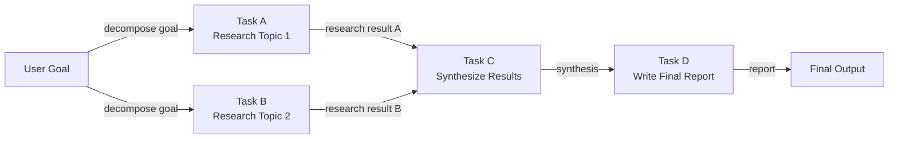

## Definição

Um agente baseado em DAG organiza seu trabalho como um **grafo acíclico dirigido (DAG)**: um conjunto de nós (tarefas ou etapas do agente) conectados por arestas dirigidas que codificam dependências entre eles. "Acíclico" significa que não há dependências circulares — a execução flui estritamente de entradas para saídas. O principal benefício em relação a pipelines sequenciais é que **nós independentes podem ser executados em paralelo**, reduzindo drasticamente o tempo total para fluxos de trabalho complexos de múltiplos passos.

Na prática, cada nó no DAG pode ser uma chamada ao LLM, uma invocação de ferramenta, uma transformação de dados ou até mesmo um subagente. Um nó é disparado assim que todos os seus predecessores foram concluídos com sucesso, passando suas saídas como entradas. Esse modelo mapeia-se naturalmente para tarefas como análise competitiva (pesquisar três empresas em paralelo, depois sintetizar), revisão de código (verificar segurança, estilo e testes simultaneamente, depois relatar) ou pipelines de dados (buscar múltiplas fontes de dados em paralelo, juntá-las, depois agregar).

A construção dinâmica de DAG vai ainda mais além: em vez de um grafo fixo definido em tempo de projeto, o agente constrói ou modifica o grafo em tempo de execução com base em resultados intermediários. Um agente de planejamento pode produzir uma lista de tarefas cujas dependências não são conhecidas até que ele veja os dados, depois constrói e executa o DAG apropriado em tempo real. Isso combina o paralelismo estruturado dos DAGs com a adaptabilidade dos agentes de planejamento, ao custo de complexidade adicional de implementação.

## Como funciona

### Definição de grafo e tipos de nó

Um DAG é definido por um conjunto de nós e um conjunto de arestas dirigidas. Cada nó carrega uma função (o trabalho a fazer), uma especificação de entrada (quais saídas de nós upstream aceitar) e uma especificação de saída (o que ele produz). As arestas são definidas como pares `(nó_upstream, nó_downstream)`. Nós sem arestas de entrada são pontos de entrada; nós sem arestas de saída são pontos de saída. As funções dos nós podem ser síncronas ou assíncronas — nós assíncronos são essenciais para alcançar paralelismo real em fluxos de trabalho ligados a E/S.

### Ordenação topológica e agendamento

Antes da execução, o agendador calcula uma **ordenação topológica** do grafo: uma sequência linear de nós tal que cada nó aparece após todos os seus predecessores. Se múltiplos nós estiverem na mesma profundidade (sem dependência entre si), eles podem ser despachados concorrentemente. O algoritmo padrão é o algoritmo de Kahn, que processa nós camada por camada. Em tempo de execução, uma fila mantém nós cujas dependências foram todas satisfeitas; trabalhadores puxam da fila e executam nós, depois enfileiram novos nós downstream desbloqueados.

### Execução paralela

Nós independentes — aqueles sem dependências compartilhadas — são executados em paralelo usando threads, coroutines assíncronas ou um pool de processos. O grau de paralelismo é limitado pela estrutura do DAG: uma cadeia totalmente sequencial não oferece paralelismo, enquanto um amplo fan-out seguido por um fan-in de agregação pode executar dezenas de tarefas simultaneamente. Em fluxos de trabalho de agentes, isso é especialmente valioso para tarefas como buscas web em massa, buscas de dados de múltiplas fontes ou chamadas de subagentes independentes.

### Construção dinâmica de DAG

No modo dinâmico, uma etapa de planejamento é executada primeiro e produz uma especificação de grafo (por exemplo, uma lista JSON de nós e arestas). O agendador instancia o DAG, valida se há ciclos e inicia a execução. DAGs dinâmicos devem incluir detecção de ciclos — tipicamente via DFS — antes do início do agendamento. Esse padrão é mais frágil do que DAGs estáticos porque um plano malformado pode produzir um grafo inválido, mas habilita muito mais adaptabilidade.



## Quando usar / Quando NÃO usar

| Use quando | Evite quando |
|---|---|
| O fluxo de trabalho tem múltiplas subtarefas independentes que podem ser executadas em paralelo | Todas as tarefas são estritamente sequenciais sem oportunidade de paralelismo |
| O tempo de execução é uma prioridade e as tarefas são ligadas a E/S | O grafo de dependências é simples o suficiente para que um pipeline linear baste |
| As dependências de tarefas são bem definidas e podem ser especificadas antecipadamente | Replanejamento dinâmico é mais importante do que execução paralela |
| Você precisa de observabilidade refinada sobre quais tarefas passaram ou falharam | A equipe não está familiarizada com conceitos de agendamento de grafos |
| O fluxo de trabalho se assemelha a um pipeline de dados com estágios de fan-out e fan-in | As tarefas são tão rápidas que a sobrecarga de agendamento supera o benefício do paralelismo |

## Comparações

| Critério | Agentes baseados em DAG | Pipeline sequencial | Planner-Executor |
|---|---|---|---|
| Paralelismo | Nativo — branches independentes executam concorrentemente | Nenhum | Nenhum por padrão |
| Flexibilidade / adaptação dinâmica | Baixa-média (grafo fixo) | Baixa | Alta (ciclo de replanejamento) |
| Complexidade de implementação | Alta (agendador, detecção de ciclos, async) | Muito baixa | Média |
| Auditabilidade | Alta — estrutura do grafo é explícita | Média | Alta — artefato do plano é explícito |
| Tratamento de falhas | Repetição por nó, re-execuções parciais possíveis | Reiniciar do início | Replanejamento na falha |
| Melhor para | Fluxos de trabalho amplos e paralelizáveis | Tarefas sequenciais simples | Tarefas adaptativas de múltiplos passos |

## Exemplos de código

```python
"""
Simple DAG execution engine with topological sort.

Nodes are Python callables. Edges encode dependencies.
Independent nodes execute concurrently using asyncio.
"""
from __future__ import annotations

import asyncio
from collections import defaultdict, deque
from dataclasses import dataclass, field
from typing import Any, Callable, Coroutine


# ---------------------------------------------------------------------------
# DAG data structures
# ---------------------------------------------------------------------------

@dataclass
class Node:
    """A single unit of work in the DAG."""
    name: str
    # func receives a dict of {upstream_node_name: result} for all predecessors
    func: Callable[..., Coroutine[Any, Any, Any]]
    depends_on: list[str] = field(default_factory=list)


class DAGExecutionError(Exception):
    pass


# ---------------------------------------------------------------------------
# DAG engine
# ---------------------------------------------------------------------------

class DAGExecutor:
    """
    Executes a DAG of async nodes respecting dependencies.
    Independent nodes are dispatched concurrently.
    """

    def __init__(self):
        self._nodes: dict[str, Node] = {}

    def add_node(self, node: Node) -> "DAGExecutor":
        self._nodes[node.name] = node
        return self

    def _validate(self) -> list[str]:
        """
        Kahn's topological sort algorithm.
        Returns an ordered list of node names, or raises on cycle detection.
        """
        in_degree: dict[str, int] = {n: 0 for n in self._nodes}
        dependents: dict[str, list[str]] = defaultdict(list)

        for node in self._nodes.values():
            for dep in node.depends_on:
                if dep not in self._nodes:
                    raise DAGExecutionError(f"Dependency '{dep}' not found in DAG.")
                in_degree[node.name] += 1
                dependents[dep].append(node.name)

        queue = deque(n for n, deg in in_degree.items() if deg == 0)
        order: list[str] = []

        while queue:
            current = queue.popleft()
            order.append(current)
            for downstream in dependents[current]:
                in_degree[downstream] -= 1
                if in_degree[downstream] == 0:
                    queue.append(downstream)

        if len(order) != len(self._nodes):
            raise DAGExecutionError("Cycle detected in DAG — cannot execute.")

        return order

    async def run(self) -> dict[str, Any]:
        """Execute the DAG and return a mapping of node_name -> result."""
        self._validate()

        results: dict[str, Any] = {}
        completed: set[str] = set()
        pending: dict[str, asyncio.Task] = {}
        in_degree: dict[str, int] = {n: len(self._nodes[n].depends_on) for n in self._nodes}

        async def execute_node(node: Node) -> Any:
            upstream = {dep: results[dep] for dep in node.depends_on}
            return await node.func(upstream)

        # Start nodes with no dependencies immediately
        ready = [n for n, deg in in_degree.items() if deg == 0]
        for name in ready:
            pending[name] = asyncio.create_task(execute_node(self._nodes[name]))

        # Build reverse adjacency for unblocking
        dependents: dict[str, list[str]] = defaultdict(list)
        for node in self._nodes.values():
            for dep in node.depends_on:
                dependents[dep].append(node.name)

        while pending:
            # Wait for any one task to finish
            done_tasks, _ = await asyncio.wait(
                pending.values(), return_when=asyncio.FIRST_COMPLETED
            )
            for task in done_tasks:
                # Find the node name for this task
                finished_name = next(n for n, t in pending.items() if t is task)
                results[finished_name] = task.result()
                completed.add(finished_name)
                del pending[finished_name]

                # Unblock downstream nodes
                for downstream in dependents[finished_name]:
                    in_degree[downstream] -= 1
                    if in_degree[downstream] == 0 and downstream not in completed:
                        pending[downstream] = asyncio.create_task(
                            execute_node(self._nodes[downstream])
                        )

        return results


# ---------------------------------------------------------------------------
# Example: Research DAG (mirrors the Mermaid diagram above)
# ---------------------------------------------------------------------------

async def research_topic_1(upstream: dict) -> str:
    await asyncio.sleep(0.1)  # Simulate async I/O (e.g., web search)
    return "Research result for Topic 1: renewable energy trends in Europe."

async def research_topic_2(upstream: dict) -> str:
    await asyncio.sleep(0.1)  # Runs in parallel with research_topic_1
    return "Research result for Topic 2: renewable energy adoption in Asia."

async def synthesize(upstream: dict) -> str:
    result_a = upstream["task_a"]
    result_b = upstream["task_b"]
    return f"Synthesis of:\n  A: {result_a}\n  B: {result_b}"

async def write_report(upstream: dict) -> str:
    synthesis = upstream["task_c"]
    return f"Final report based on synthesis:\n{synthesis}"


async def main():
    dag = DAGExecutor()
    dag.add_node(Node("task_a", research_topic_1, depends_on=[]))
    dag.add_node(Node("task_b", research_topic_2, depends_on=[]))
    dag.add_node(Node("task_c", synthesize, depends_on=["task_a", "task_b"]))
    dag.add_node(Node("task_d", write_report, depends_on=["task_c"]))

    import time
    start = time.perf_counter()
    results = await dag.run()
    elapsed = time.perf_counter() - start

    print(f"DAG completed in {elapsed:.3f}s (task_a and task_b ran in parallel)\n")
    for name, result in results.items():
        print(f"[{name}]\n{result}\n")


if __name__ == "__main__":
    asyncio.run(main())
```

## Recursos práticos

- [Documentação do LangGraph](https://langchain-ai.github.io/langgraph/) — Framework de execução de grafos de nível de produção para agentes LLM, com suporte nativo a ramificações, execução paralela e ciclos.
- [LLM Compiler: Parallel Function Calling (Kim et al., 2023)](https://arxiv.org/abs/2312.04511) — Artigo introduzindo chamadas de ferramentas paralelas baseadas em DAG para agentes LLM, com melhorias significativas de latência.
- [Conceitos de DAG do Apache Airflow](https://airflow.apache.org/docs/apache-airflow/stable/core-concepts/dags.html) — Modelo de orquestração de DAG testado em batalha no mundo da engenharia de dados; muitos motores de DAG de agentes tomam emprestados esses conceitos.
- [Prefect — Orquestração de Fluxo de Trabalho](https://docs.prefect.io/latest/concepts/flows/) — Orquestração de fluxo de trabalho moderna com execução de tarefas paralelas integrada, aplicável a fluxos de trabalho de agentes.

## Fontes

- [LLM Compiler: Parallel Function Calling (Kim et al., 2023)](https://arxiv.org/abs/2312.04511) — Artigo fundamental sobre execução paralela de ferramentas baseada em DAG para agentes LLM.
- [TaskBench: Benchmarking Large Language Models for Task Automation (Shen et al., 2023)](https://arxiv.org/abs/2311.18760) — Framework de avaliação para planejamento complexo de tarefas em múltiplas etapas e decomposição em DAG.
- [LangGraph official documentation](https://langchain-ai.github.io/langgraph/) — Referência para máquinas de estado de agentes baseadas em grafos usadas para implementar padrões de agentes DAG.
- [Apache Airflow documentation](https://airflow.apache.org/docs/) — Referência canônica para conceitos de orquestração de fluxo de trabalho baseada em DAG adotados por frameworks de agentes.

## Veja também

- [Arquitetura Planner-Executor](/docs/agents/planner-executor)
- [Agentes de IA](/docs/agents)
- [Airflow](/docs/mlops/data-engineering/airflow)
