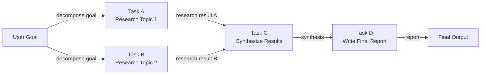

# Agentes baseados em DAG

## Definição

Ein DAG-basierter Agent organisiert seine Arbeit als **gerichteten azyklischen Graphen (DAG)**: eine Menge von Knoten (Aufgaben oder Agentenschritte), die durch gerichtete Kanten verbunden sind, die Abhängigkeiten zwischen ihnen kodieren. „Azyklisch" bedeutet, dass es keine zirkulären Abhängigkeiten gibt – die Ausführung fließt strikt vorwärts von Eingaben zu Ausgaben. Der wesentliche Vorteil gegenüber sequentiellen Pipelines besteht darin, dass **unabhängige Knoten parallel ausgeführt werden können**, was die Wanduhrzeit für komplexe mehrstufige Workflows drastisch reduziert.

In der Praxis kann jeder Knoten im DAG ein LLM-Aufruf, ein Werkzeugaufruf, eine Datentransformation oder sogar ein Subagent sein. Ein Knoten feuert, sobald alle seine Vorgänger erfolgreich abgeschlossen wurden, und übergibt deren Ausgaben als Eingaben. Dieses Modell passt natürlich zu Aufgaben wie der Wettbewerbsanalyse (drei Unternehmen parallel recherchieren, dann synthetisieren), dem Code-Review (Sicherheit, Stil und Tests gleichzeitig prüfen, dann berichten) oder Datenpipelines (mehrere Datenquellen parallel abrufen, zusammenführen und aggregieren).

Die dynamische DAG-Konstruktion geht noch weiter: Anstatt eines zur Entwurfszeit definierten festen Graphen erstellt oder modifiziert der Agent den Graphen zur Laufzeit auf der Grundlage von Zwischenergebnissen. Ein Planungsagent könnte eine Aufgabenliste erzeugen, deren Abhängigkeiten erst bekannt sind, wenn er die Daten sieht, und dann den entsprechenden DAG spontan aufbauen und ausführen. Dies kombiniert den strukturierten Parallelismus von DAGs mit der Anpassungsfähigkeit von Planungsagenten – auf Kosten zusätzlicher Implementierungskomplexität.

## Como funciona

### Graphdefinition und Knotentypen

Ein DAG wird durch eine Menge von Knoten und eine Menge gerichteter Kanten definiert. Jeder Knoten trägt eine Funktion (die zu erledigende Arbeit), eine Eingabespezifikation (welche Ausgaben der vorgelagerten Knoten akzeptiert werden) und eine Ausgabespezifikation (was er produziert). Kanten sind als `(upstream_node, downstream_node)`-Paare definiert. Knoten ohne eingehende Kanten sind Einstiegspunkte; Knoten ohne ausgehende Kanten sind Ausstiegspunkte. Knotenfunktionen können synchron oder asynchron sein – asynchrone Knoten sind für echte Parallelität in I/O-gebundenen Workflows unerlässlich.

### Topologische Sortierung und Scheduling

Vor der Ausführung berechnet der Scheduler eine **topologische Ordnung** des Graphen: eine lineare Sequenz von Knoten, sodass jeder Knoten nach allen seinen Vorgängern erscheint. Wenn mehrere Knoten auf derselben Tiefe liegen (keine Abhängigkeit voneinander), können sie gleichzeitig ausgeführt werden. Der Standardalgorithmus ist der Kahn-Algorithmus, der Knoten schichtweise verarbeitet. Zur Laufzeit hält eine Warteschlange Knoten, deren Abhängigkeiten alle erfüllt sind; Worker entnehmen der Warteschlange Knoten, führen sie aus und fügen neu freigeschaltete nachgelagerte Knoten in die Warteschlange ein.

### Parallele Ausführung

Unabhängige Knoten – solche ohne gemeinsame Abhängigkeiten – werden parallel mit Threads, asynchronen Coroutinen oder einem Prozesspool ausgeführt. Der Grad der Parallelität ist durch die Struktur des DAG begrenzt: Eine vollständig sequentielle Kette bietet keine Parallelität, während ein breites Fan-out gefolgt von einer Fan-in-Aggregation Dutzende von Aufgaben gleichzeitig ausführen kann. In Agenten-Workflows ist dies besonders wertvoll für Aufgaben wie Massen-Websuchen, Datenabrufe aus mehreren Quellen oder unabhängige Subagenten-Aufrufe.

### Dynamische DAG-Konstruktion

Im dynamischen Modus läuft zunächst ein Planungsschritt und gibt eine Graphspezifikation aus (z. B. eine JSON-Liste von Knoten und Kanten). Der Scheduler instanziiert den DAG, validiert ihn auf Zyklen und beginnt die Ausführung. Dynamische DAGs müssen eine Zykluserkennung – typischerweise per DFS – enthalten, bevor das Scheduling beginnt. Dieses Muster ist anfälliger als statische DAGs, weil ein fehlerhafter Plan einen ungültigen Graphen erzeugen kann, aber es ermöglicht eine viel reichhaltigere Anpassungsfähigkeit.



## Quando usar / Quando NÃO usar

| Usar quando | Evitar quando |
|---|---|
| Der Workflow mehrere unabhängige Teilaufgaben hat, die parallel ausgeführt werden können | Alle Aufgaben streng sequentiell sind und keine Parallelisierungsmöglichkeit besteht |
| Ausführungszeit Priorität hat und Aufgaben I/O-gebunden sind | Der Abhängigkeitsgraph einfach genug ist, dass eine lineare Pipeline ausreicht |
| Aufgabenabhängigkeiten klar definiert und im Voraus spezifizierbar sind | Dynamisches Replanning wichtiger ist als parallele Ausführung |
| Feingranulare Beobachtbarkeit darüber benötigt wird, welche Aufgaben bestanden oder fehlgeschlagen sind | Das Team mit Graphen-Scheduling-Konzepten nicht vertraut ist |
| Der Workflow einer Datenpipeline mit Fan-out- und Fan-in-Phasen ähnelt | Aufgaben so schnell sind, dass der Scheduling-Overhead den Parallelisierungsnutzen übersteigt |

## Comparações

| Kriterium | DAG-basierte Agenten | Sequentielle Pipeline | Planner-Executor |
|---|---|---|---|
| Parallelismus | Nativ — unabhängige Zweige laufen gleichzeitig | Keiner | Standardmäßig keiner |
| Flexibilität / dynamische Anpassung | Niedrig-mittel (fester Graph) | Niedrig | Hoch (Replanning-Schleife) |
| Implementierungskomplexität | Hoch (Scheduler, Zykluserkennung, async) | Sehr niedrig | Mittel |
| Nachvollziehbarkeit | Hoch — Graphstruktur ist explizit | Mittel | Hoch — Plan-Artefakt ist explizit |
| Fehlerbehandlung | Wiederholung pro Knoten, teilweise Neuausführungen möglich | Neustart von Anfang an | Replanning bei Fehler |
| Melhor para | Breite, parallelisierbare Workflows | Einfache sequentielle Aufgaben | Mehrstufige adaptive Aufgaben |

## Exemplos de código

```python
"""
Simple DAG execution engine with topological sort.

Nodes are Python callables. Edges encode dependencies.
Independent nodes execute concurrently using asyncio.
"""
from __future__ import annotations

import asyncio
from collections import defaultdict, deque
from dataclasses import dataclass, field
from typing import Any, Callable, Coroutine


# ---------------------------------------------------------------------------
# DAG data structures
# ---------------------------------------------------------------------------

@dataclass
class Node:
    """A single unit of work in the DAG."""
    name: str
    # func receives a dict of {upstream_node_name: result} for all predecessors
    func: Callable[..., Coroutine[Any, Any, Any]]
    depends_on: list[str] = field(default_factory=list)


class DAGExecutionError(Exception):
    pass


# ---------------------------------------------------------------------------
# DAG engine
# ---------------------------------------------------------------------------

class DAGExecutor:
    """
    Executes a DAG of async nodes respecting dependencies.
    Independent nodes are dispatched concurrently.
    """

    def __init__(self):
        self._nodes: dict[str, Node] = {}

    def add_node(self, node: Node) -> "DAGExecutor":
        self._nodes[node.name] = node
        return self

    def _validate(self) -> list[str]:
        """
        Kahn's topological sort algorithm.
        Returns an ordered list of node names, or raises on cycle detection.
        """
        in_degree: dict[str, int] = {n: 0 for n in self._nodes}
        dependents: dict[str, list[str]] = defaultdict(list)

        for node in self._nodes.values():
            for dep in node.depends_on:
                if dep not in self._nodes:
                    raise DAGExecutionError(f"Dependency '{dep}' not found in DAG.")
                in_degree[node.name] += 1
                dependents[dep].append(node.name)

        queue = deque(n for n, deg in in_degree.items() if deg == 0)
        order: list[str] = []

        while queue:
            current = queue.popleft()
            order.append(current)
            for downstream in dependents[current]:
                in_degree[downstream] -= 1
                if in_degree[downstream] == 0:
                    queue.append(downstream)

        if len(order) != len(self._nodes):
            raise DAGExecutionError("Cycle detected in DAG — cannot execute.")

        return order

    async def run(self) -> dict[str, Any]:
        """Execute the DAG and return a mapping of node_name -> result."""
        self._validate()

        results: dict[str, Any] = {}
        completed: set[str] = set()
        pending: dict[str, asyncio.Task] = {}
        in_degree: dict[str, int] = {n: len(self._nodes[n].depends_on) for n in self._nodes}

        async def execute_node(node: Node) -> Any:
            upstream = {dep: results[dep] for dep in node.depends_on}
            return await node.func(upstream)

        # Start nodes with no dependencies immediately
        ready = [n for n, deg in in_degree.items() if deg == 0]
        for name in ready:
            pending[name] = asyncio.create_task(execute_node(self._nodes[name]))

        # Build reverse adjacency for unblocking
        dependents: dict[str, list[str]] = defaultdict(list)
        for node in self._nodes.values():
            for dep in node.depends_on:
                dependents[dep].append(node.name)

        while pending:
            # Wait for any one task to finish
            done_tasks, _ = await asyncio.wait(
                pending.values(), return_when=asyncio.FIRST_COMPLETED
            )
            for task in done_tasks:
                # Find the node name for this task
                finished_name = next(n for n, t in pending.items() if t is task)
                results[finished_name] = task.result()
                completed.add(finished_name)
                del pending[finished_name]

                # Unblock downstream nodes
                for downstream in dependents[finished_name]:
                    in_degree[downstream] -= 1
                    if in_degree[downstream] == 0 and downstream not in completed:
                        pending[downstream] = asyncio.create_task(
                            execute_node(self._nodes[downstream])
                        )

        return results


# ---------------------------------------------------------------------------
# Example: Research DAG (mirrors the Mermaid diagram above)
# ---------------------------------------------------------------------------

async def research_topic_1(upstream: dict) -> str:
    await asyncio.sleep(0.1)  # Simulate async I/O (e.g., web search)
    return "Research result for Topic 1: renewable energy trends in Europe."

async def research_topic_2(upstream: dict) -> str:
    await asyncio.sleep(0.1)  # Runs in parallel with research_topic_1
    return "Research result for Topic 2: renewable energy adoption in Asia."

async def synthesize(upstream: dict) -> str:
    result_a = upstream["task_a"]
    result_b = upstream["task_b"]
    return f"Synthesis of:\n  A: {result_a}\n  B: {result_b}"

async def write_report(upstream: dict) -> str:
    synthesis = upstream["task_c"]
    return f"Final report based on synthesis:\n{synthesis}"


async def main():
    dag = DAGExecutor()
    dag.add_node(Node("task_a", research_topic_1, depends_on=[]))
    dag.add_node(Node("task_b", research_topic_2, depends_on=[]))
    dag.add_node(Node("task_c", synthesize, depends_on=["task_a", "task_b"]))
    dag.add_node(Node("task_d", write_report, depends_on=["task_c"]))

    import time
    start = time.perf_counter()
    results = await dag.run()
    elapsed = time.perf_counter() - start

    print(f"DAG completed in {elapsed:.3f}s (task_a and task_b ran in parallel)\n")
    for name, result in results.items():
        print(f"[{name}]\n{result}\n")


if __name__ == "__main__":
    asyncio.run(main())
```

## Recursos práticos

- [LangGraph Documentation](https://langchain-ai.github.io/langgraph/) — Produktionsreifes Graph-Ausführungs-Framework für LLM-Agenten, mit erstklassiger Unterstützung für Verzweigungen, parallele Ausführung und Zyklen.
- [LLM Compiler: Parallel Function Calling (Kim et al., 2023)](https://arxiv.org/abs/2312.04511) — Paper, das DAG-basierte parallele Werkzeugaufrufe für LLM-Agenten einführt, mit signifikanten Latenzverbesserungen.
- [Apache Airflow DAG Concepts](https://airflow.apache.org/docs/apache-airflow/stable/core-concepts/dags.html) — Bewährtes DAG-Orchestrierungsmodell aus der Datentechnik; viele Agenten-DAG-Engines übernehmen diese Konzepte.
- [Prefect — Workflow Orchestration](https://docs.prefect.io/latest/concepts/flows/) — Moderne Workflow-Orchestrierung mit integrierter paralleler Aufgabenausführung, anwendbar auf Agenten-Workflows.

## Veja também

- [Planner-Executor architecture](/docs/agents/planner-executor)
- [AI agents](/docs/agents)
- [Airflow](/docs/mlops/data-engineering/airflow)
