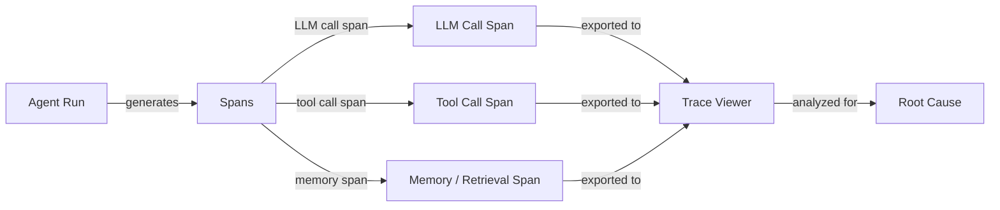

## Definição

Depuração e observabilidade de agentes é a disciplina de tornar os sistemas de agentes de IA suficientemente transparentes para que falhas, regressões e ineficiências possam ser identificadas, diagnosticadas e corrigidas. Ao contrário da depuração tradicional de software — onde um stack trace aponta para uma linha exata — as falhas de agentes são frequentemente emergentes: uma chamada de LLM correta produz saída plausível, mas incorreta, que se propaga por chamadas subsequentes de ferramentas, corrompe o estado do agente e produz uma resposta final errada sem que nenhuma exceção seja lançada. A observabilidade fornece os dados necessários para reconstruir o que aconteceu.

Os três pilares da observabilidade — logs, métricas e trilhas — se aplicam a agentes como se aplicam a sistemas distribuídos, mas com adaptações importantes. Os logs devem capturar não apenas erros, mas o conteúdo semântico de entradas e saídas do LLM. As métricas devem incluir contagens de tokens, latência por span e frequências de chamadas de ferramentas ao lado das métricas usuais do sistema. As trilhas devem modelar a estrutura hierárquica de uma execução de agente: um span raiz para a tarefa geral, spans filhos para cada chamada de LLM, spans netos para cada invocação de ferramenta e assim por diante. Juntos, esses fornecem um registro completo e reproduzível de cada execução do agente.

Sem boa observabilidade, a depuração se torna adivinhação: você reexecuta o agente, talvez obtenha um resultado diferente devido ao não determinismo, e não pode ter certeza se sua correção abordou a causa raiz. Com ela, você pode identificar a chamada exata ao LLM onde o raciocínio deu errado, identificar qual ferramenta retornou dados inesperados, medir a contribuição de latência de cada etapa e comparar duas execuções lado a lado para entender o que mudou.

## Como funciona



### Registro estruturado

Registro estruturado significa emitir logs JSON legíveis por máquina em vez de strings de texto livre. Para agentes, cada entrada de log deve incluir: ID de execução, número de etapa, tipo de span (llm/ferramenta/memória), payload de entrada, payload de saída, timestamps, contagens de tokens e qualquer erro. Logs estruturados tornam possível filtrar, agregar e correlacionar eventos em uma execução distribuída sem análise manual de strings. Bibliotecas como `structlog` ou `loguru` do Python tornam isso simples.

### Rastreamento distribuído e spans

Uma trilha é um grafo acíclico dirigido de spans representando uma única execução do agente. O span raiz cobre toda a execução; spans filhos cobrem chamadas ao LLM, invocações de ferramentas e consultas de memória. Cada span carrega um ID de trilha (compartilhado em toda a execução) e um ID de span (único por span), habilitando reconstrução completa. OpenTelemetry (OTel) é o padrão aberto para emitir trilhas; ele tem exportadores para Jaeger, Zipkin, Phoenix e LangSmith. Instrumentar um agente com spans OTel requer envolver chamadas de LLM e chamadas de ferramentas com gerenciadores de contexto de span.

### Visualização de trilhas

Visualizadores de trilhas renderizam a árvore de spans visualmente, mostrando a linha do tempo, duração, entradas, saídas e erros para cada span. O LangSmith fornece um visualizador de trilhas específico para agentes LangChain com detalhes no nível de token. Phoenix (Arize) é uma alternativa de código aberto que suporta qualquer fonte compatível com OpenTelemetry. Weights & Biases Traces integra-se a execuções W&B para equipes que já o usam para rastreamento de experimentos. Bons visualizadores de trilhas permitem comparar duas execuções lado a lado, filtrar spans por tipo e aprofundar-se na entrada/saída exata no nível de token que causou uma falha.

### Análise de causa raiz

Com trilhas em mãos, a análise de causa raiz segue um processo sistemático: encontre o primeiro span onde a saída divergiu da expectativa, inspecione suas entradas (estavam corretas?) e determine se a falha foi no raciocínio do LLM, uma ferramenta retornando dados ruins ou um problema de memória/contexto. O não determinismo torna isso mais difícil — executar a mesma entrada duas vezes pode produzir resultados diferentes — portanto, capturar trilhas para cada execução (não apenas falhas) e comparar com uma trilha de referência conhecida é essencial. Marcar trilhas com metadados (ID do usuário, tipo de tarefa, versão do prompt) habilita análise de coorte para identificar padrões em muitas execuções.

### Desafios comuns de depuração

O não determinismo significa que o mesmo bug pode não se reproduzir na próxima execução, exigindo análise estatística em muitas trilhas. Falhas de múltiplos passos se compõem: um erro na etapa 2 pode não aparecer até a etapa 7, então você deve rastrear a propagação do erro de volta. Erros de ferramentas — timeouts de rede, respostas de API malformadas, erros de permissão — são frequentemente silenciosos (o agente recebe uma string de erro como resultado da ferramenta e continua). Injeção de prompt e limites de janela de contexto podem causar mudanças comportamentais repentinas que parecem aleatórias sem contexto de trilha.

## Quando usar / Quando NÃO usar

| Use quando | Evite quando |
|---|---|
| Diagnosticando uma falha específica de agente em produção | Tratar observabilidade como uma reflexão tardia após a implantação |
| Comparando duas versões de prompt para entender diferenças comportamentais | Registrar excessivamente cada token em um pipeline de baixa latência e alto volume sem amostragem |
| Identificando qual chamada de ferramenta é o gargalo para latência | Depender apenas da resposta final para julgar se uma execução foi bem-sucedida |
| Construindo um conjunto de regressão que requer asserções no nível de trilha | Registrar PII bruto sem redação em sistemas multi-inquilino |
| Auditando frequências de chamadas de ferramentas e distribuições de argumentos | Usar instruções de impressão em vez de trilhas estruturadas e correlacionadas |

## Prós e contras

| Prós | Contras |
|---|---|
| Habilita análise precisa de causa raiz para falhas de múltiplos passos | A instrumentação adiciona complexidade de código e sobrecarga menor de latência |
| Fornece um trilha de auditoria completa para conformidade e depuração | Armazenar trilhas completas de E/S do LLM gera volume significativo de dados |
| Torna o comportamento não determinístico tratável via comparação de execuções | Visualizadores de trilhas têm uma curva de aprendizado para novos membros da equipe |
| Integra-se com stacks existentes de MLOps e monitoramento | Estratégias de amostragem devem ser ajustadas para equilibrar cobertura vs. custo |
| Logs estruturados habilitam detecção automatizada de anomalias | Dados sensíveis do usuário em trilhas requerem controle cuidadoso de acesso |

## Exemplos de código

```python
# Agent observability with OpenTelemetry + Phoenix (Arize)
# pip install opentelemetry-api opentelemetry-sdk openinference-instrumentation-openai arize-phoenix

import os
import time
import json
import structlog
from opentelemetry import trace
from opentelemetry.sdk.trace import TracerProvider
from opentelemetry.sdk.trace.export import BatchSpanProcessor
from opentelemetry.exporter.otlp.proto.http.trace_exporter import OTLPSpanExporter
from opentelemetry.sdk.resources import Resource


# --- Configure structured logger ---
structlog.configure(
    processors=[
        structlog.processors.TimeStamper(fmt="iso"),
        structlog.stdlib.add_log_level,
        structlog.processors.JSONRenderer(),
    ]
)
log = structlog.get_logger()


# --- Set up OpenTelemetry tracer pointing at Phoenix (default port 6006) ---
resource = Resource.create({"service.name": "my-agent", "service.version": "0.1.0"})
provider = TracerProvider(resource=resource)
otlp_exporter = OTLPSpanExporter(
    endpoint="http://localhost:6006/v1/traces",  # Phoenix local endpoint
)
provider.add_span_processor(BatchSpanProcessor(otlp_exporter))
trace.set_tracer_provider(provider)
tracer = trace.get_tracer("agent.tracer")


# --- Simulated LLM call (replace with real client) ---
def call_llm(messages: list[dict], run_id: str) -> dict:
    """Wrap an LLM call in an OTel span."""
    with tracer.start_as_current_span("llm.call") as span:
        span.set_attribute("llm.model", "gpt-4o-mini")
        span.set_attribute("llm.prompt_tokens", sum(len(m["content"]) for m in messages))
        span.set_attribute("run.id", run_id)

        # Simulate LLM response with a tool call decision
        time.sleep(0.05)  # Simulate network latency
        response = {
            "content": None,
            "tool_call": {"name": "search_web", "args": {"query": messages[-1]["content"]}},
            "completion_tokens": 42,
        }
        span.set_attribute("llm.completion_tokens", response["completion_tokens"])
        log.info("llm_call_complete", run_id=run_id, tool_call=response.get("tool_call"))
        return response


# --- Simulated tool call ---
def call_tool(name: str, args: dict, run_id: str) -> str:
    """Wrap a tool call in an OTel span."""
    with tracer.start_as_current_span(f"tool.{name}") as span:
        span.set_attribute("tool.name", name)
        span.set_attribute("tool.input", json.dumps(args))
        span.set_attribute("run.id", run_id)

        start = time.time()
        # Simulate tool execution
        time.sleep(0.1)
        result = f"Search results for: {args.get('query', '')}"
        duration_ms = (time.time() - start) * 1000

        span.set_attribute("tool.output", result)
        span.set_attribute("tool.duration_ms", round(duration_ms, 1))
        log.info("tool_call_complete", run_id=run_id, tool=name, duration_ms=duration_ms)
        return result


# --- Agent run with full trace ---
def run_agent(task: str, run_id: str, max_steps: int = 5) -> str:
    """Run a simple ReAct-style agent with full OTel tracing."""
    with tracer.start_as_current_span("agent.run") as root_span:
        root_span.set_attribute("agent.task", task)
        root_span.set_attribute("run.id", run_id)
        log.info("agent_run_start", run_id=run_id, task=task)

        messages = [
            {"role": "system", "content": "You are a helpful assistant with tool access."},
            {"role": "user", "content": task},
        ]

        for step in range(max_steps):
            with tracer.start_as_current_span(f"agent.step.{step}") as step_span:
                step_span.set_attribute("agent.step", step)

                response = call_llm(messages, run_id)

                if response.get("tool_call"):
                    tool_call = response["tool_call"]
                    tool_result = call_tool(tool_call["name"], tool_call["args"], run_id)
                    # Append tool result to conversation
                    messages.append({"role": "assistant", "content": str(response["content"])})
                    messages.append({"role": "tool", "content": tool_result})
                else:
                    # No tool call: agent has a final answer
                    final_answer = response.get("content", "")
                    root_span.set_attribute("agent.final_answer", str(final_answer))
                    log.info("agent_run_complete", run_id=run_id, steps=step + 1)
                    return final_answer

        root_span.set_attribute("agent.stopped", "max_steps_reached")
        log.warning("agent_max_steps_reached", run_id=run_id, max_steps=max_steps)
        return "Agent stopped: max steps reached."


# --- Run the agent ---
if __name__ == "__main__":
    import uuid
    run_id = str(uuid.uuid4())
    answer = run_agent("What are the latest developments in AI agents?", run_id)
    print(f"Answer: {answer}")
    # Traces are now visible at http://localhost:6006 in Phoenix UI
```

## Recursos práticos

- [Documentação do LangSmith](https://docs.smith.langchain.com/) — Plataforma completa de rastreamento, gerenciamento de conjunto de dados e avaliação para agentes baseados em LangChain, com um visualizador de trilhas dedicado.
- [Documentação do Phoenix (Arize)](https://docs.arize.com/phoenix) — Plataforma de observabilidade de LLM de código aberto suportando trilhas OpenTelemetry; funciona com qualquer framework de agentes.
- [Documentação do OpenTelemetry Python](https://opentelemetry-python.readthedocs.io/) — Documentação oficial para instrumentar aplicações Python com rastreamento distribuído, métricas e logs.
- [Weights & Biases Weave](https://wandb.github.io/weave/) — Ferramenta de rastreamento e avaliação do W&B para aplicações LLM, integrada ao rastreamento de experimentos W&B.
- [Instrumentação OpenInference](https://github.com/Arize-ai/openinference) — Bibliotecas de instrumentação baseadas em OTel de código aberto para LLMs, agentes e armazenamentos vetoriais (usadas pelo Phoenix).

## Fontes

- [OpenTelemetry specification](https://opentelemetry.io/docs/specs/otel/) — Padrão aberto para rastreamento distribuído, métricas e logging que sustenta as ferramentas modernas de observabilidade de LLMs.
- [AgentBench: Evaluating LLMs as Agents (Liu et al., 2023)](https://arxiv.org/abs/2308.03688) — Suite de benchmark e metodologia para avaliação sistemática de agentes em tarefas do mundo real.
- [LangSmith documentation](https://docs.smith.langchain.com/) — Referência para rastreamento de chamadas de agentes LLM, construção de conjuntos de avaliação e medição de desempenho.
- [Phoenix (Arize) documentation](https://docs.arize.com/phoenix) — Plataforma de observabilidade de código aberto suportando trilhas OTel para qualquer framework de agentes.

## Veja também

- [Avaliação e testes de agentes](/docs/agents/evaluation)
- [Agentes](/docs/agents)
- [Monitoramento MLOps](/docs/mlops/monitoring)
