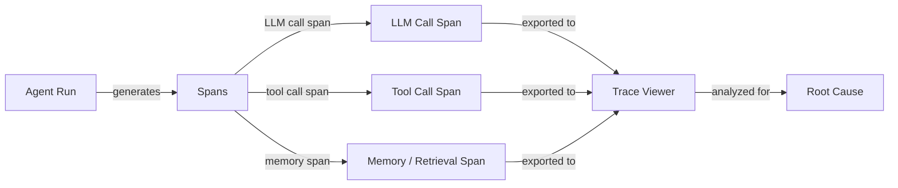

# Depuração e observabilidade de agentes

## Definição

Agenten-Debugging und Beobachtbarkeit ist die Disziplin, KI-Agentensysteme so transparent zu machen, dass Fehler, Regressionen und Ineffizienzen identifiziert, diagnostiziert und behoben werden können. Anders als beim traditionellen Software-Debugging – wo ein Stack-Trace auf eine genaue Zeile zeigt – sind Agentenfehler oft emergent: Ein korrekter LLM-Aufruf produziert plausible, aber falsche Ausgaben, die sich durch nachfolgende Werkzeugaufrufe kaskadieren, den Agentenzustand korrumpieren und eine falsche Endantwort erzeugen, ohne dass eine Ausnahme ausgelöst wird. Beobachtbarkeit liefert die Daten, die nötig sind, um zu rekonstruieren, was geschehen ist.

Die drei Säulen der Beobachtbarkeit – Logs, Metriken und Traces – gelten für Agenten wie für verteilte Systeme, aber mit wichtigen Anpassungen. Logs müssen nicht nur Fehler, sondern auch den semantischen Inhalt von LLM-Eingaben und -Ausgaben erfassen. Metriken müssen Token-Zählungen, Latenz pro Span und Werkzeugaufruf-Häufigkeiten neben den üblichen Systemmetriken einschließen. Traces müssen die hierarchische Struktur eines Agenten-Laufs modellieren: ein Root-Span für die Gesamtaufgabe, Child-Spans für jeden LLM-Aufruf, Grandchild-Spans für jede Werkzeugaufruf und so weiter. Zusammen ergeben diese ein vollständiges, reproduzierbares Protokoll jeder Agenten-Ausführung.

Ohne gute Beobachtbarkeit wird Debugging zum Raten: Sie führen den Agenten erneut aus, erhalten möglicherweise aufgrund von Nicht-Determinismus ein anderes Ergebnis und können nicht sicher sein, ob Ihre Lösung die Grundursache behebt. Mit ihr können Sie den genauen LLM-Aufruf identifizieren, bei dem die Überlegung falsch lief, feststellen, welches Werkzeug unerwartete Daten zurückgegeben hat, den Latenzanteil jedes Schritts messen und zwei Läufe nebeneinander vergleichen, um zu verstehen, was sich geändert hat.

## Como funciona



### Strukturiertes Logging

Strukturiertes Logging bedeutet, maschinenlesbare JSON-Logs anstelle von Freitextzeichenfolgen auszugeben. Bei Agenten sollte jeder Log-Eintrag Folgendes enthalten: Lauf-ID, Schrittnummer, Span-Typ (llm/tool/memory), Eingabe-Payload, Ausgabe-Payload, Zeitstempel, Token-Zählungen und etwaige Fehler. Strukturierte Logs ermöglichen es, Ereignisse über einen verteilten Lauf hinweg zu filtern, zu aggregieren und zu korrelieren, ohne manuelles String-Parsing. Bibliotheken wie Pythons `structlog` oder `loguru` machen dies unkompliziert.

### Verteiltes Tracing und Spans

Ein Trace ist ein gerichteter azyklischer Graph von Spans, der eine einzelne Agenten-Ausführung repräsentiert. Der Root-Span deckt den gesamten Lauf ab; Child-Spans decken LLM-Aufrufe, Werkzeugaufrufungen und Speicherabfragen ab. Jeder Span trägt eine Trace-ID (über den gesamten Lauf geteilt) und eine Span-ID (eindeutig pro Span), was eine vollständige Rekonstruktion ermöglicht. OpenTelemetry (OTel) ist der offene Standard für die Ausgabe von Traces; es hat Exporteure für Jaeger, Zipkin, Phoenix und LangSmith. Die Instrumentierung eines Agenten mit OTel-Spans erfordert das Umhüllen von LLM-Aufrufen und Werkzeugaufrufen mit Span-Kontextmanagern.

### Trace-Visualisierung

Trace-Viewer rendern den Span-Baum visuell und zeigen die Zeitleiste, Dauer, Eingaben, Ausgaben und Fehler für jeden Span. LangSmith bietet einen zweckgebundenen Trace-Viewer für LangChain-Agenten mit Token-Level-Details. Phoenix (Arize) ist eine Open-Source-Alternative, die jede OpenTelemetry-kompatible Quelle unterstützt. Weights & Biases Traces integriert sich in W&B-Läufe für Teams, die es bereits für Experiment-Tracking verwenden. Gute Trace-Viewer ermöglichen es Ihnen, zwei Läufe nebeneinander zu vergleichen, Spans nach Typ zu filtern und in die genaue Token-Level-Eingabe/Ausgabe zu bohren, die einen Fehler verursacht hat.

### Ursachenanalyse

Mit Traces in der Hand folgt die Ursachenanalyse einem systematischen Prozess: Finden Sie den ersten Span, bei dem die Ausgabe von der Erwartung abwich, inspizieren Sie seine Eingaben (waren sie korrekt?) und bestimmen Sie, ob der Fehler in der LLM-Überlegung lag, ein Werkzeug schlechte Daten zurückgegeben hat oder ein Speicher-/Kontextproblem vorlag. Nicht-Determinismus erschwert dies – das Ausführen derselben Eingabe zweimal kann unterschiedliche Ergebnisse erzeugen – daher ist das Erfassen von Traces für jeden Lauf (nicht nur für Fehler) und der Vergleich mit einem bekannt-guten Trace unerlässlich. Das Markieren von Traces mit Metadaten (Benutzer-ID, Aufgabentyp, Prompt-Version) ermöglicht eine Kohorten-Analyse, um Muster über viele Läufe hinweg zu erkennen.

### Häufige Debugging-Herausforderungen

Nicht-Determinismus bedeutet, dass derselbe Fehler beim nächsten Lauf möglicherweise nicht reproduzierbar ist, was eine statistische Analyse über viele Traces hinweg erfordert. Mehrstufige Fehler kumulieren: Ein Fehler in Schritt 2 taucht möglicherweise erst in Schritt 7 auf, sodass Sie die Fehlerausbreitung rückwärts verfolgen müssen. Werkzeugfehler – Netzwerk-Timeouts, fehlerhafte API-Antworten, Berechtigungsfehler – sind oft still (der Agent erhält eine Fehlerzeichenfolge als Werkzeug-Ergebnis und setzt fort). Prompt-Injection und Kontextfenster-Grenzen können plötzliche Verhaltensänderungen verursachen, die ohne Trace-Kontext zufällig erscheinen.

## Quando usar / Quando NÃO usar

| Usar quando | Evitar quando |
|---|---|
| Einen spezifischen Agentenfehler in der Produktion diagnostizieren | Beobachtbarkeit als nachträglichen Gedanken nach der Bereitstellung behandeln |
| Zwei Prompt-Versionen vergleichen, um Verhaltensunterschiede zu verstehen | Jeden Token in einer latenzarmen, hochvolumigen Pipeline ohne Sampling übermäßig protokollieren |
| Identifizieren, welcher Werkzeugaufruf der Engpass für die Latenz ist | Sich nur auf die endgültige Antwort verlassen, um zu beurteilen, ob ein Lauf erfolgreich war |
| Eine Regressionssuite erstellen, die Trace-Level-Assertionen erfordert | Rohe PII ohne Redaktion in mandantenfähigen Systemen protokollieren |
| Werkzeugaufruf-Häufigkeiten und Argumentverteilungen prüfen | Print-Anweisungen statt strukturierter, korrelierter Traces verwenden |

## Vantagens e desvantagens

| Vantagens | Desvantagens |
|---|---|
| Ermöglicht präzise Ursachenanalyse für mehrstufige Fehler | Instrumentierung fügt Code-Komplexität und geringe Latenz-Overhead hinzu |
| Bietet einen vollständigen Prüfpfad für Compliance und Debugging | Das Speichern vollständiger LLM-I/O-Traces erzeugt erhebliches Datenvolumen |
| Macht nicht-deterministisches Verhalten durch Lauf-Vergleich handhabbar | Trace-Viewer haben eine Lernkurve für neue Teammitglieder |
| Integriert sich in bestehende MLOps- und Monitoring-Stacks | Sampling-Strategien müssen ausbalanciert werden zwischen Abdeckung und Kosten |
| Strukturierte Logs ermöglichen automatisierte Anomalieerkennung | Sensible Benutzerdaten in Traces erfordern sorgfältige Zugangskontrolle |

## Exemplos de código

```python
# Agent observability with OpenTelemetry + Phoenix (Arize)
# pip install opentelemetry-api opentelemetry-sdk openinference-instrumentation-openai arize-phoenix

import os
import time
import json
import structlog
from opentelemetry import trace
from opentelemetry.sdk.trace import TracerProvider
from opentelemetry.sdk.trace.export import BatchSpanProcessor
from opentelemetry.exporter.otlp.proto.http.trace_exporter import OTLPSpanExporter
from opentelemetry.sdk.resources import Resource


# --- Configure structured logger ---
structlog.configure(
    processors=[
        structlog.processors.TimeStamper(fmt="iso"),
        structlog.stdlib.add_log_level,
        structlog.processors.JSONRenderer(),
    ]
)
log = structlog.get_logger()


# --- Set up OpenTelemetry tracer pointing at Phoenix (default port 6006) ---
resource = Resource.create({"service.name": "my-agent", "service.version": "0.1.0"})
provider = TracerProvider(resource=resource)
otlp_exporter = OTLPSpanExporter(
    endpoint="http://localhost:6006/v1/traces",  # Phoenix local endpoint
)
provider.add_span_processor(BatchSpanProcessor(otlp_exporter))
trace.set_tracer_provider(provider)
tracer = trace.get_tracer("agent.tracer")


# --- Simulated LLM call (replace with real client) ---
def call_llm(messages: list[dict], run_id: str) -> dict:
    """Wrap an LLM call in an OTel span."""
    with tracer.start_as_current_span("llm.call") as span:
        span.set_attribute("llm.model", "gpt-4o-mini")
        span.set_attribute("llm.prompt_tokens", sum(len(m["content"]) for m in messages))
        span.set_attribute("run.id", run_id)

        # Simulate LLM response with a tool call decision
        time.sleep(0.05)  # Simulate network latency
        response = {
            "content": None,
            "tool_call": {"name": "search_web", "args": {"query": messages[-1]["content"]}},
            "completion_tokens": 42,
        }
        span.set_attribute("llm.completion_tokens", response["completion_tokens"])
        log.info("llm_call_complete", run_id=run_id, tool_call=response.get("tool_call"))
        return response


# --- Simulated tool call ---
def call_tool(name: str, args: dict, run_id: str) -> str:
    """Wrap a tool call in an OTel span."""
    with tracer.start_as_current_span(f"tool.{name}") as span:
        span.set_attribute("tool.name", name)
        span.set_attribute("tool.input", json.dumps(args))
        span.set_attribute("run.id", run_id)

        start = time.time()
        # Simulate tool execution
        time.sleep(0.1)
        result = f"Search results for: {args.get('query', '')}"
        duration_ms = (time.time() - start) * 1000

        span.set_attribute("tool.output", result)
        span.set_attribute("tool.duration_ms", round(duration_ms, 1))
        log.info("tool_call_complete", run_id=run_id, tool=name, duration_ms=duration_ms)
        return result


# --- Agent run with full trace ---
def run_agent(task: str, run_id: str, max_steps: int = 5) -> str:
    """Run a simple ReAct-style agent with full OTel tracing."""
    with tracer.start_as_current_span("agent.run") as root_span:
        root_span.set_attribute("agent.task", task)
        root_span.set_attribute("run.id", run_id)
        log.info("agent_run_start", run_id=run_id, task=task)

        messages = [
            {"role": "system", "content": "You are a helpful assistant with tool access."},
            {"role": "user", "content": task},
        ]

        for step in range(max_steps):
            with tracer.start_as_current_span(f"agent.step.{step}") as step_span:
                step_span.set_attribute("agent.step", step)

                response = call_llm(messages, run_id)

                if response.get("tool_call"):
                    tool_call = response["tool_call"]
                    tool_result = call_tool(tool_call["name"], tool_call["args"], run_id)
                    # Append tool result to conversation
                    messages.append({"role": "assistant", "content": str(response["content"])})
                    messages.append({"role": "tool", "content": tool_result})
                else:
                    # No tool call: agent has a final answer
                    final_answer = response.get("content", "")
                    root_span.set_attribute("agent.final_answer", str(final_answer))
                    log.info("agent_run_complete", run_id=run_id, steps=step + 1)
                    return final_answer

        root_span.set_attribute("agent.stopped", "max_steps_reached")
        log.warning("agent_max_steps_reached", run_id=run_id, max_steps=max_steps)
        return "Agent stopped: max steps reached."


# --- Run the agent ---
if __name__ == "__main__":
    import uuid
    run_id = str(uuid.uuid4())
    answer = run_agent("What are the latest developments in AI agents?", run_id)
    print(f"Answer: {answer}")
    # Traces are now visible at http://localhost:6006 in Phoenix UI
```

## Recursos práticos

- [LangSmith documentation](https://docs.smith.langchain.com/) — Vollständige Tracing-, Datensatz-Management- und Evaluierungsplattform für LangChain-basierte Agenten, mit einem zweckgebundenen Trace-Viewer.
- [Phoenix by Arize documentation](https://docs.arize.com/phoenix) — Open-Source LLM-Beobachtbarkeitsplattform, die OpenTelemetry-Traces unterstützt; funktioniert mit jedem Agenten-Framework.
- [OpenTelemetry Python documentation](https://opentelemetry-python.readthedocs.io/) — Offizielle Docs für die Instrumentierung von Python-Anwendungen mit verteiltem Tracing, Metriken und Logs.
- [Weights & Biases Weave](https://wandb.github.io/weave/) — W&Bs Tracing- und Evaluierungswerkzeug für LLM-Apps, integriert mit W&B Experiment-Tracking.
- [OpenInference instrumentation](https://github.com/Arize-ai/openinference) — Open-Source OTel-basierte Instrumentierungsbibliotheken für LLMs, Agenten und Vektorspeicher (verwendet von Phoenix).

## Veja também

- [Agent evaluation and testing](/docs/agents/evaluation)
- [Agents](/docs/agents)
- [MLOps monitoring](/docs/mlops/monitoring)
