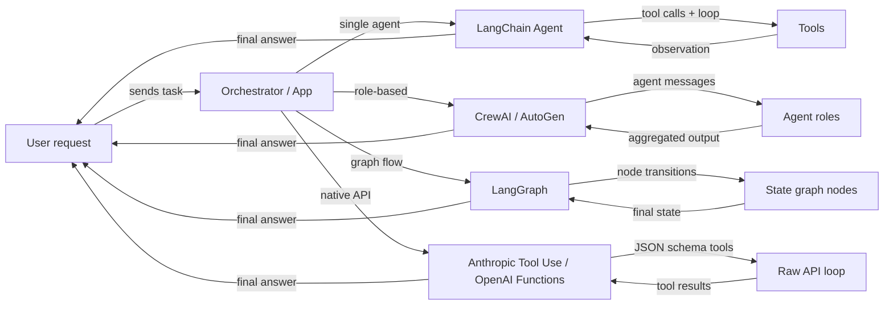

## Definição

Um **framework de agentes** é uma biblioteca ou SDK que cuida das preocupações de infraestrutura na construção de agentes de IA: registro de ferramentas, passagem de mensagens, gerenciamento de estado, orquestração e integração com provedores de LLM. Sem um framework, você escreve essas camadas de base manualmente; com um framework, você descreve *o que* seu agente deve fazer e ele cuida de *como* o ciclo é executado.

O ecossistema de frameworks de agentes cresceu rapidamente e agora abrange várias categorias distintas. Alguns frameworks focam em um único agente com ferramentas (agentes LangChain), outros priorizam a colaboração baseada em papéis entre muitos agentes (CrewAI, AutoGen), outros modelam o comportamento do agente como grafos explícitos com estado (LangGraph), e alguns ignoram completamente o framework e dependem das capacidades nativas do provedor do modelo (Anthropic Tool Use, OpenAI Function Calling). Cada categoria reflete uma filosofia diferente sobre onde o controle e a complexidade devem residir.

Escolher o framework certo não é apenas uma decisão técnica — ela molda como você raciocina sobre o seu sistema, depura falhas e escala para produção. Um iniciante construindo um assistente de pesquisa simples tem necessidades muito diferentes das de uma equipe de plataforma conectando uma dúzia de agentes especializados em um pipeline de produção.

## Como funciona

### Frameworks de agente único (agentes LangChain)

Frameworks de agente único concedem a um LLM acesso a um conjunto de ferramentas e executam um ciclo: o modelo decide qual ferramenta chamar, o framework a executa, a observação é adicionada à conversa e o ciclo continua até o modelo emitir uma resposta final. LangChain é o exemplo canônico, expondo `create_react_agent` e `AgentExecutor` para agentes no estilo ReAct. O desenvolvedor registra ferramentas (funções Python com docstrings ou esquemas Pydantic) e o framework cuida da construção do prompt e da análise de resultados. O agente único é o ponto de partida correto: menor latência, mais fácil de depurar e mais simples de testar. A complexidade cresce quando você precisa de múltiplos papéis especializados trabalhando em paralelo ou quando o estado se torna grande demais para uma única janela de contexto.

### Frameworks multi-agentes (CrewAI, AutoGen)

Frameworks multi-agentes coordenam vários agentes apoiados por LLM, cada um com seu próprio papel, instruções e ferramentas, em direção a um objetivo compartilhado. O CrewAI usa uma metáfora de equipe com papéis, objetivos e históricos; o AutoGen usa uma metáfora de conversa onde os agentes trocam mensagens. Ambos suportam padrões de execução sequencial e paralela. O framework gerencia o roteamento de mensagens, a passagem de saídas entre agentes e, opcionalmente, pontos de verificação com humanos no ciclo. Abordagens multi-agentes se destacam quando o problema se decompõe naturalmente em especializações distintas (pesquisador, escritor, crítico) ou quando você precisa de redundância e debate para melhorar a qualidade da saída.

### Frameworks baseados em grafos (LangGraph)

Frameworks baseados em grafos representam o comportamento do agente como um grafo dirigido explícito: nós são funções Python (cada uma pode chamar um LLM ou uma ferramenta), arestas são transições entre nós, e o estado compartilhado é um dicionário tipado. O LangGraph, construído sobre o LangChain, popularizou essa abordagem. Ciclos no grafo permitem que o agente faça iterações até que uma condição de encerramento seja satisfeita; arestas condicionais permitem roteamento dinâmico com base em resultados intermediários. A explicitação de um grafo facilita o raciocínio sobre fluxos complexos, testes isolados e persistência entre interrupções. Este é o padrão preferido quando você precisa de controle refinado sobre o fluxo de execução, checkpointing ou aprovações com humanos no ciclo em etapas específicas.

### Uso nativo de ferramentas (Anthropic Tool Use, OpenAI Function Calling)

O uso nativo de ferramentas ignora completamente a camada de framework e usa o mecanismo integrado do provedor do modelo para chamadas de funções estruturadas. A API da Anthropic aceita um parâmetro `tools` com definições em JSON schema; o modelo retorna blocos `tool_use` que seu código executa, depois você devolve blocos `tool_result`. O equivalente da OpenAI são `functions` / `tools` com respostas `function_call`. Essa abordagem tem sobrecarga mínima de abstração, controle total sobre o ciclo e a integração mais próxima com recursos específicos do modelo, como streaming e chamadas paralelas de ferramentas. A contrapartida é que você escreve a lógica de orquestração você mesmo, o que é adequado para casos de uso simples, mas cresce em complexidade em escala.



## Quando usar / Quando NÃO usar

| Use quando | Evite quando |
|---|---|
| Você precisa de comportamento de LLM aumentado por ferramentas além de um único prompt | Sua tarefa é um prompt único sem necessidade de dados externos |
| Seu problema se decompõe em múltiplos papéis especializados (multi-agente) | Você precisa de latência ultra-baixa e não pode pagar por ciclos de múltiplos passos |
| Você quer fluxos de agentes reproduzíveis e inspecionáveis (baseado em grafo) | Sua equipe não tem experiência para depurar ciclos de agentes não determinísticos |
| Você quer ficar próximo da API do provedor com abstração mínima (nativa) | Você precisa de prototipagem rápida e não quer escrever boilerplate de orquestração |
| Você está construindo um sistema de produção que precisa de checkpointing e persistência | A tarefa pode ser resolvida com um pipeline RAG simples ou uma única cadeia de prompt |

## Comparações

| Critério | CrewAI | AutoGen | LangGraph | Anthropic Tool Use |
|---|---|---|---|---|
| **Arquitetura** | Equipe baseada em papéis com tarefas e processos | Pares de agentes e chats em grupo orientados por conversa | Grafo de estado explícito com nós e arestas | API bruta com definições de ferramentas em JSON schema |
| **Suporte multi-agente** | Nativo: agentes são membros da equipe com papéis e objetivos | Nativo: agentes conversam via barramento de mensagens | Possível via subgrafos, mas principalmente grafos de agente único | Manual: você implementa a coordenação multi-agente você mesmo |
| **Gerenciamento de estado** | Implícito: passado entre tarefas via contexto da equipe | Implícito: histórico de mensagens na conversa | Explícito: estado TypedDict compartilhado em todos os nós | Manual: você mantém seu próprio dicionário de estado |
| **Curva de aprendizado** | Baixa: API declarativa no estilo YAML | Média: requer entendimento de papéis de agentes e chat em grupo | Média-alta: requer intuição de teoria de grafos | Baixa: apenas Python + JSON schema, mas mais boilerplate |
| **Comunidade e ecossistema** | Crescendo rapidamente, tutoriais fortes | Grande (apoiado pela Microsoft), forte comunidade de pesquisa | Crescendo rapidamente, integração estreita com LangChain | SDK oficial da Anthropic, bem documentado |
| **Melhor para** | Pipelines baseados em papéis estruturados, fluxos de conteúdo | Pesquisa, geração de código, experimentação com humanos no ciclo | Fluxos com ramificações complexas, pipelines de produção | Ferramentas simples a médias, integração próxima com o modelo |
| **Suporte a streaming** | Limitado | Limitado | Suportado via streaming do LangChain | Streaming completo via SDK da Anthropic |

## Exemplos de código

```python
# --- LangChain agent (single-agent, ReAct) ---
from langchain_anthropic import ChatAnthropic
from langchain.agents import create_react_agent, AgentExecutor
from langchain_core.tools import tool

@tool
def search(query: str) -> str:
    """Search the web for information."""
    return f"Results for: {query}"

llm = ChatAnthropic(model="claude-3-5-sonnet-20241022")
agent = create_react_agent(llm, tools=[search])
executor = AgentExecutor(agent=agent, tools=[search])
result = executor.invoke({"input": "What is LangGraph?"})


# --- CrewAI minimal setup ---
from crewai import Agent, Task, Crew

researcher = Agent(role="Researcher", goal="Find accurate information", backstory="Expert researcher")
task = Task(description="Research LangGraph", agent=researcher)
crew = Crew(agents=[researcher], tasks=[task])
result = crew.kickoff()


# --- AutoGen minimal setup ---
import autogen

assistant = autogen.AssistantAgent(name="assistant", llm_config={"model": "gpt-4o"})
user = autogen.UserProxyAgent(name="user", human_input_mode="NEVER")
user.initiate_chat(assistant, message="Explain LangGraph in one paragraph.")


# --- LangGraph minimal setup ---
from langgraph.graph import StateGraph, END
from typing import TypedDict

class State(TypedDict):
    message: str

def process(state: State) -> State:
    return {"message": f"Processed: {state['message']}"}

graph = StateGraph(State)
graph.add_node("process", process)
graph.set_entry_point("process")
graph.add_edge("process", END)
app = graph.compile()
result = app.invoke({"message": "hello"})


# --- Anthropic Tool Use minimal setup ---
import anthropic

client = anthropic.Anthropic()
tools = [{"name": "search", "description": "Search the web", "input_schema": {"type": "object", "properties": {"query": {"type": "string"}}, "required": ["query"]}}]
response = client.messages.create(
    model="claude-opus-4-5",
    max_tokens=1024,
    tools=tools,
    messages=[{"role": "user", "content": "Search for LangGraph documentation."}]
)
```

## Recursos práticos

- [Documentação de agentes LangChain](https://python.langchain.com/docs/concepts/agents/) — Guia completo para construir agentes com LangChain, incluindo ReAct, uso de ferramentas e memória.
- [Documentação oficial do CrewAI](https://docs.crewai.com/) — Referência completa para papéis, tarefas, equipes e processos no CrewAI.
- [Documentação do AutoGen (Microsoft)](https://microsoft.github.io/autogen/) — Cobre ConversableAgent, chats em grupo, execução de código e padrões com humanos no ciclo.
- [Documentação do LangGraph](https://langchain-ai.github.io/langgraph/) — Máquinas de estado de agentes baseadas em grafos, persistência e checkpoints com humanos no ciclo.
- [Guia de uso de ferramentas da Anthropic](https://docs.anthropic.com/en/docs/build-with-claude/tool-use) — Guia oficial para definir ferramentas com JSON schema e lidar com os tipos de mensagem tool_use / tool_result.
- [AgentsKit](https://www.agentskit.io/) — Framework JavaScript full-stack pronto para produção para construir agentes de IA com memória, ferramentas, RAG e orquestração multi-agente

## Além dos frameworks: runtimes e orquestradores

Frameworks ajudam você a *construir* um ciclo de agente. Uma camada separada em rápido crescimento (2026) foca em *executar e coordenar* agentes a longo prazo: **AgentsKit** como uma stack JS completa, **Hermes Agent** como um agente único persistente e auto-aprimorado, e **Paperclip** como um orquestrador orientado por interface que executa uma equipe de agentes existentes como uma empresa. Se seu problema principal é a operação em vez da construção, veja [runtimes e orquestradores de agentes](/docs/agents/agent-runtimes).

## Fontes

- [ReAct: Synergizing Reasoning and Acting in Language Models (Yao et al., 2022)](https://arxiv.org/abs/2210.03629) — Artigo fundamental sobre o loop pensamento–ação–observação subjacente à maioria dos frameworks de agente único.
- [AutoGen: Enabling Next-Gen LLM Applications via Multi-Agent Conversation (Wu et al., 2023)](https://arxiv.org/abs/2308.08155) — Base de pesquisa para o paradigma multi-agente orientado à conversa.
- [LangGraph official documentation](https://langchain-ai.github.io/langgraph/) — Referência para o design de máquinas de estado de agentes baseadas em grafos.
- [Anthropic Tool Use guide](https://docs.anthropic.com/en/docs/build-with-claude/tool-use) — Especificação oficial para uso nativo de ferramentas em agentes Claude.
- [Cognitive Architectures for Language Agents (Sumers et al., 2023)](https://arxiv.org/abs/2309.02427) — Levantamento que taxonomiza arquiteturas de agentes, memória e abordagens de raciocínio.

## Veja também

- [Runtimes e orquestradores de agentes](/docs/agents/agent-runtimes)

- [CrewAI](/docs/agents/crewai)
- [AutoGen](/docs/agents/autogen)
- [LangGraph](/docs/agents/langgraph)
- [Anthropic Tool Use](/docs/agents/anthropic-tool-use)
- [Sistemas multi-agentes](/docs/agents/multi-agent-systems)
- [Agentes de IA](/docs/agents)
