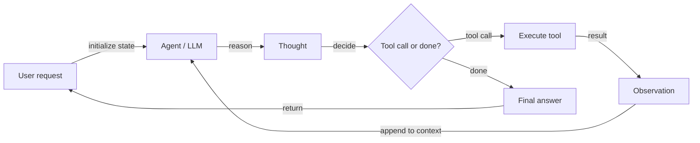
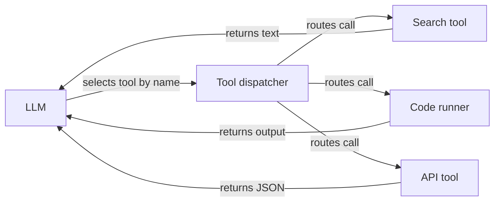

## Definição

Um **agente de IA** é um sistema que percebe seu ambiente (por exemplo, entradas do usuário, resultados de ferramentas), raciocina (possivelmente com um LLM) e executa ações (por exemplo, chamar APIs, escrever código) para atingir objetivos. Agentes frequentemente utilizam ferramentas e ciclos de pensamento–ação–observação para resolver tarefas que exigem mais do que uma única chamada ao LLM.

De forma mais formal: **um agente é um programa autônomo que se comunica com um modelo de IA para realizar operações baseadas em objetivos, usando as ferramentas e o contexto disponíveis, sendo capaz de tomar decisões autônomas fundamentadas na realidade.** Os agentes preenchem a lacuna entre um protótipo pontual (por exemplo, no AI Studio) e uma aplicação escalável: você define ferramentas, concede ao agente acesso a elas, e ele decide quando chamar qual ferramenta e como combinar os resultados para satisfazer o objetivo do usuário.

A característica definidora de um agente — em contraste com uma simples cadeia ou pipeline — é a **autonomia na decisão da próxima ação**. O agente não segue um roteiro fixo; ele usa o LLM para raciocinar sobre o estado atual e selecionar a ação mais adequada. Isso torna os agentes poderosos para tarefas abertas, mas também mais difíceis de prever e depurar do que pipelines determinísticos. Configurações de [multi-agentes](/docs/agents/multi-agent-systems) e [subagentes](/docs/subagents) estendem agentes individuais com padrões de coordenação e delegação hierárquica.

## Como funciona

### Ciclo de raciocínio do agente



### Registro e despacho de ferramentas



Ciclo típico: receber tarefa → planejar ou raciocinar → escolher ação (por exemplo, chamada de ferramenta) → observar resultado → repetir até concluir ou atingir o limite. O **usuário** envia uma solicitação; o **agente** (apoiado por um LLM) produz um **pensamento** (raciocínio) e uma **decisão**: ou chama uma **ferramenta** (por exemplo, busca, API, executor de código) e obtém uma **observação**, ou retorna uma **resposta final**. A observação é devolvida ao agente para o próximo passo. LLMs fornecem raciocínio e seleção de ferramentas; frameworks (LangChain, LlamaIndex, Google ADK) cuidam da orquestração, registro de ferramentas e passagem de mensagens.

## Quando usar / Quando NÃO usar

| Cenário | Use agentes | Não use agentes |
|---|---|---|
| Tarefas de múltiplos passos que exigem várias ferramentas | Sim — agentes lidam naturalmente com cadeias de ferramentas complexas | Não — uma cadeia simples ou pipeline é mais barato e previsível |
| Tarefas com número desconhecido de etapas de antemão | Sim — agentes decidem dinamicamente quantas etapas são necessárias | Não — se os passos são fixos, use um pipeline codificado |
| Pesquisa e síntese em muitas fontes | Sim — agentes podem buscar, ler e integrar iterativamente | Não — se os dados já são estruturados, uma consulta em lote é suficiente |
| Tarefas críticas de segurança sem supervisão humana | Não — agentes podem tomar decisões inesperadas | Sim — mantenha humanos no ciclo para ações de alto risco |
| Respostas simples e de baixa latência em um único passo | Não — a sobrecarga do agente adiciona latência | Sim — uma chamada direta ao LLM é mais rápida |

## Comparações

| Abordagem | Autonomia | Uso de ferramentas | Etapas | Previsibilidade | Custo |
|---|---|---|---|---|---|
| Chamada direta ao LLM | Nenhuma | Não | 1 | Alta | Baixo |
| Cadeia / pipeline | Baixa (fluxo fixo) | Possível | Fixo | Alta | Baixo–médio |
| Agente (único) | Alta (dinâmica) | Sim | Dinâmico | Média | Médio–alto |
| Multi-agente | Muito alta | Sim | Dinâmico por agente | Baixa–média | Alto |

## Prós e contras

| Prós | Contras |
|---|---|
| Flexível — pode usar muitas ferramentas e lidar com tarefas abertas | Imprevisível — pode entrar em loop, travar ou tomar caminhos inesperados |
| Lida com tarefas de múltiplos passos com ramificações dinâmicas | Latência e custo decorrentes de múltiplas chamadas ao LLM |
| Permite automação de fluxos de trabalho complexos | Requer ferramentas, esquemas e salvaguardas de segurança bem projetados |
| Escala do protótipo à produção com o framework certo | Depuração exige inspeção de longas trilhas de pensamento–ação |

## Exemplos de código

```python
# Conceptual agent loop (pseudocode)
def agent_loop(task: str, tools: dict, llm) -> str:
    messages = [{"role": "user", "content": task}]
    for _ in range(10):  # max iterations
        response = llm.invoke(messages, tools=list(tools.values()))
        if response.tool_calls:
            for call in response.tool_calls:
                tool_fn = tools[call["name"]]
                result = tool_fn(**call["arguments"])
                messages.append({"role": "tool", "content": str(result)})
        else:
            return response.content  # final answer
    return "Max iterations reached."

# LangChain example with a real tool
from langchain_openai import ChatOpenAI
from langchain.agents import AgentExecutor, create_tool_calling_agent
from langchain_community.tools import DuckDuckGoSearchRun
from langchain import hub

llm = ChatOpenAI(model="gpt-4o-mini")
tools = [DuckDuckGoSearchRun()]
prompt = hub.pull("hwchase17/openai-tools-agent")
agent = create_tool_calling_agent(llm, tools, prompt)
executor = AgentExecutor(agent=agent, tools=tools, verbose=True)
result = executor.invoke({"input": "What are the latest developments in RAG?"})
print(result["output"])
```

## Recursos práticos

- [From Prototypes to Agents with ADK – Google Codelabs](https://codelabs.developers.google.com/your-first-agent-with-adk#0) — Construa seu primeiro agente com o Agent Development Kit (ADK) do Google
- [LangChain – Agents](https://python.langchain.com/docs/concepts/agents/) — Conceitos de agentes, uso de ferramentas e orquestração no estilo ReAct
- [LlamaIndex – Agents](https://docs.llamaindex.ai/en/stable/module_guides/deploying/agents/) — Guias de agentes e mecanismos de consulta
- [OpenAI Assistants API](https://platform.openai.com/docs/assistants/overview) — Agentes gerenciados com ferramentas integradas (interpretador de código, busca em arquivos)
- [Anthropic – Build with Claude: Agents](https://docs.anthropic.com/en/docs/build-with-claude/tool-use) — Uso de ferramentas com Claude e padrões de agentes
- [AgentsKit](https://emersonbraun.github.io/agentskit/) — Framework pronto para produção para construir agentes de IA com memória, ferramentas e orquestração multi-agente

## Fontes

- [ReAct: Synergizing Reasoning and Acting in Language Models (Yao et al., 2022)](https://arxiv.org/abs/2210.03629) — Artigo seminal que estabelece o loop pensamento–ação–observação do agente.
- [Cognitive Architectures for Language Agents (Sumers et al., 2023)](https://arxiv.org/abs/2309.02427) — Levantamento abrangente de frameworks de raciocínio, memória e ação de agentes.
- [Toolformer: Language Models Can Teach Themselves to Use Tools (Schick et al., 2023)](https://arxiv.org/abs/2302.04761) — Artigo-chave sobre LLMs aumentados com ferramentas.
- [Anthropic – Build with Claude: Tool use](https://docs.anthropic.com/en/docs/build-with-claude/tool-use) — Guia oficial para padrões de uso agentico de ferramentas.
- [LangChain Agents documentation](https://python.langchain.com/docs/concepts/agents/) — Referência prática para construir agentes em produção.

## Veja também

- [Sistemas multi-agentes](/docs/agents/multi-agent-systems)
- [Subagentes](/docs/subagents)
- [Agentes autônomos](/docs/autonomous-agents)
- [ReAct](/docs/reasoning-patterns/react)
- [RDD](/docs/reasoning-patterns/rdd)
