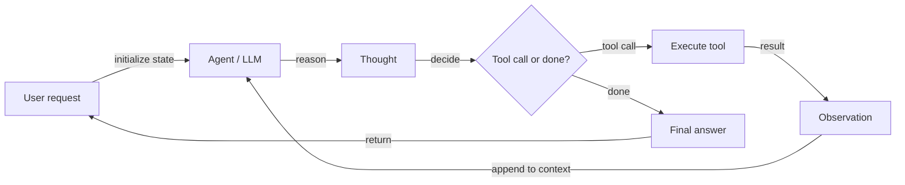
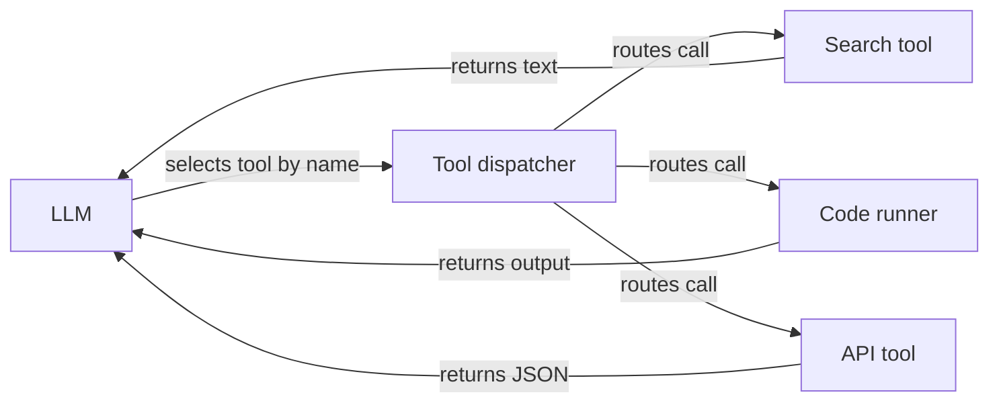

# Agentes de IA

## Definição

Ein **KI-Agent** ist ein System, das seine Umgebung wahrnimmt (z. B. Benutzereingaben, Werkzeugausgaben), schlussfolgert (möglicherweise mit einem LLM) und Aktionen ausführt (z. B. APIs aufrufen, Code schreiben), um Ziele zu erreichen. Agenten verwenden oft Werkzeuge und Schleifen aus Gedanke–Aktion–Beobachtung, um Aufgaben zu lösen, die mehr als einen einzigen LLM-Aufruf erfordern.

Formal gesagt: **Ein Agent ist ein autonomes Programm, das mit einem KI-Modell kommuniziert, um zielbasierte Operationen mithilfe der Werkzeuge und des Kontexts durchzuführen, die es hat, und das in der Lage ist, auf Wahrheit gegründete autonome Entscheidungen zu treffen.** Agenten überbrücken die Lücke zwischen einem einmaligen Prototyp (z. B. in AI Studio) und einer skalierbaren Anwendung: Sie definieren Werkzeuge, geben dem Agenten Zugang dazu, und er entscheidet, wann welches Werkzeug aufgerufen werden soll und wie Ergebnisse kombiniert werden, um das Ziel des Benutzers zu erfüllen.

Das Hauptmerkmal eines Agenten – im Gegensatz zu einer einfachen Kette oder Pipeline – ist **Autonomie bei der Entscheidung über die nächste Aktion**. Der Agent folgt keinem festen Skript; er verwendet das LLM, um über den aktuellen Zustand nachzudenken und die am besten geeignete Aktion auszuwählen. Dies macht Agenten mächtig für offene Aufgaben, aber auch schwieriger vorherzusagen und zu debuggen als deterministische Pipelines. [Multi-Agent](/docs/agents/multi-agent-systems) und [Subagenten](/docs/subagents)-Setups erweitern einzelne Agenten mit Koordinationsmustern und hierarchischer Delegation.

## Como funciona

### Agenten-Reasoning-Schleife



### Werkzeugregistrierung und -dispatch



Typische Schleife: Aufgabe empfangen → planen oder schlussfolgern → Aktion wählen (z. B. Werkzeugaufruf) → Ergebnis beobachten → wiederholen bis fertig oder Limit erreicht. Der **Benutzer** sendet eine Anfrage; der **Agent** (gestützt durch ein LLM) produziert einen **Gedanken** (Überlegung) und eine **Entscheidung**: entweder ein **Werkzeug** aufrufen (z. B. Suche, API, Code-Runner) und eine **Beobachtung** erhalten, oder eine **Endantwort** zurückgeben. Die Beobachtung wird für den nächsten Schritt zurück in den Agenten eingespeist. LLMs liefern Überlegung und Werkzeugauswahl; Frameworks (LangChain, LlamaIndex, Google ADK) übernehmen Orchestrierung, Werkzeugregistrierung und Nachrichtenübermittlung.

## Quando usar / Quando NÃO usar

| Cenário | Usar agentes | Não usar agentes |
|---|---|---|
| Mehrstufige Aufgaben, die mehrere Werkzeuge erfordern | Ja — Agenten bewältigen komplexe Werkzeugketten auf natürliche Weise | Nein — eine einfache Kette oder Pipeline ist günstiger und vorhersehbarer |
| Aufgaben mit unbekannter Anzahl von Schritten im Voraus | Ja — Agenten entscheiden dynamisch, wie viele Schritte benötigt werden | Nein — wenn Schritte fest sind, verwenden Sie eine hardcodierte Pipeline |
| Recherche und Synthese über viele Quellen | Ja — Agenten können iterativ suchen, lesen und integrieren | Nein — wenn die Daten bereits strukturiert sind, reicht eine Batch-Abfrage |
| Sicherheitskritische Aufgaben ohne menschliche Aufsicht | Nein — Agenten können unerwartete Entscheidungen treffen | Ja — Menschen in der Schleife für hochriskante Aktionen behalten |
| Niedrige Latenz, einfache, einstufige Antworten | Nein — Agenten-Overhead fügt Latenz hinzu | Ja — ein direkter LLM-Aufruf ist schneller |

## Comparações

| Ansatz | Autonomie | Werkzeug-Nutzung | Schritte | Vorhersehbarkeit | Kosten |
|---|---|---|---|---|---|
| Direkter LLM-Aufruf | Keine | Nein | 1 | Hoch | Niedrig |
| Kette / Pipeline | Niedrig (fester Fluss) | Möglich | Fest | Hoch | Niedrig–mittel |
| Agent (einzeln) | Hoch (dynamisch) | Ja | Dynamisch | Mittel | Mittel–hoch |
| Multi-Agent | Sehr hoch | Ja | Dynamisch pro Agent | Niedrig–mittel | Hoch |

## Vantagens e desvantagens

| Vantagens | Desvantagens |
|---|---|
| Flexibel — kann viele Werkzeuge verwenden und offene Aufgaben bewältigen | Unvorhersehbar — kann loopen, steckenbleiben oder unerwartete Pfade nehmen |
| Bewältigt mehrstufige Aufgaben mit dynamischem Branching | Latenz und Kosten durch mehrere LLM-Aufrufe |
| Ermöglicht die Automatisierung komplexer Workflows | Erfordert gut gestaltete Werkzeuge, Schemas und Sicherheitsleitplanken |
| Skaliert vom Prototyp zur Produktion mit dem richtigen Framework | Debugging erfordert das Inspizieren langer Gedanke–Aktion-Traces |

## Exemplos de código

```python
# Conceptual agent loop (pseudocode)
def agent_loop(task: str, tools: dict, llm) -> str:
    messages = [{"role": "user", "content": task}]
    for _ in range(10):  # max iterations
        response = llm.invoke(messages, tools=list(tools.values()))
        if response.tool_calls:
            for call in response.tool_calls:
                tool_fn = tools[call["name"]]
                result = tool_fn(**call["arguments"])
                messages.append({"role": "tool", "content": str(result)})
        else:
            return response.content  # final answer
    return "Max iterations reached."

# LangChain example with a real tool
from langchain_openai import ChatOpenAI
from langchain.agents import AgentExecutor, create_tool_calling_agent
from langchain_community.tools import DuckDuckGoSearchRun
from langchain import hub

llm = ChatOpenAI(model="gpt-4o-mini")
tools = [DuckDuckGoSearchRun()]
prompt = hub.pull("hwchase17/openai-tools-agent")
agent = create_tool_calling_agent(llm, tools, prompt)
executor = AgentExecutor(agent=agent, tools=tools, verbose=True)
result = executor.invoke({"input": "What are the latest developments in RAG?"})
print(result["output"])
```

## Recursos práticos

- [From Prototypes to Agents with ADK – Google Codelabs](https://codelabs.developers.google.com/your-first-agent-with-adk#0) — Erstellen Sie Ihren ersten Agenten mit Googles Agent Development Kit (ADK)
- [LangChain – Agents](https://python.langchain.com/docs/concepts/agents/) — Agenten-Konzepte, Werkzeug-Nutzung und ReAct-Style-Orchestrierung
- [LlamaIndex – Agents](https://docs.llamaindex.ai/en/stable/module_guides/deploying/agents/) — Agenten- und Query-Engine-Leitfäden
- [OpenAI Assistants API](https://platform.openai.com/docs/assistants/overview) — Verwaltete Agenten mit eingebauten Werkzeugen (Code-Interpreter, Dateisuche)
- [Anthropic – Build with Claude: Agents](https://docs.anthropic.com/en/docs/build-with-claude/tool-use) — Claude Werkzeug-Nutzung und agentische Muster
- [AgentsKit](https://emersonbraun.github.io/agentskit/) — Produktionsreifes Framework zum Aufbau von KI-Agenten mit Speicher, Werkzeugen und Multi-Agent-Orchestrierung

## Veja também

- [Multi-agent systems](/docs/agents/multi-agent-systems)
- [Subagents](/docs/subagents)
- [Autonomous agents](/docs/autonomous-agents)
- [ReAct](/docs/reasoning-patterns/react)
- [RDD](/docs/reasoning-patterns/rdd)
