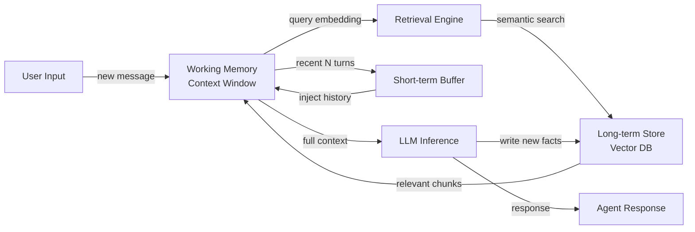

## Definição

A memória de agentes refere-se aos mecanismos pelos quais um agente de IA armazena, indexa e recupera informações ao longo de sua operação. Sem memória, cada interação começa do zero — o agente não pode aprender com conversas passadas, acumular fatos ou rastrear o estado de uma tarefa de longa duração. A memória transforma uma chamada de LLM sem estado em um sistema persistente e orientado a objetivos.

Na ciência cognitiva, a memória é dividida em vários tipos: memória de trabalho (informação ativa mantida em mente no momento), memória de curto prazo (eventos recentes retidos por um período limitado) e memória de longo prazo (conhecimento durável que persiste indefinidamente). Agentes de IA espelham essa taxonomia de perto. A janela de contexto do LLM atua como memória de trabalho; um buffer deslizante de mensagens recentes serve como memória de curto prazo; e um armazenamento externo — frequentemente um banco de dados vetorial — serve como memória de longo prazo.

A memória é o que habilita o raciocínio em múltiplos turnos. Quando um agente precisa responder a uma pergunta de acompanhamento, executar um plano em múltiplos passos ou lembrar as preferências de um usuário de uma sessão anterior, ele está recorrendo a uma ou mais dessas camadas de memória. Projetar a memória corretamente determina se um agente parece um assistente experiente ou um chatbot amnésico.

## Como funciona

### Memória de trabalho e a janela de contexto

A janela de contexto é a forma mais imediata de memória disponível para qualquer agente apoiado por LLM. Todas as mensagens, resultados de ferramentas e pensamentos intermediários dentro de uma única chamada de inferência residem na memória de trabalho. Janelas de contexto típicas variam de 8K a 200K tokens, estabelecendo um teto rígido para quanto o agente pode raciocinar ativamente de uma vez. Quando esse limite está próximo, informações mais antigas devem ser resumidas, comprimidas ou removidas para abrir espaço. A memória de trabalho é rápida e de latência zero, mas completamente volátil — ela desaparece quando a chamada termina.

### Memória de buffer de curto prazo

A memória de curto prazo é implementada como um buffer rotativo que mantém os últimos N turnos de conversa. Quando um novo turno chega, o turno mais antigo é descartado se o buffer estiver cheio. Essa abordagem é simples, barata e suficiente para continuidade conversacional dentro de uma única sessão. O buffer geralmente é serializado e reinjetado na janela de contexto no início de cada nova chamada de inferência. Sua principal limitação é que não escala para sessões longas ou recuperação entre sessões.

### Memória semântica de longo prazo

A memória de longo prazo usa um armazenamento persistente externo — tipicamente um banco de dados vetorial — para armazenar embeddings de eventos passados, fatos e resumos. Quando o agente precisa lembrar algo, ele incorpora a consulta atual e realiza uma busca por vizinho mais próximo aproximado para recuperar as memórias semanticamente mais relevantes. Os fragmentos recuperados são injetados na janela de contexto antes da inferência. Esse padrão escala para milhões de fatos armazenados e suporta recuperação entre sessões, mas adiciona latência de recuperação e requer um modelo de embedding.

### Memória episódica vs. semântica

A memória episódica armazena eventos passados específicos com seu contexto: "Na sessão 23, o usuário perguntou sobre política de reembolso e ficou frustrado." A memória semântica armazena conhecimento geral do mundo ou fatos acumulados: "A janela de reembolso é de 30 dias." Ambos os tipos podem coexistir no mesmo banco vetorial, distinguidos por metadados. A memória episódica é valiosa para personalização; a memória semântica é valiosa para fundamentar o agente em conhecimento de domínio.

### Ciclo de recuperação

O ciclo de recuperação conecta todas as camadas. A cada turno, o agente consulta a memória de longo prazo para contexto relevante, mescla com o buffer de curto prazo e alimenta o contexto combinado na memória de trabalho do LLM. Após a geração, fatos importantes do novo turno podem ser escritos de volta no armazenamento de longo prazo, fechando o ciclo.



## Quando usar / Quando NÃO usar

| Use quando | Evite quando |
|---|---|
| O agente deve lembrar informações de sessões ou turnos anteriores | A tarefa é completamente autocontida em um único prompt sem acompanhamento |
| Os usuários esperam personalização com base em interações passadas | O custo de armazenamento de memória ou latência é inaceitável para o caso de uso |
| O agente rastreia tarefas de longa duração com muitos resultados intermediários | A janela de contexto é grande o suficiente para conter todas as informações relevantes |
| O conhecimento de domínio excede o que cabe em uma única janela de contexto | Requisitos de privacidade proíbem armazenar dados de conversa do usuário |
| Você precisa de comportamento consistente em múltiplas invocações do agente | A complexidade adicional supera o benefício marginal da persistência |

## Prós e contras

| Prós | Contras |
|---|---|
| Habilita continuidade em múltiplos turnos e entre sessões | Armazenamentos de longo prazo adicionam latência de recuperação |
| Suporta personalização e contexto específico do usuário | Bancos de dados vetoriais introduzem complexidade de infraestrutura |
| Escala além dos limites da janela de contexto | A qualidade da recuperação depende da precisão do modelo de embedding |
| A memória episódica melhora significativamente a experiência do usuário | O envelhecimento da memória requer estratégias de remoção ou atualização |
| A memória semântica fundamenta o agente em conhecimento de domínio | Políticas de privacidade e retenção de dados devem ser gerenciadas explicitamente |

## Exemplos de código

```python
"""
Simple agent memory implementation combining a list-based short-term buffer
with a vector-based long-term store using sentence-transformers and numpy.
"""
from __future__ import annotations

import json
import numpy as np
from dataclasses import dataclass, field
from typing import Optional
from sentence_transformers import SentenceTransformer  # pip install sentence-transformers


# ---------------------------------------------------------------------------
# Short-term buffer memory (last N turns)
# ---------------------------------------------------------------------------

@dataclass
class ShortTermMemory:
    """Keeps the most recent `max_turns` conversation turns in a list."""
    max_turns: int = 10
    turns: list[dict] = field(default_factory=list)

    def add(self, role: str, content: str) -> None:
        self.turns.append({"role": role, "content": content})
        # Evict oldest turn when capacity is exceeded
        if len(self.turns) > self.max_turns:
            self.turns.pop(0)

    def get_history(self) -> list[dict]:
        """Return all buffered turns for injection into the context window."""
        return list(self.turns)


# ---------------------------------------------------------------------------
# Long-term vector memory (semantic retrieval)
# ---------------------------------------------------------------------------

@dataclass
class LongTermMemory:
    """
    Simple in-memory vector store backed by numpy.
    In production, replace with Chroma, Pinecone, or pgvector.
    """
    model_name: str = "all-MiniLM-L6-v2"
    _model: Optional[SentenceTransformer] = field(default=None, init=False, repr=False)
    _texts: list[str] = field(default_factory=list, init=False)
    _embeddings: Optional[np.ndarray] = field(default=None, init=False)

    @property
    def model(self) -> SentenceTransformer:
        if self._model is None:
            self._model = SentenceTransformer(self.model_name)
        return self._model

    def store(self, text: str) -> None:
        """Embed and store a piece of text in long-term memory."""
        embedding = self.model.encode([text])  # shape: (1, dim)
        self._texts.append(text)
        if self._embeddings is None:
            self._embeddings = embedding
        else:
            self._embeddings = np.vstack([self._embeddings, embedding])

    def retrieve(self, query: str, top_k: int = 3) -> list[str]:
        """Return the top_k most semantically similar stored memories."""
        if not self._texts:
            return []
        query_emb = self.model.encode([query])  # shape: (1, dim)
        # Cosine similarity
        norms = np.linalg.norm(self._embeddings, axis=1, keepdims=True)
        normed = self._embeddings / (norms + 1e-9)
        query_norm = query_emb / (np.linalg.norm(query_emb) + 1e-9)
        scores = (normed @ query_norm.T).flatten()
        top_indices = np.argsort(scores)[::-1][:top_k]
        return [self._texts[i] for i in top_indices]


# ---------------------------------------------------------------------------
# Agent with combined memory
# ---------------------------------------------------------------------------

class MemoryAgent:
    """
    A simple agent that combines short-term buffer and long-term vector memory.
    Uses a mock LLM call for illustration; replace with openai.chat.completions.create.
    """

    def __init__(self, max_short_term_turns: int = 6):
        self.short_term = ShortTermMemory(max_turns=max_short_term_turns)
        self.long_term = LongTermMemory()
        self.system_prompt = "You are a helpful assistant with access to past context."

    def _build_context(self, user_message: str) -> list[dict]:
        """Combine long-term retrieval + short-term buffer into a message list."""
        # Retrieve relevant memories from long-term store
        memories = self.long_term.retrieve(user_message, top_k=3)
        memory_block = "\n".join(f"- {m}" for m in memories) if memories else "None"

        messages = [
            {"role": "system", "content": self.system_prompt},
            {"role": "system", "content": f"Relevant past context:\n{memory_block}"},
        ]
        # Append recent conversation history
        messages.extend(self.short_term.get_history())
        # Append the current user message
        messages.append({"role": "user", "content": user_message})
        return messages

    def chat(self, user_message: str) -> str:
        """Process a user message and return the agent's response."""
        messages = self._build_context(user_message)

        # --- Replace this mock with a real LLM call ---
        # import openai
        # response = openai.chat.completions.create(model="gpt-4o", messages=messages)
        # reply = response.choices[0].message.content
        reply = f"[Mock LLM reply to: {user_message!r} with {len(messages)} context messages]"
        # ----------------------------------------------

        # Update short-term buffer
        self.short_term.add("user", user_message)
        self.short_term.add("assistant", reply)

        # Write important facts to long-term memory (in production, use LLM to decide)
        self.long_term.store(f"User said: {user_message}")
        self.long_term.store(f"Assistant replied: {reply}")

        return reply


# ---------------------------------------------------------------------------
# Example usage
# ---------------------------------------------------------------------------
if __name__ == "__main__":
    agent = MemoryAgent(max_short_term_turns=4)

    turns = [
        "My name is Alice and I prefer concise answers.",
        "What is the capital of France?",
        "What did I say my name was?",
    ]
    for turn in turns:
        print(f"User: {turn}")
        print(f"Agent: {agent.chat(turn)}\n")
```

## Recursos práticos

- [Conceitos de memória LangChain](https://python.langchain.com/docs/concepts/memory/) — Documentação oficial do LangChain cobrindo todos os tipos de memória integrados e quando aplicar cada um.
- [MemGPT: Towards LLMs as Operating Systems](https://arxiv.org/abs/2310.08560) — Artigo de pesquisa introduzindo gerenciamento de contexto virtual para memória ilimitada de agentes, comparável à memória virtual de SO.
- [Chroma – Banco de dados de embedding de código aberto](https://docs.trychroma.com/) — Banco vetorial leve popular usado em muitas implementações de memória de agentes.
- [OpenAI Assistants Threads](https://platform.openai.com/docs/assistants/how-it-works/managing-threads) — Como a API de agentes gerenciados da OpenAI lida com threads de conversa e memória persistente.

## Fontes

- [MemGPT: Towards LLMs as Operating Systems (Packer et al., 2023)](https://arxiv.org/abs/2310.08560) — Introduz gerenciamento de contexto virtual para memória persistente de agentes além de uma janela de contexto fixa.
- [Generative Agents: Interactive Simulacra of Human Behavior (Park et al., 2023)](https://arxiv.org/abs/2304.03442) — Demonstra recuperação de memória episódica e reflexão em simulações de agentes de longa duração.
- [Cognitive Architectures for Language Agents (Sumers et al., 2023)](https://arxiv.org/abs/2309.02427) — Taxonomia dos tipos de memória (in-context, externa, paramétrica) usados em agentes LLM.
- [Retrieval-Augmented Generation for Knowledge-Intensive NLP Tasks (Lewis et al., 2020)](https://arxiv.org/abs/2005.11401) — Base para memória externa baseada em recuperação em agentes.

## Veja também

- [Agentes de IA](/docs/agents)
- [Memória conversacional](/docs/agents/conversational-memory)
- [RAG](/docs/rag)
